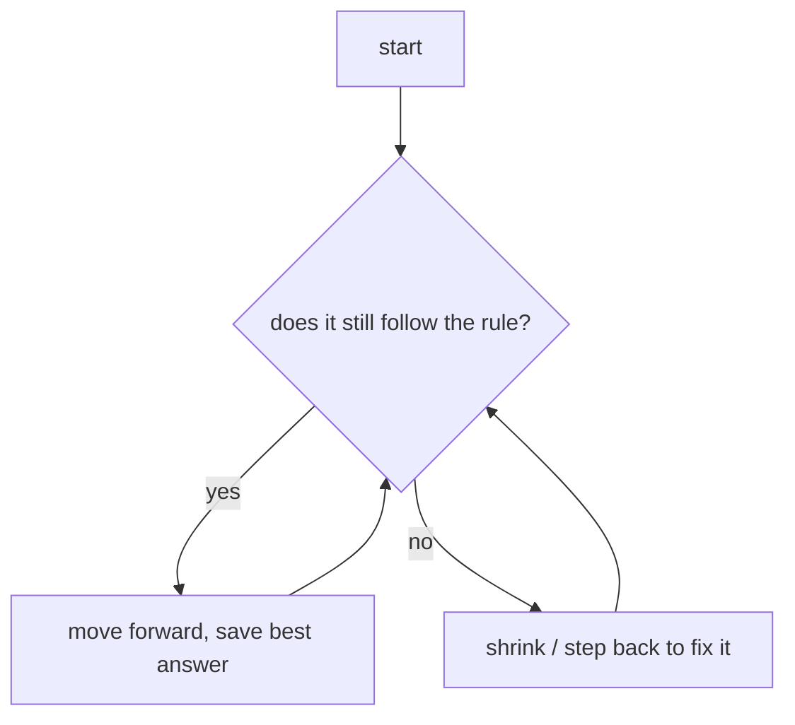

# ts-algorithms

Notes for learning algorithm patterns when you can already **code** (loops, arrays,
objects, functions) but never studied "algorithms" or much math.

The goal: stop memorizing solutions. Instead, learn to **recognize** what kind of
problem you're looking at — so the right idea pops into your head on its own.

---

## How this works

You won't remember a thousand solutions. Nobody can. But there are only a handful of
recurring **tricks**, and each one shows up in problems that _look_ totally different
on the surface.

So the trick is to spot the disguise. Each note here is built to train one
question: **"Wait, have I seen this shape before?"**

Read each note in this order — it's the same order you'd use on a real problem:

1. **When do I use this?** (spot the clues in the question)
2. **What do I need?** (the variables / data you'll track)
3. **How does it work?** (plain steps, like a recipe)
4. **What does it look like?** (a picture)
5. **Two problems that secretly use it** (so you recognize the disguise)
6. **What to ask out loud** (sound like you know what you're doing)
7. **How to go faster next time**

The code comes last, not first.

---

## A quick word on "fast" and "slow"

People throw around things like `O(n)` and `O(n²)`. You don't need the math. Here's
the plain version, in terms you already know:

| You'll hear | What it means in code | Rule of thumb |
|---|---|---|
| **O(n)** | One `for` loop over the list. | List doubles → work doubles. Fine. |
| **O(n²)** | A `for` loop **inside** another `for` loop (compare everything to everything). | List doubles → work goes up **4×**. Slow on big lists. |
| **O(log n)** | Each step you throw away **half** what's left (like "higher / lower" guessing). | Even a huge list finishes in a few steps. Very fast. |

**Why you care:** if a problem says *"the list can have up to 100,000 items,"* that's
a hint. The obvious loop-inside-a-loop version will be too slow — so there's probably
a smarter trick. That sentence about list size is a clue, not decoration.

---

## The map of tricks

The arrows mean **"this one is just the one above it, plus an extra rule."** For
example, "Sliding Window" is really just "Two Pointers" with a rule for how the two
markers move. So it sits underneath it.

```mermaid
graph TD
    TP[Two Pointers: two markers walking a list] --> SW[Sliding Window]
    TP --> FS[Fast & Slow Pointers]
    TP --> CP[Two Markers From Both Ends]
    TP --> M2[Merge Two Sorted Lists]

    BS[Binary Search: keep halving] --> SA[Guess-and-Check the Answer]
    BS --> RA[Search a Rotated List]

    HASH[Hashing: a lookup table] --> FC[Counting Things]
    HASH --> TS[Two Sum]
    HASH --> AG[Grouping Anagrams]

    ST[Stack: last-in first-out pile] --> MS[Monotonic Stack]
    ST --> PM[Matching Brackets]

    HEAP[Heap: always-pop-the-smallest box] --> TK[Top-K]
    HEAP --> MK[Merge K Lists]
    HEAP --> TH[Running Median]

    RB[Recursion & Backtracking: try, undo, try again] --> SP[All Subsets / Orderings]
    RB --> CS[Puzzle Solving]
    RB --> MEMO[Remember Past Answers]
    MEMO -.turns into.-> DP

    DP[Dynamic Programming: build on smaller answers] --> D1[1-D]
    DP --> D2[Grid]
    DP --> KS[Pick Items Under a Limit]
    DP --> IV[Ranges]

    GR[Graphs: dots connected by lines] --> GBFS[Explore Ring by Ring]
    GR --> GDFS[Explore One Path Deep]
    GR --> TOPO[Order by Dependencies]
    GR --> UF[Who's Connected to Who]
    GR --> SHP[Cheapest Path]

    TR[Trees: a branching family chart] --> TDFS[Go Deep]
    TR --> TBFS[Go Level by Level]
    TR --> BST[Sorted Tree]
```



Helpers that show up _inside_ many of these:
**Prefix Sum** (running totals), **Intervals** (start/end ranges),
**Bit Manipulation** (toggling 0s and 1s), **Greedy** (always grab the best-looking
option right now).

### Where notes live (folders match the map)

Each leaf above is a folder with its own `README.md`. The "parent" trick is the
folder; the variations live inside it.

```text
two-pointers/
  sliding-window/
  fast-slow-pointers/        # also used in linked-list problems — link, don't copy
  two-markers-both-ends/
  merge-two-sorted/
binary-search/
  guess-the-answer/
  rotated-list/
hashing/
  counting/
  two-sum/
  grouping-anagrams/
stack/
  monotonic-stack/
  matching-brackets/
heap/
  top-k/
  merge-k-lists/
  running-median/
recursion-backtracking/
  subsets-orderings/
  puzzle-solving/
dynamic-programming/         # "remember past answers" lives here
  one-d/
  grid/
  pick-under-limit/
  ranges/
graphs/
  ring-by-ring/
  deep-path/
  order-by-dependencies/
  whos-connected/
  cheapest-path/
trees/
  go-deep/
  level-by-level/
  sorted-tree/
prefix-sum/
intervals/
bit-manipulation/
greedy/
```

**Rule:** a trick lives in **one** folder only. If it fits two families, pick its
real parent and **link** to it from the other — never paste a copy.

---

## The note template

Every `<family>/<trick>/README.md` fills in these 7 parts, in this order. Copy the
block below and answer each question in plain words. Skip nothing.

````markdown
# <Trick name>

## 1. When do I use this?
This is the most important part. You're learning to **spot the disguise**.

Read the problem and ask: does it sound like any of these? Write the real giveaways
in plain words, with tiny everyday examples:
- Does it ask about a **chunk of the list sitting side-by-side**? (e.g. "longest run
  of days with no rain", "best 5 numbers in a row")
- Does it hand you a **sorted** list and ask you to **find a pair**?
- Does it ask for "the biggest / smallest / kth-from-the-top" thing?
- Does it say the list can be **huge** (like 100,000+)? → the loop-inside-a-loop way
  is too slow, so a trick is hiding here.

> One line to remember: "If the problem looks like ____, reach for this."

## 2. What do I need?
The stuff you'll keep track of while the code runs, and **why** — using things you
already know:
- a couple of number variables (e.g. a `left` and `right` position)
- a running total
- an object used as a lookup table (e.g. `counts[letter]`)
- a list used as a pile (push to the end, pop from the end)

## 3. How does it work?
Plain steps, like a cooking recipe. No fancy words. A 15-year-old who can write a
`for` loop should be able to follow it:
> 1. Start with `left` and `right` both at the front.
> 2. Move `right` forward and add the new item in.
> 3. If you broke the rule, move `left` forward until the rule holds again.
> 4. Each step, remember the best answer so far.
> 5. Stop when `right` reaches the end.

## 4. What does it look like?
A picture of what's happening each step — markers moving, a pile growing, halving the
list. Use Mermaid:



## 5. Two problems that secretly use it
Pick **two problems that look completely unrelated** but use the exact same trick.
This is what wires the recognition. Say plainly how each one maps:
- **Problem A** (e.g. something with text): "the 'chunk of letters' is the window."
- **Problem B** (e.g. something with money / network traffic / game scores): "the
  'best stretch of days' is the same window — different story, same trick."

## 6. What to ask out loud
Two short lists. (In an interview, the questions you ask matter as much as the code.)

**Questions that waste time** (the problem already answers these, or they make you
look unsure):
- e.g. "What's a subarray?" — don't.

**Questions that make you look experienced** (they nail down the tricky bits fast):
- "Can the list be empty or have one item?"
- "Can numbers be negative? Are there duplicates?"
- "How big can the list get?" (decides if you need the fast version)
- "Should I change the list in place or return a new one?"

## 7. How to go faster next time
Your cheat sheet for any problem of this shape:
- The skeleton you keep ready (the loop you can type from memory).
- The one rule you must never break while looping (the "invariant" — the thing that
  stays true every step).
- The usual mistakes here (off-by-one, forgetting the empty case, etc.).
- Say your plan out loud before coding: "This is O(n), one pass, using two markers."
````

---

## Handy questions for almost any problem

When you're not sure what to ask, these scope a problem fast and make you sound like
you've done this before:

| Ask early | Why it helps |
|---|---|
| "How big can the input get?" | Tells you if the slow obvious way is good enough or not. |
| "Can it be empty, or just one item?" | These are where bugs hide. |
| "Sorted already? Duplicates? Negatives?" | Each answer points at a different trick. |
| "Change it in place, or return something new?" | Decides how much extra memory you can use. |
| "Do you want one answer, or all of them?" | One answer → often a quick greedy grab. All → usually try-everything. |
| "Is the data coming in piece by piece, or do I have it all up front?" | Streaming needs different tools than a full list. |

**Don't:** re-ask what the prompt already says, or ask "what approach should I use?"
Always restate the problem in your own words first — that alone catches half the
misunderstandings.
