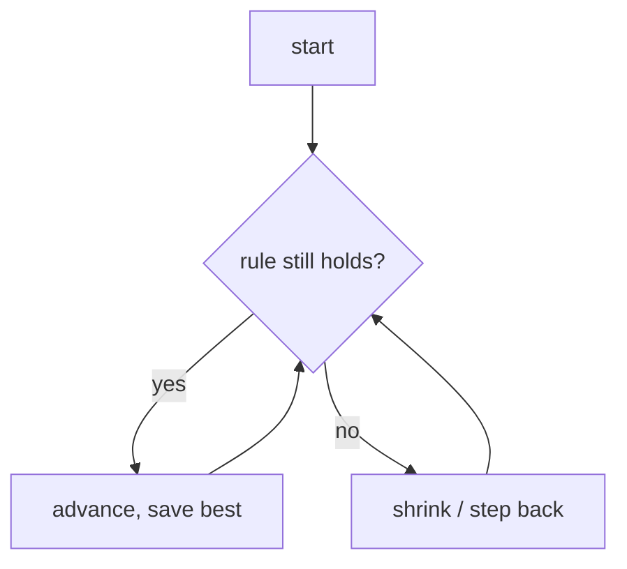

# ts-algorithms

Notes for engineers who can **code** (loops, arrays, objects) but never studied algorithms.

Two goals:

1. **Recognize** which trick a problem needs — so you stop memorizing solutions.
2. **Read** algorithms in the wild — spot them in a code review, in any stack (frontend or backend), and judge whether they're the right call.

---

## How slow is too slow? (Big-O, no math)

Big-O answers one question: **when the list gets bigger, how fast does the work pile up?** You're comparing the _shape_ of the code, not crunching numbers.

| Shape of code | Name | Steps for 1,000 items |
|---|---|---|
| Grab one item directly (`arr[0]`, look up a key) | **O(1)** | 1 |
| Cut what's left in half each step (like "higher / lower" guessing) | **O(log n)** | ~10 |
| One loop through the list | **O(n)** | 1,000 |
| Sort it, then one loop | **O(n log n)** | ~10,000 |
| A loop inside a loop (check every pair) | **O(n²)** | 1,000,000 |

Same list — the loop-in-a-loop does a **million** steps where a single loop does a **thousand**.

**Use it like this:** the problem tells you the list size. Big list (100,000+)? The loop-in-a-loop is out — reach for a faster shape. Decide this **before** you write code.

---

## The building blocks

The tricks are built out of these. Plain words:

| Thing | Plain meaning | In JS/TS you'd use |
|---|---|---|
| **Array / list** | items in a row, reached by position | `[]`, `arr[i]` |
| **Hash map** | a labelled drawer — store and find by name, instantly | `Map` or a plain object `{}` |
| **Set** | a bag that ignores duplicates — "have I seen this before?" | `Set` |
| **Stack** | a pile — add and remove from the **top** only (last in, first out) | `arr.push()` / `arr.pop()` |
| **Queue** | a line — add at the back, remove from the **front** (first in, first out) | `arr.push()` / `arr.shift()` |
| **Heap** | a bag that always hands you the smallest (or biggest) item next | a priority-queue library |
| **Tree** | a branching chart — one root, each node points to its children | nodes with a `children` list |
| **Graph** | dots joined by lines; a tree without the "one parent" rule | a map of node → its neighbours |

---

## The tricks (and where they live)

Folders mirror the hierarchy: a trick nested inside another is **built on it** — Sliding Window lives inside `two-pointers/` because it's just two markers plus a rule for moving them. Each leaf is a folder with its own note.

```text
two-pointers/            # sliding window, fast/slow, both-ends, merge two sorted
binary-search/           # on a sorted list, or on the answer itself
hashing/                 # counting, two-sum, grouping
stack/                   # monotonic stack, bracket matching
heap/                    # top-k, merge-k, running median
recursion-backtracking/  # subsets / orderings, puzzles
dynamic-programming/     # remember past answers — 1-D, grid, knapsack, ranges
graphs/                  # BFS, DFS, topological sort, union-find, shortest path
trees/                   # depth-first, level-order, BST
bit-manipulation/        # divide by doubling, exponential search
prefix-sum/              # running totals — highest altitude, peak so far
```

Leaf folders (e.g. `two-pointers/sliding-window/`) get created as you write each note.

Helpers that show up _inside_ many of these: **Intervals** (start/end ranges), **Greedy** (grab the best-looking option right now).

---

## Notes

The table of contents — and a recognition lookup. Add a row when you write a note.

| Trick | Folder | Reach for it when you see… |
|---|---|---|
| Two Sum (hashmap) | [`hashing/two-sum`](./hashing/two-sum/) | **unsorted** list + "find a pair summing to X"; "have I seen this?"; dedupe by key; replay / idempotency guard |
| Two markers, both ends | [`two-pointers/two-markers-both-ends`](./two-pointers/two-markers-both-ends/) | **sorted** list + "find a pair"; palindrome / reverse-in-place; max area between two walls |
| Divide by doubling | [`bit-manipulation/divide-two-integers`](./bit-manipulation/divide-two-integers/) | "no `*` `/` `%`"; a count/quotient up to ~2³¹ (too big to loop one-by-one); doubling a step until it overshoots; exponential search |
| Running total, keep the best | [`prefix-sum/highest-altitude`](./prefix-sum/highest-altitude/) | step-by-step changes + "highest / lowest / peak so far"; running balance / altitude / concurrency; cumulative tally |
| Binary search (halve a sorted range) | [`binary-search/find-target`](./binary-search/find-target/) | **sorted** data + find a value or a boundary; "first/last position where…"; huge input needing O(log n); `git bisect` |

> The first two rows are the **same question** (Two Sum) under opposite inputs: **sorted → two pointers** (O(1) space), **unsorted → hashmap** (O(n) space). Recognizing *which* is the whole skill.

---

## Note template

Every `<family>/<trick>/README.md` answers these 8, in order. Plain words. Skip nothing.

````markdown
# <Trick name>

## 1. What it is
One line: "<parent> plus <the extra rule>."
(e.g. "Two markers, but the gap between them is a window we grow and shrink under a rule.")

## 2. Spot it
You meet this trick two ways — write the giveaways for both.

**In a problem:** the phrases / shapes that should fire it.
- e.g. "longest run with no repeats", "best 5 in a row", sorted list + "find a pair".

**In real code** (reviewing a PR — any stack): what it looks like written out.
- Frontend: e.g. a `start` index that only moves forward while scanning events → a window
  (debounce/throttle buffers, virtualized-list ranges, infinite-scroll page math).
- Backend: e.g. dropping old timestamps off the front of a list to count recent hits → the
  same window (rate limiters, log/stream scanning, moving averages).
- Smell test: is this O(n²) loop-in-a-loop doing work a single pass could?

## 3. What you track
The variables / data, and why — in terms you know:
- two indices (`left`, `right`); a running total; an object as a counter (`counts[x]`); a list used as a pile.

## 4. How it works
Recipe steps. Someone who can write a `for` loop should follow it:
> 1. ...
> 2. ...

## 5. Picture
Mermaid flowchart of the loop and how its state moves:



## 6. Two disguises
Two unrelated problems, same trick — this is what wires recognition.
- A (e.g. text): how it maps.
- B (e.g. money / traffic / scores): same trick, different story.

## 7. Questions to ask
Only the **trick-specific** ones here (generic scoping questions live in the README's question table).
- e.g. "Can the window be empty?", "Are values bounded so I can count them in an array?"

## 8. Go faster
- The loop skeleton you keep ready to type.
- The one rule that must stay true every step (the invariant).
- Bugs **specific to this trick** (the universal ones live in the README's traps list).
- State the cost out loud first: "O(n), one pass, two markers."
````

---

## Universal traps (check these every time)

Before you call any solution done, run the list that bites everyone:

- **Empty input** — zero items. Does the loop still return something sane?
- **One item** — many two-pointer / window bugs only show up here.
- **All duplicates / all the same value** — breaks "find the unique one" assumptions.
- **Already sorted, or reverse-sorted** — often the best and worst case at once.
- **Off-by-one** — is the end index included or not? Pick one rule and hold it everywhere.
- **Negatives / zero** — running totals and "grow the window" logic often assume positives.
- **Huge input** — does the O(n²) version blow the time limit? (see [Big-O](#how-slow-is-too-slow-big-o-no-math))

---

## Questions that work on almost anything

When unsure what to ask, these scope fast and signal experience:

| Ask early | Why it helps |
|---|---|
| "How big can the input get?" | Says whether the slow obvious way is good enough. |
| "Can it be empty, or one item?" | Where bugs hide. |
| "Sorted? Duplicates? Negatives?" | Each answer points at a different trick. |
| "Mutate in place, or return new?" | Decides your memory budget. |
| "One answer, or all of them?" | One → often greedy. All → usually try-everything. |
| "Data all up front, or streaming in?" | Streaming needs different tools. |

**Don't** re-ask what the prompt says, or ask "what approach should I use?" Restate the problem in your own words first — that alone catches half the misunderstandings.

---

## How to practice

The notes only build recognition if you **quiz yourself** — not re-read:

1. Pick a problem. Before solving, read only its **"Spot it"** clues and guess the trick.
2. Cover the recipe and rebuild the steps from memory; peek only when stuck.
3. Found the trick in real code (a PR, a library)? Add it as a third "disguise" in that note.
4. Got one wrong? That note's **"Spot it"** is missing a clue — add the one that would've tipped you off.
