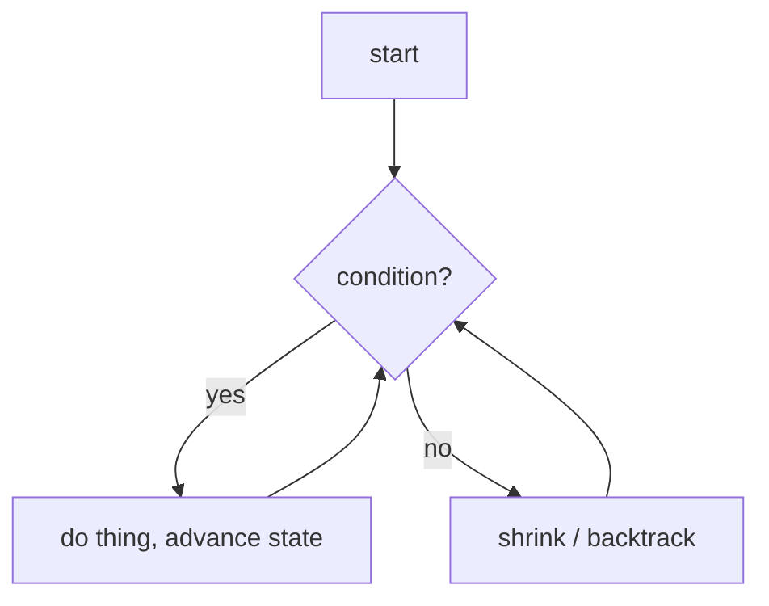

# ts-algorithms

A personal algorithm-pattern reference built for **recognition, not memorization**.

---

## Philosophy — "Associate, don't memorize"

You will never memorize enough solutions to cover every interview problem. But you
can train a small number of **triggers**: a problem _shape_ that fires the thought
_"this is a sliding-window problem"_ before you write a single line.

Every entry in this repo exists to wire one of those triggers. So the entries are
ordered to mirror how you actually attack a problem:

> **Spot it → grab Tools → know How → See it → Prove it → Talk smart → Go fast.**

Read each entry top-to-bottom in that order. The code is the _last_ thing you look
at, not the first.

---

## How to use this repo

1. **Stuck on a problem?** Scan the **Recognition Signals** of the relevant family
   in the [Master Hierarchy Map](#master-hierarchy-map) below — match the _shape_,
   not the topic.
2. **Learning a pattern?** Open its folder and read the entry top-to-bottom.
3. **Adding a pattern?** Copy the [Entry Template](#the-entry-template) verbatim and
   fill every section. An entry with a missing section is incomplete.

---

## Master Hierarchy Map

An arrow means **"the child is built on / composes the parent technique."** Sliding
Window is just Two Pointers with a rule for moving them, so it lives _under_ Two
Pointers — both in this map and on disk.

```mermaid
graph TD
    TP[Two Pointers] --> SW[Sliding Window]
    TP --> FS[Fast & Slow Pointers]
    TP --> CP[Converging Pointers]
    TP --> M2[Merge Two Sorted]

    BS[Binary Search] --> SA[Search on Answer]
    BS --> RA[Rotated Array]

    HASH[Hashing] --> FC[Frequency Count]
    HASH --> TS[Two Sum]
    HASH --> AG[Anagram Grouping]

    ST[Stack] --> MS[Monotonic Stack]
    ST --> PM[Paren Matching]

    HEAP[Heap / Priority Queue] --> TK[Top-K]
    HEAP --> MK[Merge K Sorted]
    HEAP --> TH[Two-Heaps Median]

    RB[Recursion & Backtracking] --> SP[Subsets / Permutations]
    RB --> CS[Constraint Search]
    RB --> MEMO[Memoization]
    MEMO -.becomes.-> DP

    DP[Dynamic Programming] --> D1[1-D DP]
    DP --> D2[Grid 2-D DP]
    DP --> KS[Knapsack]
    DP --> IV[Interval DP]

    GR[Graphs] --> GBFS[BFS]
    GR --> GDFS[DFS]
    GR --> TOPO[Topological Sort]
    GR --> UF[Union-Find]
    GR --> SHP[Shortest Path]

    TR[Trees] --> TDFS[DFS Traversal]
    TR --> TBFS[BFS Level-Order]
    TR --> BST[BST Ops]

    GBFS -.uses.-> Q[Queue]
    MS -.uses.-> ST
    SW -.uses.-> Q
```



Supporting techniques that show up _inside_ many of the above:
**Prefix Sum**, **Intervals**, **Bit Manipulation**, **Greedy**.

### Folder layout (mirrors the map)

Each leaf is a folder with its own `README.md` following the template. Parents are
folders; children nest inside them.

```text
two-pointers/
  sliding-window/
  fast-slow-pointers/        # cross-link: also referenced by linked-list problems
  converging-pointers/
  merge-two-sorted/
binary-search/
  search-on-answer/
  rotated-array/
hashing/
  frequency-count/
  two-sum/
  anagram-grouping/
stack/
  monotonic-stack/
  paren-matching/
heap/
  top-k/
  merge-k-sorted/
  two-heaps-median/
recursion-backtracking/
  subsets-permutations/
  constraint-search/
dynamic-programming/         # memoization = recursion + caching, lives here
  one-d/
  grid-2d/
  knapsack/
  interval/
graphs/
  bfs/
  dfs/
  topological-sort/
  union-find/
  shortest-path/
trees/
  dfs-traversal/
  bfs-level-order/
  bst-ops/
prefix-sum/
intervals/
bit-manipulation/
greedy/
```

**Conventions**
- A technique lives in **exactly one** folder. If it appears in two families
  (e.g. fast/slow pointers in linked-list problems), pick its true parent and
  **cross-link**, never duplicate.
- A composite pattern goes under the technique it is _built on_, not the topic it is
  _used for_ (Sliding Window → `two-pointers/`, not `arrays/`).

---

## The Entry Template

Every `<family>/<algorithm>/README.md` **must** contain these 8 sections, in this
order. Copy the block below and fill it in. Reorder nothing — the order _is_ the
learning path.

````markdown
# <Algorithm Name>

## 1. Lineage
> Built on: [<parent technique>](../)
One line: what does this add on top of the parent? (e.g. "Two pointers, but the gap
between them encodes a window we grow and shrink under a constraint.")

## 2. Recognition Signals — patterns to look for
What in the problem statement should make this pattern fire? List the tells:
- Phrase tells — e.g. "contiguous subarray / substring", "sorted array + find a pair",
  "kth largest", "shortest/longest window such that…".
- Shape tells — e.g. "answer is a range over the input", "monotonic relationship",
  "asks for an order / dependency".
- Constraint tells — e.g. `n ≤ 1e5` rules out O(n²); "values are small" hints counting.

## 3. Data Structures required
What you reach for and **why**:
- e.g. two integer indices + a running sum; a hashmap of char→count; a deque holding
  indices; a min-heap of size k.

## 4. Pseudocode (teen-simple)
Plain words, no language syntax. A smart 15-year-old should follow it without knowing
TypeScript. Describe the loop and the rule that moves state.

## 5. Flow-State Diagram
A Mermaid `flowchart` or `stateDiagram` of the loop and its state transitions
(pointer moves, window grow/shrink, push/pop). Example:



## 6. Two Examples, Far Apart
Two problems from **different domains** that reduce to the same pattern — the point is
to force the association. State the mapping for each.
- **Example A** (e.g. a string problem): how it maps to this pattern.
- **Example B** (e.g. a streaming / networking / scheduling problem): how it maps.

## 7. Questions: Dumb vs Senior
Two short lists.
- **Dumb to ask** — answerable from the prompt, or signals you're stalling:
  - e.g. "What does 'subarray' mean?"
- **Senior to ask** — scopes complexity and edge cases fast, shows you've seen this before:
  - e.g. "Are values non-negative? Can the window be empty? Are there duplicates?
    What's the max n — do I need O(n) or is O(n log n) fine?"

## 8. Speed Strategies
A checklist to solve _any_ similar challenge quickly:
- The template you keep ready (the loop skeleton).
- The invariant you must hold every iteration.
- Common off-by-one / edge traps for this pattern.
- The complexity target to state out loud _before_ coding.
````

---

## Appendix — Global Senior-Signal Cheat Sheet

Reusable questions that scope almost any problem fast. Keep per-entry question lists
**specific**; lean on this list for the generic ones.

| Ask early | Why it signals seniority |
|---|---|
| "What's the input size / constraints?" | Picks the target complexity before coding. |
| "Can the input be empty / a single element?" | Surfaces edge cases up front. |
| "Sorted? Duplicates allowed? Negatives?" | Decides between two-pointers, hashing, counting. |
| "Mutate input in place, or return new?" | Clarifies space budget and side effects. |
| "One answer or all answers? Any valid one?" | Greedy vs backtracking vs DP. |
| "Streaming / online, or all data up front?" | Heap / running-window vs full-scan. |

**Dumb tells to avoid:** re-asking what the prompt already states, asking for the
solution approach, or asking before restating the problem in your own words.
