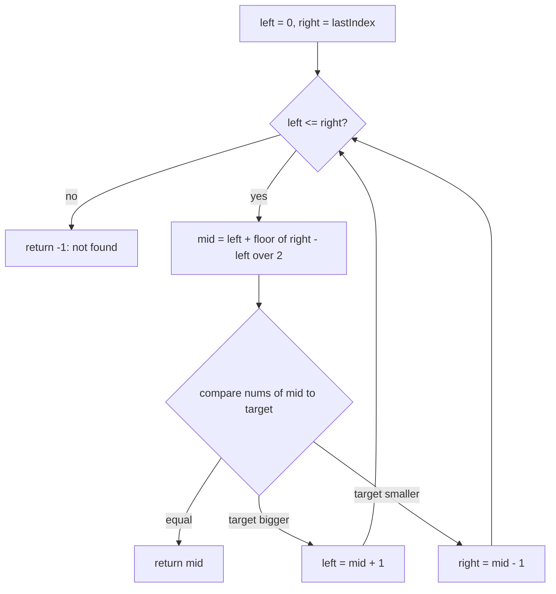

# Binary search — halve a sorted range

## 1. What it is
Find something in a **sorted** list by repeatedly **throwing away half** of what's
left. Keep a window (a `left` and a `right` edge) around the part still worth
searching. Each step, look at the middle item: if it's the target you're done; if the
target must be smaller, drop the right half; if larger, drop the left half. The window
halves every step, so even a million items finish in ~20 looks.

`nums = [-1, 0, 3, 5, 9, 12]`, looking for `9`:
- window `[-1..12]`, middle is `3` → `9 > 3`, drop the left half → window `[5..12]`
- window `[5..12]`, middle is `9` → found it.

### The 5 things to lock in
1. **Halve every step** — toss half the window each loop. That's the whole reason it's fast (`O(log n)`).
2. **Two pointers fence, one probe looks** — `left` and `right` bound the slice still in play; `mid` is the single spot you actually check. Three numbers, one job.
3. **Compute `mid` safely** — `mid = left + ⌊(right − left) / 2⌋`. Written this way (not `(left + right) / 2`) it can't overflow and always lands inside the window.
4. **Step *past* `mid` when you shrink** — you already checked `mid`, so move to `mid + 1` or `mid − 1`, never back to `mid`. That single `±1` is what stops the loop from spinning forever.
5. **Only works on sorted data** — the move "target is smaller → it's in the left half" is only true if the list is ordered.

> Built on: nothing — this is a base technique. Note `two-pointers/two-markers-both-ends`
> also walks two pointers inward, but there a *comparison of the two ends* drives it;
> here a *middle probe* drives it, and the data must be sorted.

## 2. Spot it
Don't memorize example problems — run a **test** on the problem's words. Ask these three
in order; all "yes" → binary search.

1. **Is anything in order?** The data is sorted, *or* the possible answers line up small→large. (No order anywhere → stop, it's not binary search.)
2. **Am I after ONE thing?** A single value, or a single boundary — "the first / last / smallest / largest X that works." (Wants *all* matches, or a *combination / sum*? → not binary search.)
3. **THE decider — does checking the middle throw away half?** Pick the middle candidate and test it. Does the result tell you the answer is *entirely to the left* or *entirely to the right*? **Yes → binary search.** If a wrong guess could still be on *either* side → not binary search.

Question 3 is the whole game: binary search only works when **one look in the middle eliminates half the possibilities.**

### Run the test (so you can feel the difference)
- *"Sorted prices — first day the price went over $100?"* → ordered ✅; one boundary ✅; middle day over $100 means first-over is here-or-earlier, drop the right half ✅ → **binary search.**
- *"Servers come in sizes — smallest size that still handles the traffic?"* → no sorted list, but sizes line up ✅; smallest that works ✅; test the middle size, if it copes the answer is this-or-smaller ✅ → **binary search on the *answer*** (no array needed — this is the unlock).
- *"Unsorted array — two numbers that add to a target?"* → not ordered ❌; a wrong middle pair tells you nothing about which half to keep ❌ → **not** binary search (that's the hashmap [`two-sum`](../../hashing/two-sum/README.md)).

**The formal LeetCode tells** (same test, dressed up): "array is **sorted**", "find the **first/last** index where…", "**minimize/maximize** x **such that** condition holds", a huge input where `O(n)` is too slow but `O(log n)` is fine.

**In real code** (reviewing a PR — any stack): `git bisect` (halving commits to find the one that broke the build); a lookup in a pre-sorted array; finding the insert spot to keep a list sorted; the second half of exponential search (see [`../../bit-manipulation/divide-two-integers`](../../bit-manipulation/divide-two-integers/README.md)). **Smell test:** a linear scan over **sorted** data hunting a value or boundary → swap in binary search, `O(n)` → `O(log n)`.

## 3. What you track
- `left`, `right` — the edges of the window still worth searching (the fence).
- `mid` — the one spot you probe each step.
- (for boundary searches) `answer` — the best position found so far.

## 4. How it works
Plain pseudocode — find a target, return its index, or `-1` if missing:

```
left  = 0                      // left edge of the search window
right = last index             // right edge (inclusive)

while window is not empty (left <= right):
    mid = the middle of the window

    if item at mid == target:
        return mid             // found it

    if item at mid < target:
        left = mid + 1         // target is bigger → keep the RIGHT half
    else:
        right = mid - 1        // target is smaller → keep the LEFT half

return -1                      // window emptied, never found it
```

Finding the middle, written safely:

```
mid = left + (right - left) / 2     // round down; never overflows, always inside the window
```

**Why `mid + 1` / `mid - 1`, and why `<=` (the part to slow down for):** `mid` was just
checked, so re-including it does nothing but risk an **infinite loop** — when the window
shrinks to one item, `mid` lands on it, and if you set `left = mid` (not `mid + 1`) the
window never changes and you loop forever. Stepping past `mid` guarantees the window
gets strictly smaller every time. The `<=` (not `<`) matters because `right` is an
**inclusive** edge: when `left === right` there's still one item left to check.

## 5. Picture


## 6. Two disguises
Same halving, two different jobs.

- **A — LeetCode #704 Binary Search** (find a value): a sorted array and a target;
  return its index or `-1`. Mapping: the classic recipe above — probe the middle, drop
  the wrong half.
- **B — First Bad Version / `git bisect`** (debugging): versions `1..n` are *good, good,
  …, bad, bad* (once it breaks it stays broken). Find the **first bad** one, asking an
  `isBad(version)` check as few times as possible. Mapping: same halving, but instead of
  "equal?" the probe asks "is this one bad?" — bad → the answer is here or earlier
  (`right = mid - 1`, remember it); good → the answer is later (`left = mid + 1`). This
  is binary search on a **yes/no boundary** instead of an exact value — and it's exactly
  what `git bisect` does to your commit history.

## 7. Questions to ask
Only the trick-specific ones (generic scoping lives in the repo README):
- "Is the data **sorted**? By what key?" (no order → no binary search.)
- "Are there **duplicates**, and do you want the **first**, the **last**, or any match?"
- "If the target's missing, return `-1`, or the **insert position**?"
- "Is `right` an inclusive index or a length?" (decides `<=` vs `<` and `mid - 1` vs `mid`.)

## 8. Go faster
- Skeleton you keep ready:
  ```ts
  let left = 0, right = nums.length - 1;
  while (left <= right) {
    const mid = left + Math.floor((right - left) / 2);
    if (nums[mid] === target) return mid;
    if (nums[mid] < target) left = mid + 1;
    else right = mid - 1;
  }
  return -1;
  ```
- Invariant: the target, if present, is always inside `[left, right]`.
- Trick-specific bugs: setting `left = mid` instead of `mid + 1` (**infinite loop**);
  using `<` when `right` is inclusive (misses the last item); forgetting the data must be sorted.
- Say the cost out loud first: **"O(log n) time, O(1) space."**

---

Solution code (both disguises, fully commented): [`solution.ts`](./solution.ts).
