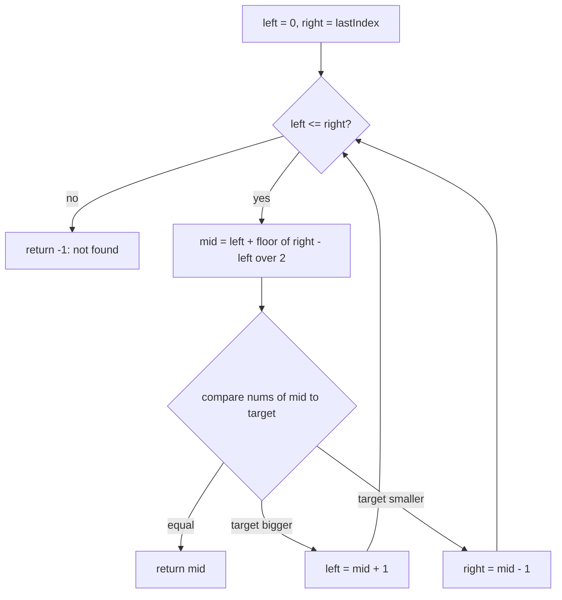

# Binary search — halve a sorted range

## TL;DR

**Is it binary search? Ask 3 questions — all "yes" → yes:**
1. **Is anything in order?** Data is sorted, *or* the possible answers line up small→large. (No order → not binary search.)
2. **Am I after ONE thing?** A single value or a single boundary ("first/last/smallest/largest X that works"). (All matches, or a combo/sum → not binary search.)
3. **Does checking the middle throw away half?** Test the middle candidate — does the result prove the answer is *entirely left* or *entirely right*? If a wrong guess could still be on either side → not binary search. **This one is the decider.**

**Before you code, pin down:** sorted by what key? duplicates — want first / last / any? missing → return `-1` or the insert position? is `right` an index or a length?

**The 4 lines where every bug hides** (details in *How it works*):
`right = n - 1` · `while left <= right` · round-down `mid` · `mid ± 1` when shrinking.

---

## What it is
Find something in a **sorted** list by repeatedly **throwing away half** of what's
left. Keep a window (a `left` and a `right` edge) around the part still worth
searching. Each step, look at the middle item: if it's the target you're done; if the
target must be smaller, drop the right half; if larger, drop the left half. The window
halves every step, so even a million items finish in ~20 looks.

`nums = [-1, 0, 3, 5, 9, 12]`, looking for `9`:
- window `[-1..12]`, middle is `3` → `9 > 3`, drop the left half → window `[5..12]`
- window `[5..12]`, middle is `9` → found it.

### The 5 things to lock in
1. **Halve every step** — toss half the window each loop. That's the whole reason it's fast (`O(log n)`).
2. **Two pointers fence, one probe looks** — `left` and `right` bound the slice still in play; `mid` is the single spot you actually check. Three numbers, one job.
3. **Compute `mid` safely** — `mid = left + ⌊(right − left) / 2⌋`. Written this way (not `(left + right) / 2`) it can't overflow and always lands inside the window.
4. **Step *past* `mid` when you shrink** — you already checked `mid`, so move to `mid + 1` or `mid − 1`, never back to `mid`. That single `±1` is what stops the loop from spinning forever.
5. **Only works on sorted data** — the move "target is smaller → it's in the left half" is only true if the list is ordered.

> Built on: nothing — this is a base technique. Note `two-pointers/two-markers-both-ends`
> also walks two pointers inward, but there a *comparison of the two ends* drives it;
> here a *middle probe* drives it, and the data must be sorted.

## What you track
- `left`, `right` — the edges of the window still worth searching (the fence).
- `mid` — the one spot you probe each step.
- (for boundary searches) `answer` — the best position found so far.

## How it works
Pseudocode. The four ⚠️ lines are where every binary-search bug hides — read those
slowly; the rest is filler.

```
left  = 0
right = n - 1                    // ⚠️ LAST index, not n. (right is INCLUSIVE)

while left <= right:             // ⚠️ <= , not < . When left == right one item
                                 //    still needs checking; using < skips it.

    mid = left + (right - left) / 2   // ⚠️ round DOWN, and write it THIS way
                                      //    (not (left+right)/2) so it can't overflow

    if value[mid] == target:
        return mid                    // found it

    else if value[mid] < target:
        left = mid + 1           // ⚠️ mid + 1 , never `left = mid`. You already
                                 //    checked mid; if you don't step past it the
                                 //    window stops shrinking → INFINITE LOOP.
    else:
        right = mid - 1          // ⚠️ mid - 1 , same reason.

return -1                        // range emptied → not in the list
```

Lock these four in and it can't loop forever or miss an element:
**`right = n-1`**, **`while left <= right`**, **round-down `mid`**, **`mid ± 1` when shrinking.**

## Picture


## Where you'll meet it (practice + recognition)

**On LeetCode (and similar platforms):**
- **#704 Binary Search** — find a value in a sorted array (the classic; this note's code).
- **#35 Search Insert Position** — where the value *would* go if it's missing.
- **#278 First Bad Version** — versions go *good…good, bad…bad*; find the **first bad** one, asking `isBad(v)` as few times as possible. The probe asks "is it bad?" instead of "is it equal?" — binary search on a **yes/no boundary**, not a value. (See `firstBadVersion` in [`solution.ts`](./solution.ts).)
- **#875 Koko Eating Bananas / #1011 Capacity to Ship** — binary search on the **answer**: the smallest speed/size that passes a test.

**Real life / other platforms:**
- **`git bisect`** — halve your commit history to find the one that broke the build. (This *is* First Bad Version.)
- **"Smallest server size that handles the traffic"** — no array, but the sizes line up; test the middle size. (Binary search on the answer.)
- A phone-book / sorted-index lookup; slotting a new score into a ranked leaderboard.

**Looks like it but ISN'T:** *"two numbers in an **unsorted** array that sum to a target"* — a wrong middle guess tells you nothing about which half to keep, so it's the hashmap [`two-sum`](../../hashing/two-sum/README.md), not binary search.

---

Solution code (classic search + the First Bad Version variant, fully commented): [`solution.ts`](./solution.ts).
