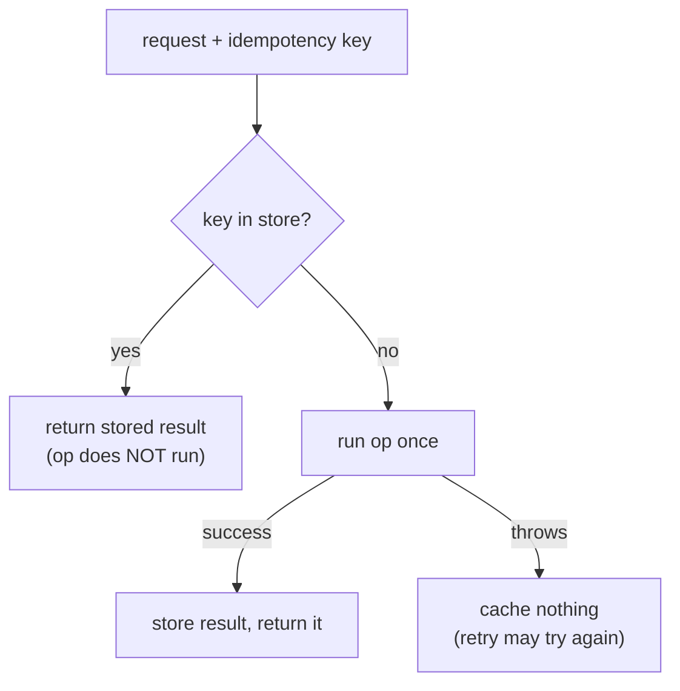

# Idempotency keys — make retries safe (exactly-once side effects)

> A `domains/fintech/` **building-block** note (3rd note shape). A thing you *build*, not a trick you
> *spot* — see the [fintech roadmap](../../). **This block:** the client tags each operation with a
> unique key; the server runs it once per key and replays the stored result on every retry.

## TL;DR

**Reach for it when — any yes → you need this:**
1. A request causes a **side effect that costs money** — charge, payout, transfer, order?
2. The caller can **retry** (timeout, dropped response, at-least-once queue, user double-click)?
3. **Would running it twice be wrong?** ← decider. Reads are naturally safe to repeat; *effectful
   writes* are not. If a second run double-charges, you need idempotency.

**Before you build it, pin down:** who **generates the key** and what's its scope (client per logical
op, reused across retries — usually a UUID)? **how long** do you keep it (TTL — long enough to cover
all retries)? what counts as the **same** request (key alone, or key + payload hash to catch a reused
key with different body)? do retries arrive **concurrently** (then you need a lock / unique
constraint, not just a check)?

**Where money / compliance bugs hide:** **no key** → retried charge bills twice · **check-then-act
race** (two retries both miss the store, both run) → still double-charges · **caching a failure** → a
transient error becomes permanent for that key · **key reused for a different operation** → wrong
cached result returned.

## What it really is

Networks drop **responses**, not just requests. Client charges a card → charge succeeds → the `200`
never arrives → client retries → you bill twice. You can't stop the retry; it's correct. So you make
the **second attempt a no-op that returns the first result.**

The client sends an **idempotency key** — a unique id it picks for the logical operation and reuses on
every retry of *that* operation. The server, keyed by it: first sight → run the op once, store the
result; every later sight → skip the op, return the stored result. The side effect happens **exactly
once**; the client can retry forever and always gets the same answer.

It's the same "have I **seen** this key?" Set/Map guard as a webhook replay check
([`techniques/hashing/two-sum`](../../../../techniques/hashing/two-sum/) — `firstReplay`). The extra
twist: don't just *detect* the dupe, **replay the original outcome** so the retry still gets its
answer.

Tiny worked example — key `"k1"`:
```
charge(k1)  → store empty  → run → charge $50 → store k1 = {chargeId: ch_1}  → return ch_1
charge(k1)  → store has k1 → SKIP run         → return ch_1   (no second charge)
charge(k2)  → store empty  → run → charge $50 → store k2 = {chargeId: ch_2}  → return ch_2
```

## What it costs & risks

| Decision | The wrong way | The consequence |
|---|---|---|
| Dedupe | no key, just process every request | retried payment charges 2×, 3×… |
| Concurrency | check store, then act (no lock) | two simultaneous retries both run → double effect |
| Failures | cache the result of a thrown op | transient blip becomes a permanent error for that key |
| Key reuse | one key for different payloads | second op returns the first op's result — silent wrong answer |
| Retention | drop keys too soon | a late retry re-runs the op; keep keys past your max retry window |

## How to build it

```
idempotent(store, key, op):
    existing = store.get(key)
    if existing != null: return existing       ⚠️ check BEFORE running → retry replays, op never re-runs
    result = op()                              ⚠️ if op throws here, cache NOTHING (don't poison the key)
    store.set(key, result)                     # cache only on success
    return result
```

At scale the `get`/`set` is a DB row keyed by the idempotency key, and the real protection against
concurrent retries is a **UNIQUE constraint** on that key (the second INSERT loses and waits) — not
the in-memory check above. Recap of the bug lines: **check before act**, **cache only success**,
**unique constraint for concurrency**.

## Picture



## Where you'll meet it (practice + recognition)

- **Real systems:** Stripe's `Idempotency-Key` header; payment, payout, and order APIs; consumers of
  at-least-once queues (SQS, Kafka) that must dedupe; the outbox pattern pairs with this.
- **Libraries / standards:** HTTP idempotency (PUT/DELETE are idempotent by spec; POST needs a key);
  DB unique constraints / `INSERT … ON CONFLICT`; distributed locks (Redis) when no natural key.
- **Looks like it but ISN'T:** a plain **replay/dedupe guard** that only *rejects* the duplicate
  (returns nothing) — fine for "ignore this event", wrong for an API that must still answer the
  retry. Tell: does the caller need the **original result back**? Yes → idempotency (store + replay).
  No → a Set guard is enough.

---
Solution code — `idempotent()` wrapper + the pure replay detector, runnable self-check:
[`solution.ts`](./solution.ts).
