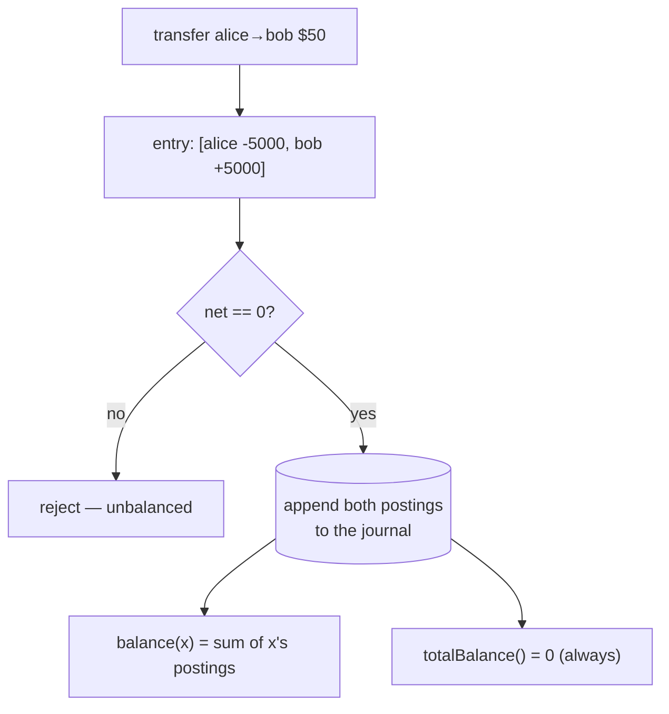

# Double-entry ledger — money moves, never appears or vanishes

> A `domains/fintech/` **building-block** note (3rd note shape). A thing you *build*, not a trick you
> *spot* — see the [fintech roadmap](../../). **This block:** every money event is a set of postings
> summing to **zero**; the ledger enforces that on every write, so the books balance by construction.

## TL;DR

**Reach for it when — any yes → you need this:**
1. You track balances that *change* — wallets, accounts, credits, payouts?
2. Someone will ask "why is this balance what it is?" and you must answer months later?
3. **Is the money real (regulated, audited, owed to a user)?** ← decider. A `balances` table you
   `UPDATE` in place has no proof and silently drifts. A ledger can't.

**Before you build it, pin down:** **chart of accounts** (what accounts exist — user wallets, fees,
revenue, a cash/clearing account)? **sign convention** (here: balance = sum of postings; +holds,
−owes)? where the **other side** of each entry lands (every debit needs a credit somewhere)? do you
need **double-entry** strictly, or is an append-only event log enough for now?

**Where money / compliance bugs hide:** **UPDATE-in-place balances** → no trail, races corrupt
silently · an entry whose postings **don't net to 0** → money leaked · **editing/deleting** a past
posting → audit trail destroyed (reverse with a new entry instead) · trusting a **cached balance**
over the journal → drift goes unnoticed.

## What it really is

Double-entry is the 700-year-old rule: **money is never created or destroyed, only moved.** A $50
transfer isn't "set alice to X, set bob to Y" — it's one **entry** with two **postings**:

```
alice  -5000   (debit)
bob    +5000   (credit)
        ─────
sum  =     0
```

Because every entry sums to zero, the sum of **all** balances in the system is always zero too — that
global invariant is your tripwire: if it's ever non-zero, the ledger is corrupt.

Two supporting rules make it auditable: the journal is **append-only** (fix mistakes with a new
reversing entry, never an edit), and a balance is **derived** (`balance(acct) = sum of its postings`),
not a number you maintain by hand. Real systems cache the balance for speed, but the journal wins any
dispute.

Tiny worked example: post `alice→bob 5000`, then `bob→carol 1500`. Balances: alice `−5000`, bob
`+3500`, carol `+1500`. Sum = 0. Every cent is accounted for, and you can replay exactly how each
balance got there.

## What it costs & risks

| Decision | The wrong way | The consequence |
|---|---|---|
| State model | `UPDATE balances SET …` | no history; concurrent transfers race → wrong number, no "why" |
| Entry validity | don't check postings sum to 0 | a forgotten credit = money vanishes; books won't reconcile |
| Corrections | edit / delete a posting | audit trail broken; regulators require append-only |
| Balance source | trust a cached counter | cache drifts from journal, nobody notices until reconciliation |
| Read speed | sum the whole journal every read | O(n) per balance — fine for the note, must index/cache at scale |

## How to build it

```
post(entry):                                  # entry = list of postings
    if entry is empty: throw
    net = sum(p.amount for p in entry)
    if net != 0: throw                         ⚠️ THE invariant — drop it and money leaks
    append every posting to the journal        ⚠️ append-only — never edit/delete past rows

balance(account):
    return sum(p.amount for p in journal if p.account == account)   # derived, not stored

totalBalance():
    return sum(p.amount for p in journal)       # must ALWAYS be 0 — else corrupt, alert
```

Recap of the bug lines: **reject any entry that doesn't net to zero**, **append-only journal**,
**balance derived from postings**, **global total == 0 as a tripwire**.

## Picture



## Where you'll meet it (practice + recognition)

- **Real systems:** every bank core, Stripe's balance/transactions, ledgers like TigerBeetle,
  Modern Treasury, or "ledger" services at fintechs; even Git is an append-only log of immutable
  changes you reconstruct state from.
- **Libraries / standards:** double-entry bookkeeping (GAAP/IFRS), event sourcing, append-only DB
  tables + DB transactions for atomic multi-posting writes.
- **Looks like it but ISN'T:** a **single-entry** balances table (just a number you mutate) — looks
  simpler, gives no proof and drifts. Tell: can you answer "why is this balance this?" from the data
  alone? Only the ledger can. (See the drifting `SingleEntrySheet` twin in the solution.)

---
Solution code — a `Ledger` that rejects unbalanced entries + a drifting single-entry twin, runnable
self-check: [`solution.ts`](./solution.ts).
