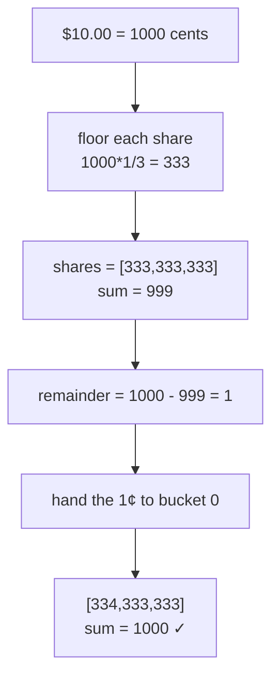

# Money representation — store money as integers, never floats

> A `domains/fintech/` **building-block** note (3rd note shape). It's a thing you *build*, not a
> trick you *spot* — read the [fintech roadmap](../../) for the map. **This block:** money = an
> integer count of minor units (cents), held as `bigint`; the hard part is splitting it without
> losing a penny.

## TL;DR

**Reach for it when — any yes → you need this:**
1. Code holds a price, balance, fee, tax — anything that's currency?
2. You'll add / multiply / split those amounts, or compare them for equality?
3. **Will the totals ever be reconciled against a bank, a processor, or an auditor?** ← decider. If
   money leaves your system, it must be exact to the cent. Floats aren't.

**Before you build it, pin down:** which **currencies** (each has its own number of decimals — USD 2,
JPY 0, BHD 3; ISO 4217 lists them)? **smallest unit** you must represent (cents? or 8-dp crypto)?
**rounding rule** when a split doesn't divide evenly (who gets the leftover penny)? do amounts cross
**currency** (then you need explicit FX, never silent addition)?

**Where money / compliance bugs hide:** using a **float** (`number`) for money → drift · **mixing
currencies** in one sum → nonsense total · **rounding each step** instead of splitting once → pennies
created/destroyed · overflowing `Number.MAX_SAFE_INTEGER` (~$90T in cents) → silent corruption (use
`bigint`).

## What it really is

A float (IEEE-754 double, what JS `number` is) stores values in **binary** fractions. Most decimal
fractions — including `0.1` and `0.2` — have **no exact binary form**, same way `1/3` has no exact
decimal. So `0.1 + 0.2 === 0.30000000000000004`. One such error is invisible; a million transactions
later the books don't balance and you can't say why.

Fix: stop storing dollars. Store the **count of the smallest unit** the currency has — "minor units".
$19.99 isn't `19.99`, it's `1999` cents. Integers add and subtract **exactly**. Use `bigint` so a
balance can't overflow.

Tiny worked example — split $10.00 three ways:
- Float way: `10 / 3 = 3.3333…` × 3 = `9.999…` → round → maybe $9.99 or $10.01. A penny appears or
  vanishes.
- Integer way: `1000` cents, floor each to `333`, that's `999` — **1 cent left over** → hand it to the
  first bucket → `[334, 333, 333]`, sums back to exactly `1000`. Nothing lost.

## What it costs & risks

| Decision | The wrong way | The consequence |
|---|---|---|
| Number type | `number` (float) for amounts | `0.1+0.2` drift; equality checks fail; books won't reconcile |
| Magnitude | `number` integer cents | overflows silently past ~9e15 cents (~$90T) — use `bigint` |
| Splitting | round each share independently | total ≠ original — a penny created or destroyed every split |
| Multi-currency | add USD + EUR as raw ints | meaningless total; must convert via explicit FX first |
| Rounding rule | unspecified / inconsistent | regulators and auditors require a **stated, consistent** rule |

## How to build it

```
type Money = { amount: bigint, currency: string }   // amount = minor units

add(a, b):
    if a.currency != b.currency: throw            ⚠️ never silently add currencies
    return { amount: a.amount + b.amount, currency: a.currency }

allocate(total, ratios):                            # penny-perfect split
    totalRatio = sum(ratios)
    shares = []
    for r in ratios:
        share = total * r / totalRatio              ⚠️ bigint division floors → under-shoots
        shares.push(share)
    remainder = total - sum(shares)                 # leftover pennies, 0 ≤ remainder < n
    for i in 0 .. remainder-1:
        shares[i] += 1                              ⚠️ hand leftovers out, else total ≠ original
    return shares                                    # sums back to EXACTLY total
```

Recap of the bug lines: **currency guard** in every op; **floor then distribute the remainder** in
`allocate` so the split is exact.

## Picture



## Where you'll meet it (practice + recognition)

- **Real systems:** Stripe amounts are integer cents (`unit_amount`); ledgers, invoicing, tax, and
  payroll all split a total by ratio (largest-remainder apportionment, a.k.a. Fowler's `allocate`).
- **Libraries / standards:** ISO 4217 (currency → decimal places); `decimal.js` / `dinero.js` /
  `big.js` when you need arbitrary-precision decimals; `Intl.NumberFormat` for display.
- **Looks like it but ISN'T:** **rounding a float at the edge** (`toFixed(2)`) feels like a fix but
  the drift already happened upstream. Tell: is the value *stored and summed* as a float anywhere? If
  yes, you have a money-representation bug, not a formatting one.

---
Solution code — `Money` + penny-perfect `allocate`, runnable self-check: [`solution.ts`](./solution.ts).
