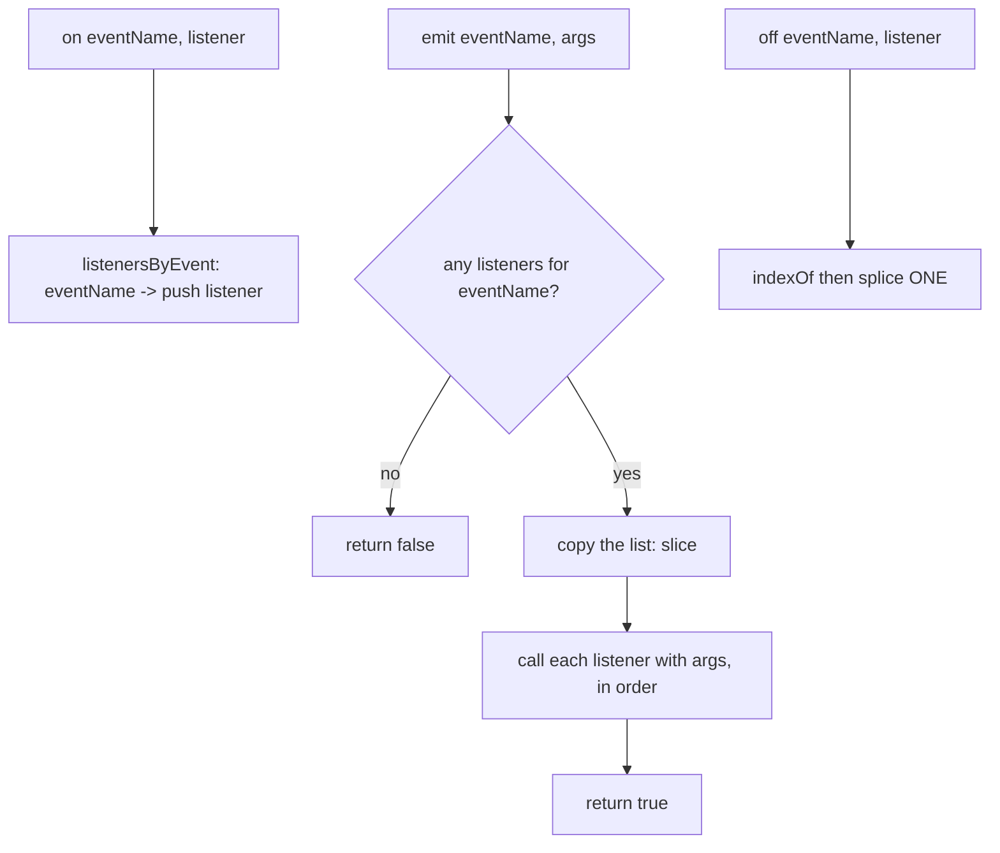

# Event emitter — a phone book of callbacks, fired by name

## TL;DR

**Is it an event emitter? Ask these — all "yes" → yes:**
1. **Does one part need to announce "this happened" without knowing who cares?** (a button, a finished upload, a created order.)
2. **Can many independent listeners react to the same announcement?** And subscribe/unsubscribe over time.
3. **Is the link by a NAME, not a direct call?** The publisher says `emit("order.created", …)`; it never holds a reference to the handlers. If one piece directly calls one known function → that's just a callback, not an emitter. **This one is the decider.**

**Before you code, pin down:** can the same listener subscribe twice (and does `off` remove one or all)? what does `emit` return (Node returns `true`/`false` for "any listeners")? need `once`? must it survive a listener that subscribes/unsubscribes *during* `emit`? sync or async dispatch?

**The lines where bugs hide** (details in *How it works*): **`emit` iterates a snapshot** (copy) of the list · **`off` removes ONE instance**, not all · **`once` removes its wrapper**, not the original.

---

## What it is
A small registry. You keep a map of `eventName → list of functions`. Three moves:
- **`on(name, fn)`** — file `fn` under `name` ("subscribe").
- **`emit(name, ...args)`** — look up everyone filed under `name` and call them with `args` ("publish").
- **`off(name, fn)`** — remove `fn` from that name ("unsubscribe").

The point is **decoupling**: the code that fires the event doesn't know who's listening, and the listeners don't know who fired it. They only share the *name*. This is the **publish/subscribe** ("pub-sub") pattern, and also the heart of the **observer** pattern.

```
ee.on("tick", x => console.log("A", x));
ee.on("tick", x => console.log("B", x));
ee.emit("tick", 1);   // logs "A 1" then "B 1", returns true
ee.off("tick", …A…);
ee.emit("tick", 2);   // logs "B 2"
ee.emit("nothing");   // returns false — no one listening
```

### Things to lock in
1. **Map of name → array of listeners.** Create the array lazily on first `on`. Order matters: listeners fire in the order they subscribed.
2. **`emit` fires over a snapshot.** Copy the list (`.slice()`) before looping, because a listener might add or remove listeners mid-fire. Loop the live array and you'll skip one or spin forever.
3. **`off` peels off one.** The same function can be registered twice; `off` should remove a single copy (`indexOf` + `splice` once), matching Node.
4. **`emit` reports if anyone heard.** Return `true` when at least one listener fired, `false` when none — handy for "did anything handle this?"

> Sibling tools: a **callback** (one fixed function you call directly) and **debounce/throttle** (control *how often* something fires). An emitter controls *who* gets called by name — see *Looks like it but ISN'T*.

## What you track
- `events` — a `Map<string, Listener[]>`: each event name points to its listeners, in subscribe order.
- (for `once`) a **wrapper** function that runs the real listener once, then removes itself.

## How it works
Pseudocode. The three ⚠️ lines are where every emitter bug hides.

```ts
const listenersByEvent = new Map<string, Function[]>(); // name → its listeners

on(eventName: string, listener: Function): this {
  const listeners = listenersByEvent.get(eventName); // current list, or undefined
  if (listeners === undefined) {
    listenersByEvent.set(eventName, [listener]);
  } else {
    listeners.push(listener);            // duplicates allowed (same listener twice)
  }
  return this;                           // chainable
}

off(eventName: string, listener: Function): this {
  const listeners = listenersByEvent.get(eventName); // current list, or undefined
  if (listeners === undefined) {
    return this;
  }
  const index = listeners.indexOf(listener); // first match, or -1
  if (index !== -1) {
    listeners.splice(index, 1);          // ⚠️ remove ONE instance, not every copy
  }
  if (listeners.length === 0) {
    listenersByEvent.delete(eventName);
  }
  return this;
}

emit(eventName: string, ...args: unknown[]): boolean {
  const listeners = listenersByEvent.get(eventName); // current list, or undefined
  if (listeners === undefined || listeners.length === 0) {
    return false;                        // nobody heard it
  }
  for (const listener of listeners.slice()) { // ⚠️ SNAPSHOT — a listener may on()/off()
    listener.apply(this, args);          //    mid-loop; looping the live array skips
  }
  return true;                           //    listeners or loops forever
}

once(eventName: string, listener: Function): this {
  const onceWrapper = (...args: unknown[]): void => { // wraps listener, self-removes
    off(eventName, onceWrapper);         // ⚠️ remove the WRAPPER (first), then run —
    listener.apply(this, args);          //    a re-emit inside listener must not fire it again
  };
  return on(eventName, onceWrapper);
}
```

Lock these in: **`emit` over `.slice()`**, **`off` splices one**, **`once` removes the wrapper before running**.

## Picture


## Where you'll meet it (practice + recognition)

**On GreatFrontEnd / coding platforms:**
- **GFE "Event Emitter"** — `on` / `off` / `emit` (this note's code).
- **GFE "Event Emitter II" / variations** — add `once`, chaining, listener counts.
- **Node's `events.EventEmitter`** — the standard-library reference this mirrors (`on`/`off`/`emit`/`once`, returns `this`).

**Real life / any stack:**
- **The DOM itself** — `addEventListener` / `removeEventListener` / `dispatchEvent` is an event emitter; so are `target.on("click", …)` wrappers.
- **A frontend app bus** — components emit `"cart:add"`, others react, without importing each other.
- **Backend domain events** — `emit("order.created", order)` → email, inventory, analytics handlers fire independently (the typed bus twin in [`solution.ts`](./solution.ts)). The backbone of event-driven architecture.
- **WebSockets / streams** — `socket.on("message", …)`, `stream.on("data", …)`.

**Looks like it but ISN'T:**
- *"call this one function when the work is done"* — a single known callback, no name lookup, no multiple subscribers → just a **callback**, not an emitter.
- *"the handler fires too often while scrolling"* — you don't need *who*, you need *how often* → [`debounce` / `throttle`](../../rate-limiting/). The tell: an emitter routes a call to N listeners **by name**; debounce/throttle gate **the rate** of a single handler.

---

Solution code (Node-style `EventEmitter` + a typed backend domain-bus twin, fully commented): [`solution.ts`](./solution.ts).
