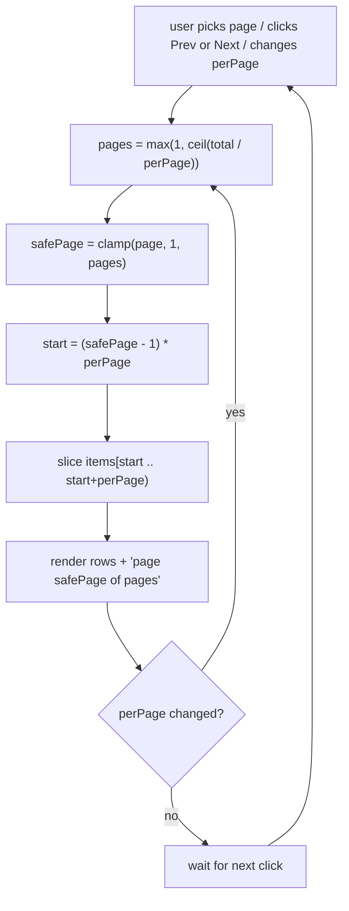
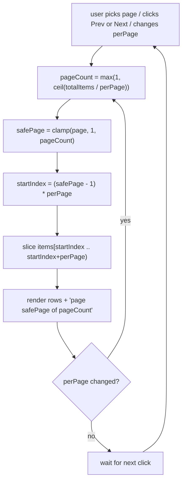

<<<<<<< HEAD
# Pagination — slice a list into fixed-size pages, clamp the page, show "X of Y"

## TL;DR

**Is it pagination? Ask these — all "yes" → yes:**
1. **Is the full list already in hand (or fetchable by page), and too long to show at once?**
2. **Do you show a fixed-size chunk at a time** — "10 per page" — rather than a growing feed?
3. **Can the user jump to a *specific* page (Prev/Next, "page 3 of 8", a page picker)?** If instead they just keep scrolling and rows *append* forever with no page number, that's **infinite scroll / cursor paging**, not this. **This one is the decider.**

**Before you code, pin down:** are pages **1-based** (page 1 is the first) or 0-based? what happens when the user **changes the page size** while deep in the list — reset to page 1, or stay as close as possible? is an **empty list** "page 1 of 1" or "0 of 0"? do Prev/Next **disable** at the ends or **wrap** around?

**The lines where bugs hide** (details in *How it works*): `ceil` not `floor` for the page count · the `(page − 1) * perPage` **off-by-one** (1-based page → 0-based index) · **re-clamp** the page on every read (so a stale page after a size change self-corrects) · guard `perPage > 0` (or you divide by zero → `Infinity` pages).

---

## What it is

You have a long list and a page size. Pagination is three tiny bits of arithmetic that
always travel together:

1. **How many pages exist** — `ceil(total / perPage)`. Round **up**: the leftover rows still
   need a page of their own.
2. **Which page are we really on** — clamp the requested page into `[1, pages]`, because a
   Prev/Next button or a `?page=` URL can ask for a page that doesn't exist.
3. **Which slice that page shows** — `items.slice((page − 1) * perPage, page * perPage)`.

A tiny worked example — **36 users, 10 per page**:

- `pages = ceil(36 / 10) = 4` — **not 3**; the last 6 users still need page 4.
- page 1 → `items[0..10)` → ids 1–10.
- page 4 → `items[30..40)` → only **6 rows** survive → ids 31–36.

### Things to lock in
1. **`ceil`, not `floor`.** Floor (or plain integer division) silently drops the final
   partial page — the last few rows become unreachable.
2. **At least 1 page.** An empty list is still "page 1 of 1", never "page 1 of **0**".
3. **Clamp both ends.** Below 1 → 1; above the last → last. Skip it and Next past the end
   gives a negative-ish start or an empty page.
4. **The `− 1` is the off-by-one.** Pages are 1-based for humans; array indexes are 0-based.
   That single `− 1` converts between them — forget it and page 1 shows nothing (you start at
   index `1 * perPage`).

## What you track
- `items` — the full list (or the slice the server returned for this page).
- `page` — the page the user asked for, **1-based**.
- `perPage` — rows per page (5 / 10 / 20…).
- `totalPages` — **derived**, never stored: `ceil(items.length / perPage)`, floored at 1.

## How it works
Pseudocode. The four ⚠️ lines are where every pagination bug hides — the rest is wiring.

```
function totalPages(total, perPage):
    if perPage <= 0: return 1          // ⚠️ guard: perPage 0 → total/0 → Infinity pages
    return max(1, ceil(total / perPage)) // ⚠️ ceil (partial page counts) + floor at 1
                                         //    (empty list still reads "1 of 1")

function paginate(items, page, perPage):
    pages    = totalPages(items.length, perPage)
    safePage = min(max(page, 1), pages)  // ⚠️ clamp BOTH ends — Prev past 1 / Next past last
                                         //    must not slice off the list. Re-clamping here,
                                         //    every call, is what fixes the "perPage changed
                                         //    and my page is now out of range" bug.
    start    = (safePage - 1) * perPage  // ⚠️ 1-based page → 0-based index. The "- 1" is THE
                                         //    off-by-one: drop it and page 1 skips the first
                                         //    `perPage` rows.
    return items.slice(start, start + perPage)
```

Lock these in: **`ceil` + floor-at-1** for the count, **clamp both ends every read**, and the
**`(page − 1) * perPage`** start. (Same math powers a backend `OFFSET (page−1)*perPage LIMIT
perPage` — see [`solution.ts`](./solution.ts).)

## Picture


## Where you'll meet it (practice + recognition)

**On GreatFrontEnd / coding platforms:**
- **GFE "Data Table"** — this note's exact problem: a paginated table with Prev/Next, "page X
  of Y", and a rows-per-page selector. The component is [`DataTable.tsx`](./DataTable.tsx).
- **GFE "Data Table II / III"** — the same base plus sorting and row selection layered on top;
  the pagination core is unchanged.

**Real life / any stack:**
- **REST `?page=&perPage=` / SQL `OFFSET … LIMIT …`** — the backend twin in
  [`solution.ts`](./solution.ts). `offset = (page − 1) * perPage` is the identical arithmetic.
- **Table libraries** — TanStack Table's `pageIndex` / `pageSize` model is this primitive with
  a nicer API; knowing the math tells you what its `pageCount` is doing.
- **"Showing 21–30 of 36"** labels — `start + 1` to `min(start + perPage, total)`.

**Looks like it but ISN'T:** *"load more posts as the user scrolls, forever"* — rows **append**
instead of **replacing**, there's no total page count, and you track a **cursor** (the id of
the last row seen) rather than a page number. That's **infinite scroll / cursor pagination**.
The tell: **can the user jump straight to page 7?** Offset/page pagination → yes; cursor/infinite
scroll → no, you can only go one step further from where you are.

---

Solution code — the pure pagination primitive (with a SQL `OFFSET/LIMIT` twin) and a runnable
self-check: [`solution.ts`](./solution.ts). The full React component: [`DataTable.tsx`](./DataTable.tsx).
||||||| 2e57a2d
=======
# Pagination — slice a list into fixed-size pages, clamp the page, show "X of Y"

## TL;DR

**Is it pagination? Ask these — all "yes" → yes:**
1. **Is the full list already in hand (or fetchable by page), and too long to show at once?**
2. **Do you show a fixed-size chunk at a time** — "10 per page" — rather than a growing feed?
3. **Can the user jump to a *specific* page (Prev/Next, "page 3 of 8", a page picker)?** If instead they just keep scrolling and rows *append* forever with no page number, that's **infinite scroll / cursor paging**, not this. **This one is the decider.**

**Before you code, pin down:** are pages **1-based** (page 1 is the first) or 0-based? what happens when the user **changes the page size** while deep in the list — reset to page 1, or stay as close as possible? is an **empty list** "page 1 of 1" or "0 of 0"? do Prev/Next **disable** at the ends or **wrap** around?

**The lines where bugs hide** (details in *How it works*): `ceil` not `floor` for the page count · the `(page − 1) * perPage` **off-by-one** (1-based page → 0-based index) · **re-clamp** the page on every read (so a stale page after a size change self-corrects) · guard `perPage > 0` (or you divide by zero → `Infinity` pages).

---

## What it is

You have a long list and a page size. Pagination is three tiny bits of arithmetic that
always travel together:

1. **How many pages exist** — `ceil(total / perPage)`. Round **up**: the leftover rows still
   need a page of their own.
2. **Which page are we really on** — clamp the requested page into `[1, pages]`, because a
   Prev/Next button or a `?page=` URL can ask for a page that doesn't exist.
3. **Which slice that page shows** — `items.slice((page − 1) * perPage, page * perPage)`.

A tiny worked example — **36 users, 10 per page**:

- `pages = ceil(36 / 10) = 4` — **not 3**; the last 6 users still need page 4.
- page 1 → `items[0..10)` → ids 1–10.
- page 4 → `items[30..40)` → only **6 rows** survive → ids 31–36.

### Things to lock in
1. **`ceil`, not `floor`.** Floor (or plain integer division) silently drops the final
   partial page — the last few rows become unreachable.
2. **At least 1 page.** An empty list is still "page 1 of 1", never "page 1 of **0**".
3. **Clamp both ends.** Below 1 → 1; above the last → last. Skip it and Next past the end
   gives a negative-ish start or an empty page.
4. **The `− 1` is the off-by-one.** Pages are 1-based for humans; array indexes are 0-based.
   That single `− 1` converts between them — forget it and page 1 shows nothing (you start at
   index `1 * perPage`).

## What you track
- `items` — the full list (or the slice the server returned for this page).
- `page` — the page the user asked for, **1-based**.
- `perPage` — rows per page (5 / 10 / 20…).
- `totalPages` — **derived**, never stored: `ceil(items.length / perPage)`, floored at 1.

## How it works
Pseudocode. The four ⚠️ lines are where every pagination bug hides — the rest is wiring.

```ts
function totalPages(totalItems: number, perPage: number): number {
  if (perPage <= 0) {                      // perPage the user picked (5 / 10 / 20…)
    return 1;                              // ⚠️ guard: perPage 0 → totalItems/0 → Infinity pages
  }
  const pageCount = Math.max(1, Math.ceil(totalItems / perPage)); // how many pages exist
                                           // ⚠️ ceil (partial page counts) + floor at 1
                                           //    (empty list still reads "1 of 1")
  return pageCount;
}

function paginate<T>(items: readonly T[], page: number, perPage: number): T[] {
  const pageCount = totalPages(items.length, perPage);          // last valid page number
  const safePage = Math.min(Math.max(page, 1), pageCount);      // requested page pulled into [1, pageCount]
                                           // ⚠️ clamp BOTH ends — Prev past 1 / Next past last
                                           //    must not slice off the list. Re-clamping here,
                                           //    every call, is what fixes the "perPage changed
                                           //    and my page is now out of range" bug.
  const startIndex = (safePage - 1) * perPage;                 // 0-based index where this page begins
                                           // ⚠️ 1-based page → 0-based index. The "- 1" is THE
                                           //    off-by-one: drop it and page 1 skips the first
                                           //    `perPage` rows.
  return items.slice(startIndex, startIndex + perPage);
}
```

Lock these in: **`ceil` + floor-at-1** for the count, **clamp both ends every read**, and the
**`(page − 1) * perPage`** start. (Same math powers a backend `OFFSET (page−1)*perPage LIMIT
perPage` — see [`solution.ts`](./solution.ts).)

## Picture


## Where you'll meet it (practice + recognition)

**On GreatFrontEnd / coding platforms:**
- **GFE "Data Table"** — this note's exact problem: a paginated table with Prev/Next, "page X
  of Y", and a rows-per-page selector. The component is [`DataTable.tsx`](./DataTable.tsx).
- **GFE "Data Table II / III"** — the same base plus sorting and row selection layered on top;
  the pagination core is unchanged.

**Real life / any stack:**
- **REST `?page=&perPage=` / SQL `OFFSET … LIMIT …`** — the backend twin in
  [`solution.ts`](./solution.ts). `offset = (page − 1) * perPage` is the identical arithmetic.
- **Table libraries** — TanStack Table's `pageIndex` / `pageSize` model is this primitive with
  a nicer API; knowing the math tells you what its `pageCount` is doing.
- **"Showing 21–30 of 36"** labels — `start + 1` to `min(start + perPage, total)`.

**Looks like it but ISN'T:** *"load more posts as the user scrolls, forever"* — rows **append**
instead of **replacing**, there's no total page count, and you track a **cursor** (the id of
the last row seen) rather than a page number. That's **infinite scroll / cursor pagination**.
The tell: **can the user jump straight to page 7?** Offset/page pagination → yes; cursor/infinite
scroll → no, you can only go one step further from where you are.

---

Solution code — the pure pagination primitive (with a SQL `OFFSET/LIMIT` twin) and a runnable
self-check: [`solution.ts`](./solution.ts). The full React component: [`DataTable.tsx`](./DataTable.tsx).
>>>>>>> origin/main
