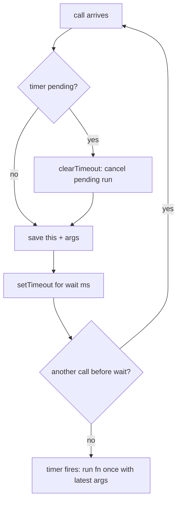

# Debounce — wait until the calls stop, then fire once

## TL;DR

**Is it debounce? Ask these — all "yes" → yes:**
1. **Are calls arriving in rapid bursts?** (keystrokes, resize events, rapid clicks.)
2. **Do I only care about the FINAL state, once things settle?** The middle calls are throwaway.
3. **Is it fine to wait for quiet before doing the work?** If the work must happen *during* the burst at a steady rate → that's **throttle**, not debounce. **This one is the decider.**

**Before you code, pin down:** how long is "quiet" (the `wait` ms)? fire on the **trailing** edge (after the burst — default) or the **leading** edge (on the first call)? does it need `cancel()` / `flush()`? must `this` survive (used as a method)?

**The lines where bugs hide** (details in *How it works*): the timer handle living **in the closure** (not inside the call) · `clearTimeout` **first, every call** · firing with the **captured `this` + latest args**.

---

## What it is
You wrap a function. Instead of running it every time it's called, the wrapper says
"hang on — I'll run you only once the calls **stop** for a bit." Every fresh call
**cancels** the one waiting and starts the clock over. So a storm of calls collapses
into a single run at the end.

The mental image: an elevator that waits a few seconds after the last person presses
a button before it actually moves. Keep pressing → it keeps waiting → one trip.

`wait = 100ms`, calls come in at `0ms, 40ms, 90ms`:
- `0ms`: set a timer for `100ms`.
- `40ms`: cancel that, set a new timer for `140ms`.
- `90ms`: cancel that, set a new timer for `190ms`.
- nothing else arrives → at `190ms` the function finally runs, **once**, with the args from the `90ms` call.

### Things to lock in
1. **One shared timer.** It lives in the closure so the *next* call can cancel the *previous* one. Declare it inside the call and every call gets its own timer — nothing ever gets cancelled.
2. **Cancel-then-reset is the whole trick.** Clear the pending timer, then start a new one. Forget the clear and the function fires every single call — you've debounced nothing.
3. **Trailing vs leading.** Trailing (default) fires at the *end* of the burst. Leading fires on the *first* call and ignores the rest. Same machinery, different `when`.
4. **Keep `this` and the latest args.** Save them and call `fn.apply(savedThis, args)`, so it still works as an object method and fires with the freshest input.

> Sibling: `throttle` (same folder). Both tame a flood of calls. Debounce = "fire once
> after it goes quiet." Throttle = "fire at a steady rate *while* it's loud." See
> *Looks like it but ISN'T* below.

## What you track
- `timer` — the one pending timeout handle, kept in the closure. `null` means "nothing scheduled."
- `savedThis`, `args` — the receiver and arguments of the **most recent** call, so the eventual run uses the latest input.

## How it works
Pseudocode. The three ⚠️ lines are where every debounce bug hides — the rest is wiring.

```
timer = null                         // ⚠️ declared in the CLOSURE, outside the returned
                                     //    function. Inside it, each call makes its own
                                     //    timer and nothing ever gets cancelled.

return function(...args):
    if timer is not null:
        clearTimeout(timer)          // ⚠️ cancel the pending run FIRST, every call.
                                     //    Skip this and the fn fires on EVERY call —
                                     //    no debounce at all.

    savedThis = this                 // ⚠️ capture `this` (+ args). Fire later with
                                     //    fn.apply(savedThis, args) so it works as a
                                     //    method and uses the LATEST arguments.

    timer = setTimeout(():
        timer = null                 // window's done — mark idle so the next burst is fresh
        fn.apply(savedThis, args)    // the single, trailing-edge run
    , wait)
```

Lock these in: **timer in the closure**, **clearTimeout first**, **fire with captured `this` + latest args**. (Leading-edge variant: fire *before* setting the timer, only when no timer was pending — see [`solution.ts`](./solution.ts).)

## Picture


## Where you'll meet it (practice + recognition)

**On GreatFrontEnd / coding platforms:**
- **GFE "Debounce"** — the classic trailing-edge version (this note's code).
- **GFE "Debounce II"** — add `cancel()` (drop the pending call) and sometimes leading-edge options.
- **Lodash `_.debounce`** — the production reference: `leading`, `trailing`, and `maxWait` options.

**Real life / any stack:**
- **Search-as-you-type** — wait until the user stops typing before hitting the API. The #1 use.
- **Autosave** — save the draft a beat after the last keystroke, not on every one.
- **Window `resize` / `scroll` end** — recompute layout once the user finishes, not 60×/sec.
- **Backend file-watch reload** — one editor save fires several `fs` "change" events; debounce to reload config once (the far-apart twin in [`solution.ts`](./solution.ts)).

**Looks like it but ISN'T:** *"update the scroll position indicator smoothly while the user scrolls"* — you need steady updates *during* the burst, not one at the end, so that's [`throttle`](../throttle/README.md). The tell: **throttle fires during the burst at a fixed rate; debounce fires once after it ends.** If dropping the in-between calls would feel laggy/frozen, you want throttle.

---

Solution code (trailing + leading debounce, plus a backend file-watch twin, fully commented): [`solution.ts`](./solution.ts).
