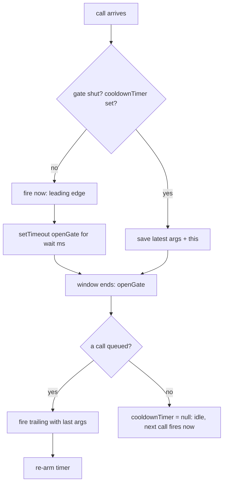

# Throttle — fire at most once per window, at a steady rate

## TL;DR

**Is it throttle? Ask these — all "yes" → yes:**
1. **Are calls arriving in rapid bursts?** (scroll, mousemove, drag, a flood of requests.)
2. **Do I want to keep reacting *during* the burst, not just at the end?** The user should see steady progress.
3. **But running on every call is too much?** Once per `wait` ms is enough. If you only care about the final state after things settle → that's **debounce**, not throttle. **This one is the decider.**

**Before you code, pin down:** what's the minimum gap between runs (`wait` ms)? do you need the **leading** fire (run immediately on the first call), the **trailing** fire (flush the last call at window's end), or both? must `this` survive (used as a method)?

**The lines where bugs hide** (details in *How it works*): the cooldown flag (the **timer handle**) gating the leading fire · **saving the last call's args** to flush at window end · **re-arming** the timer when a trailing call fires.

---

## What it is
You wrap a function so it runs **at most once every `wait` ms**, no matter how often
it's called. The first call fires right away, then the gate closes for `wait` ms.
Calls that arrive while the gate is shut don't fire immediately — but the **last** one
is remembered and fired when the gate reopens, so the final state isn't lost.

The mental image: a turnstile that lets one person through, then locks for a few
seconds. People keep arriving; only one gets through per cycle — but the most recent
arrival is the one who goes next.

`wait = 100ms`, calls at `0ms, 30ms, 60ms, 200ms`:
- `0ms`: gate open → **fire** (args@0). Close gate for `100ms`.
- `30ms`, `60ms`: gate shut → remember args (now args@60).
- `100ms`: gate reopens, a call is pending → **fire** (args@60), reopen window.
- `200ms`: idle again → **fire** (args@200).

### Things to lock in
1. **The timer handle is your cooldown flag.** Set = in the window (shut gate). `null` = idle, next call fires immediately.
2. **Leading fire is immediate.** The first call after idle runs *now*, then closes the gate. That's what makes throttle feel responsive (vs debounce's wait).
3. **Save the LAST call during the window.** Flush its args when the window ends. Skip this and you **drop the final call** — a scroll/drag never lands on its true end position. The classic throttle bug.
4. **Keep `this` and args.** Same as debounce: `fn.apply(savedThis, args)` so methods and the latest input both work.

> Sibling: `debounce` (same folder). Both tame a flood. Throttle = "steady rate *while*
> it's loud." Debounce = "once, *after* it goes quiet." See *Looks like it but ISN'T*.

## What you track
- `timer` — the cooldown handle. Non-null = inside a window; `null` = idle.
- `lastArgs`, `lastThis` — the most recent call that arrived *during* the window, to flush at its end (`null` = nothing queued).

## How it works
Pseudocode. The three ⚠️ lines are where every throttle bug hides.

```ts
let cooldownTimer = null;                   // the cooldown handle; null = idle (gate open)
let pendingArgs = null;                      // args of a call that arrived during cooldown
let pendingThis = null;                      // `this` of that pending call

function openGate() {                         // runs when a window ends
  if (pendingArgs !== null) {                 // a call was queued during the window
    callback.apply(pendingThis, pendingArgs); // ⚠️ TRAILING fire — flush the saved call.
    pendingArgs = null;
    cooldownTimer = setTimeout(openGate, wait); // ⚠️ RE-ARM: the trailing fire opens its
                                              //    own window, so a steady burst keeps cadence
  } else {
    cooldownTimer = null;                     // truly idle — next call fires immediately
  }
}

return function (...args) {
  if (cooldownTimer !== null) {               // gate shut → don't fire, just remember the latest
    pendingArgs = args;                       // ⚠️ keep ONLY the last call. Drop this and the
    pendingThis = this;                       //    final scroll/drag position is lost.
    return;
  }
  callback.apply(this, args);                 // LEADING edge — fire now
  cooldownTimer = setTimeout(openGate, wait); // close the gate for `wait` ms
};
```

Lock these in: **timer = cooldown flag**, **save last args for the trailing flush**, **re-arm on the trailing fire**. (Leading-only throttle drops the trailing flush — simpler, but loses the final call.)

## Picture


## Where you'll meet it (practice + recognition)

**On GreatFrontEnd / coding platforms:**
- **GFE "Throttle"** — leading-edge version (the simplest form).
- **GFE "Throttle II / with options"** — add `leading` / `trailing` flags, like Lodash.
- **Lodash `_.throttle`** — the production reference: `leading`, `trailing` options on top of the same idea.

**Real life / any stack:**
- **Scroll / mousemove / drag handlers** — run the layout or position math ~once per frame, not on every pixel event.
- **Infinite scroll** — check "near the bottom?" at a steady rate while scrolling.
- **Window `resize`** — redraw a chart a few times per second, not hundreds.
- **Outbound API rate-limit** — at most one request per window to a flaky third party; latest intent wins (the far-apart backend twin in [`solution.ts`](./solution.ts)).
- **Game loop / analytics sampling** — cap event frequency under a flood.

**Looks like it but ISN'T:** *"hit the search API once the user stops typing"* — you want a single call *after* the burst ends, with nothing during it, so that's [`debounce`](../debounce/README.md). The tell: **debounce waits for quiet then fires once; throttle fires during the burst at a fixed cadence.** If firing mid-burst would waste calls (every keystroke = a request), you want debounce.

---

Solution code (leading + trailing throttle, plus a backend API rate-limit twin, fully commented): [`solution.ts`](./solution.ts).
