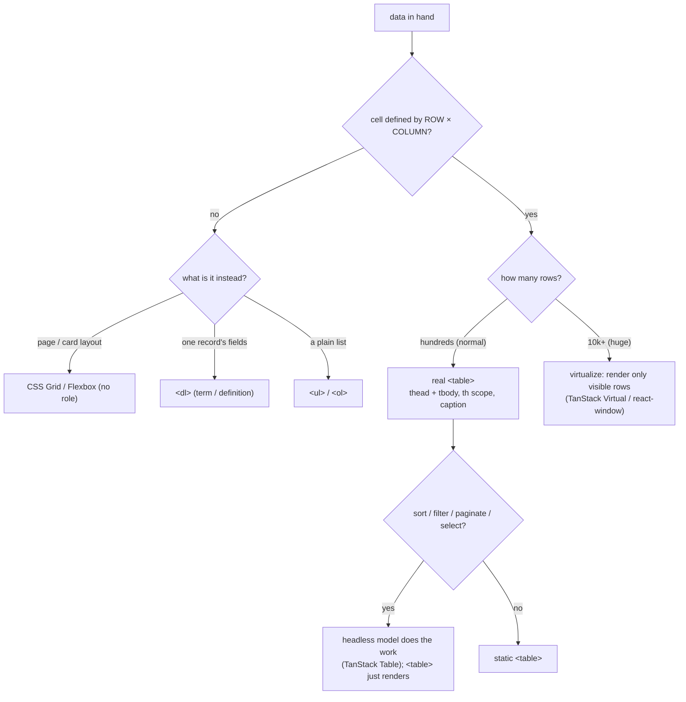

# HTML tables — when data needs a real `<table>`, and the gotchas of rendering one

> **Overview note for the `frontend/tables/` family.** The builds in here (e.g.
> [`popular-timeslots`](./popular-timeslots/)) each own an *algorithm* — how to reshape the
> data. This note owns the thing they share: the **rendering substrate**. Read it once, then
> each child note can stay focused on its trick.

## TL;DR

**Is it a real `<table>`? Ask these — all "yes" → yes:**
1. **Is the data a *grid*** — rows and columns, not a single list or a page layout?
2. **Does each cell's *meaning* depend on its headers** — you'd read a cell as "_this column_,
   _this row_" ("Monday, 18:00", "Q3, Revenue")?
3. **Would a blind user need the header announced with each cell** to make sense of it? If the
   cells are independent (a gallery of cards, a nav bar, a single record's fields) and no cell
   is defined by a row×column pair, it's **not** a table — it's a layout (CSS Grid) or a list.
   **This one is the decider.**

**Before you build, pin down:** which axis carries the **headers** — columns only, rows only,
or both? does the header **stick** when the body scrolls? are column widths **fixed** (fast,
predictable) or **auto** (sized to content)? how many rows — does it need **virtualization**?
what does an **empty cell** show? is it **sortable / paginated / selectable** (then the data
model, not the markup, is the real work)?

**The lines where bugs hide** (details in *How it works*): a header cell is `<th scope>`, a data
cell is `<td>` — mixing them silently kills accessibility · the browser **injects `<tbody>`**
you didn't write, so `table > tr` CSS never matches · stray text/elements inside `<table>` but
outside a cell get **foster-parented** (yanked out *before* the table) · `border-collapse:
collapse` **breaks `position: sticky`** headers (the border stays behind) · `table-layout: auto`
**reads every row** to size columns (slow + columns jump as data loads) · `colspan`/`rowspan`
must add up per row or the grid tears.

---

## What it is

A `<table>` is for **two-dimensional data**: a value sits at the crossing of a column and a row,
and you can't understand it without both. "18:00 on Monday." "Revenue in Q3." The element family
encodes that relationship so browsers, screen readers, and `Ctrl+F` all treat it as a grid — not
just boxes that happen to line up.

Tiny worked example — a 2×2 schedule. The markup *names* the relationship:

```html
<table>
  <caption>Office hours</caption>            <!-- the table's accessible title -->
  <thead>
    <tr><th></th><th scope="col">Mon</th><th scope="col">Tue</th></tr>
  </thead>
  <tbody>
    <tr><th scope="row">AM</th><td>9:00</td><td>10:00</td></tr>
    <tr><th scope="row">PM</th><td>—</td>   <td>16:00</td></tr>
  </tbody>
</table>
```

A screen reader on the `16:00` cell announces **"Tue, PM, 16:00"** — because `scope` told it
which `<th>` owns that column and which owns that row. Strip the `scope`s (or use `<td>` for the
headers) and it just reads "16:00" with no context — the table is visually fine but meaningless
to assistive tech.

### The contrast worth memorizing (it's in this folder's code)

`popular-timeslots` renders the **same data two ways**, and only one is a `<table>`:

- **View 1 — "popular times per day":** a flex row of `<ul>` lists, one per day. The days are
  **independent columns**; row 2 of Monday has nothing to do with row 2 of Tuesday. No
  cross-column relationship → **not a table** (a table would force a fake alignment).
- **View 2 — "the schedule grid":** every distinct time is a row, every day a column, each cell =
  (this time) × (this day). The relationship is real → **a `<table>`**.

That's the whole recognition test in one component: *is a cell defined by its row **and** its
column?*

## What you track (the parts)

| Element | Plain job | Watch out |
|---|---|---|
| `<table>` | the grid root | only table-structural children allowed inside (see foster-parenting) |
| `<caption>` | the table's title, announced first | **must be the first child** |
| `<thead>` / `<tbody>` / `<tfoot>` | row groups (header / body / summary) | omit `<tbody>` and the browser **adds one anyway** |
| `<colgroup>` / `<col>` | style/size **whole columns** at once | only a few props work (`width`, `background`, `border`) |
| `<tr>` | one row | can't take a `width` — size columns on `<col>`/cells |
| `<th scope="col\|row">` | a **header** cell | `scope` is what wires it to its column/row for screen readers |
| `<td>` | a **data** cell | this is the default — never use it for a header |
| `colspan` / `rowspan` | merge a cell across columns / rows | the counts must stay consistent per row or the grid tears |
| `headers="id…"` + `<th id>` | **explicit** cell→header link for irregular tables | only reach for it when `scope` can't express the layout |

## How it works

Markup, not pseudocode — but the bug lines are the same idea: a ⚠️ on each thing that silently
breaks. The first block is the skeleton; the comments are the traps.

```html
<table>                                <!-- ⚠️ FOSTER-PARENTING: any non-table content placed
                                            directly in <table>/<tr> (a stray string, a <div>)
                                            is yanked OUT and rendered just BEFORE the table.
                                            Your text vanishes from the grid. Keep everything
                                            inside a <td>/<th>. -->
  <caption>…</caption>                 <!-- ⚠️ must be the FIRST child or it's invalid -->
  <thead>
    <tr>
      <th scope="col">Day</th>         <!-- ⚠️ HEADER cell = <th scope>. Using <td>, or
                                            forgetting scope, leaves screen readers with no
                                            header to announce → data reads as a wall of values -->
    </tr>
  </thead>
  <tbody>                              <!-- ⚠️ write <table><tr> with NO <tbody> and the parser
                                            INSERTS one. Then `table > tr {}` selects nothing,
                                            and React warns. Always write <tbody> yourself -->
    <tr>
      <td>—</td>                       <!-- a present-but-empty cell: show a placeholder so it
                                            doesn't look broken; SR announces it as "empty" -->
    </tr>
  </tbody>
</table>
```

And the CSS, where the real gotchas live:

```css
.schedule {
  border-collapse: collapse;   /* ⚠️ collapses doubled borders into one (no border-spacing).
                                  BUT collapsed borders DON'T travel with a sticky header —
                                  the top border is left behind when <thead> sticks. If you
                                  need a sticky header, use `separate` + a box-shadow divider. */
  table-layout: auto;          /* ⚠️ DEFAULT. Browser reads EVERY row to size columns → slow on
                                  big tables, and columns visibly jump as data streams in.
                                  Switch to `fixed` + explicit <col> widths for speed and
                                  stable columns (overflow then truncates instead of reflowing). */
  width: 100%;
}
.schedule thead th {
  position: sticky; top: 0;    /* ⚠️ needs a scrolling ancestor AND the border-collapse fix
                                  above, or the header detaches from its underline on scroll. */
}
td { font-variant-numeric: tabular-nums; } /* digits same width → numbers line up in columns */
```

Recap of the bug lines: **`<th scope>` for headers, write your own `<tbody>`, keep all content
inside cells, `collapse` borders fight sticky headers, and `auto` layout reads the whole table.**

## Picture



## Gotchas, in depth (the part interviewers probe)

- **Foster parenting.** The HTML parser only allows table-structural elements inside `<table>`.
  Put a stray text node or a `<div>` directly in a `<table>`/`<tr>` and it's *moved out* of the
  table, rendered immediately before it. Symptom: "my label appears above the table, not in it."
  Fix: everything visible lives in a `<td>`/`<th>`.
- **The phantom `<tbody>`.** `<table><tr>…` in the DOM becomes `<table><tbody><tr>…`. Your
  `table > tr` selector matches nothing, and React/JSX logs a hydration warning. Always author
  `<tbody>` explicitly.
- **`border-collapse` vs sticky headers.** `collapse` (one shared border, no `border-spacing`) is
  what most data tables want visually — but a collapsed top border belongs to the table, not the
  cell, so it doesn't stick with `position: sticky` `<thead>`. Use `border-collapse: separate` and
  draw the header's underline with `box-shadow: inset 0 -1px …` (a shadow moves with the element).
- **`table-layout`.** `auto` (default) sizes columns to their widest content — which means the
  browser must measure **every** row before it can paint, and columns reflow as async data
  arrives. `fixed` takes widths from the first row (or `<col>`), paints immediately, and is the
  right call for large or streaming tables; the trade is that overflow truncates instead of
  widening the column.
- **Column sizing.** You can't set `width` on `<tr>` or `<tbody>`. Size columns via `<col>` in a
  `<colgroup>`, or on the `<th>`/`<td>`, or via `table-layout: fixed`.
- **Responsive.** A wide table on a phone has two sane answers: wrap it in a
  `overflow-x: auto` box (horizontal scroll, headers intact) — the safe default — or, at a small
  breakpoint, restyle each `<tr>` into a stacked card with `td::before { content: attr(data-label) }`
  showing the column name. Never just shrink the font into illegibility.
- **`colspan`/`rowspan` accounting.** A merged cell still "occupies" the grid slots it spans; the
  next row must account for a `rowspan` cell hanging into it. Miscount and the table visibly tears
  or screen-reader navigation desyncs. Keep it simple; reach for `headers`/`id` if the header
  layout is genuinely irregular.

## Alternatives (when a `<table>` is the wrong tool)

| Instead of a table, use… | When |
|---|---|
| **CSS Grid / Flexbox** (plain `<div>`s) | **page or component layout**, card galleries, anything where cells don't share a row×column meaning. Using a `<table>` for layout breaks source order, screen readers, and responsiveness — the cardinal HTML sin. |
| **`<dl>` / `<dt>` / `<dd>`** | a **single record's** key→value fields ("Name: …, Email: …"). It's a description list, not a grid. |
| **`<ul>` / `<ol>`** | a **list** of items with no columns. |
| **`role="table"` on `<div>`s** | you need a real grid's *semantics* but a layout `<table>` can't do (e.g. virtualized or expandable rows where rows must be positioned/flex). You then re-add **every** role by hand — `role="row"`, `columnheader`, `cell`, plus `aria-rowcount`/`aria-colindex`. Powerful but easy to get wrong; use only when a true `<table>` genuinely can't. |
| **Virtualization** (TanStack Virtual, react-window) | **10k+ rows.** Render only the rows in view. A `<table>` resists this (positioning rows breaks table layout), so virtualized grids usually go `display: block`/grid on the parts + roles, or use a library. |
| **Headless table libs** (TanStack Table) / full grids (AG Grid) | requirements stack up — **sort + filter + paginate + select + resize + group.** Headless gives you the *model* and you render the markup; full grids give you everything (and the weight). The algorithms in this folder are exactly what those libs do for you — worth knowing by hand first. |

## Where you'll meet it (practice + recognition)

**On GreatFrontEnd / coding platforms:**
- **"Data Table" / "Data Table II–III"** — a `<table>` plus pagination, then sorting and row
  selection. The pagination math is its own note: [`../pagination/data-table`](../pagination/data-table/).
- **"Popular Timeslots"** — the two-view contrast above (list vs grid).
  [`./popular-timeslots`](./popular-timeslots/) — the reshaping algorithm is **pivot / group-by**.
- **"Transfer List", "Like Button", pricing/comparison grids** — anything tabular.

**Real life / any stack:** an admin dashboard's records grid, a spreadsheet, a CSV preview, a
financials/pricing comparison, a calendar week view. The moment you see "header row + header
column + cells that mean nothing without both," it's a `<table>`.

**Looks like it but ISN'T:** a **CSS-Grid card layout** lines up in rows and columns too, but each
card is self-contained — no cell is read as "row × column." The tell: **could a screen-reader user
lose meaning if the row/column header weren't announced with the cell?** Yes → `<table>`. No →
plain Grid/Flex, no table roles.

---

## Builds in this family

| Build | Renders | Leans on (algorithm) |
|---|---|---|
| [`popular-timeslots`](./popular-timeslots/) | a per-day list **and** a day×time grid | **pivot / group-by** — flat `{dow, time}` rows → 2D grid |

Related, kept under `pagination/` because the *trick* is the slicing math, not the markup:
[`../pagination/data-table`](../pagination/data-table/) — the same `<table>` substrate + **pagination**.
