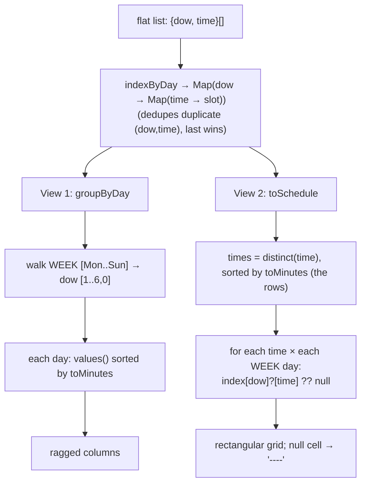

# Pivot / group-by — reshape a flat list of `{day, time}` rows into a day × time grid

## TL;DR

**Is it a pivot? Ask these — all "yes" → yes:**
1. **Do you have a *flat* list where each row carries two keys** — a row key and a column key (here `{dow, time}`)?
2. **Do you want it laid out as a 2D table** — one key becomes the columns, the other the rows?
3. **Must the grid stay *rectangular*** — every column×row cell exists, with a **blank/placeholder** where no row matches? If instead you only ever list what's present per group (ragged columns, no blanks), that's plain **group-by**, not a full pivot. **This one is the decider.**

**Before you code, pin down:** **column order** — is it the raw key order, or a *fixed* display order (Monday-first) while the data numbers days 0=Sunday? how do you **sort** along each axis — time as **minutes**, not as a string? what does a **missing cell** show — `"----"` / `null`? can the **same `(row, col)` appear twice** (duplicate input) — and do both views treat it the same? is there a **highlight** flag (`isTopTime`) to carry through?

**The lines where bugs hide** (details in *How it works*): the **day remap** — iterate a fixed `[Mon..Sun] → dow [1,2,3,4,5,6,0]`, **never** `0..6`, or Sunday's column shows Monday's data · **sort times numerically** (minutes since midnight) — lexical only works by luck on zero-padded `"HH:MM"`; `"9:00"` would sort *after* `"10:00"` · **build a `Map`/`Set` index once** for O(1) cell lookup — a `list.find(...)` per cell is O(rows·cols·n) · **rows = the *union* of distinct times** (dedupe across days) · **a gap is a placeholder, not a skipped cell** — the grid must stay rectangular · build **both views from one shared index** so a duplicate `(day,time)` collapses the same way in each.

---

## What it is

**Group-by** buckets a flat list by one key — "all of Monday's slots together." A **pivot**
goes one step further: pick a *row* key and a *column* key, and drop every record into the
grid cell `(row, col)`. Cells with no record stay **blank**, so the table is rectangular.

Two views fall out of the same data:

- **View 1 (group-by):** one column per day, that day's times listed under it. Columns are
  **ragged** — different days have different counts.
- **View 2 (pivot):** every distinct time is a **row**, every day a **column**; a cell shows
  the time if that day has it, else `"----"`.

A tiny worked example — 3 rows: `{Mon, 14:00}`, `{Tue, 16:00}`, `{Mon, 15:00}`:

```
group-by →  Mon: [14:00, 15:00]   Tue: [16:00]          (ragged)

pivot    →  rows = [14:00, 15:00, 16:00]  (union, sorted)
                       Mon     Tue
             14:00    14:00    ----
             15:00    15:00    ----
             16:00    ----     16:00
```

### Things to lock in
1. **Fixed column order ≠ data order.** The data tags days `0=Sun … 6=Sat`, but the UI shows
   **Monday first**. Iterate a fixed `WEEK` list → `dow [1,2,3,4,5,6,0]`. Loop `0..6` and every
   column is shifted a day.
2. **Sort by minutes, not by string.** `"08:00" < "10:00"` lexically *happens* to be right only
   because the hours are zero-padded to two digits. Parse to minutes (`toMinutes`) and the bug
   can't exist.
3. **Index once, look up O(1).** Build `Map<dow, Map<time, slot>>` up front; then each of the
   `rows × cols` cells is a hash lookup. `find` per cell is the quadratic-pivot trap.
4. **Rows are the union.** Collect distinct times across *all* days into a `Set`, sort once.
5. **Gaps are real cells.** A missing `(day, time)` renders `"----"` (value `null`), never a
   skipped `<td>` — otherwise rows misalign.

> **Built on:** [group-by](../../../techniques/hashing/grouping/) — bucketing the flat list by a
> key (here `dow`) is step one. Pivot adds step two: place each bucket into a *rectangular* grid
> with blanks for the gaps. Group-by alone is ragged; the grid is what makes it a pivot.

## What you track
- `index` — `Map<dow, Map<time, slot>>`: the shared "does day D have time T?" lookup. Keying on
  `time` also **dedupes** a repeated `(dow, time)` (last write wins).
- `times` — the **union** of distinct times across all days, sorted ascending → the grid's rows.
- `WEEK_DISPLAY_ORDER` — the fixed Monday-first list mapping each `label` to its data `dow`.
- per view: ragged `DayColumn[]` (view 1) or the rectangular `rows: ScheduleCell[][]` (view 2).

## How it works
Pseudocode (TypeScript). The ⚠️ lines are where every pivot bug hides — the rest is wiring.

```ts
const WEEK = [                              // ⚠️ fixed display order; dow 0 = Sun is LAST
  { dow: 1, label: "Monday" }, /* … */ { dow: 0, label: "Sunday" },
];

function toMinutes(time: string): number {  // ⚠️ sort key — numeric, never string
  const [hours, minutes] = time.split(":"); //    (as text "9:00" sorts AFTER "10:00")
  return Number(hours) * 60 + Number(minutes);
}

function indexByDay(slots: TimeSlot[]): Map<number, Map<string, TimeSlot>> {
  const index = new Map<number, Map<string, TimeSlot>>();
  for (const slot of slots) {
    const day = index.get(slot.dow) ?? new Map<string, TimeSlot>();
    day.set(slot.time, slot);               // ⚠️ keyed by time → duplicate (dow,time) last-wins
    index.set(slot.dow, day);               //    both views share this, so they agree
  }
  return index;
}

function groupByDay(slots: TimeSlot[]): DayColumn[] {     // VIEW 1 — ragged columns
  const index = indexByDay(slots);
  return WEEK.map(({ dow, label }) => ({                  // ⚠️ map over WEEK, not 0..6 (day remap)
    dow,
    label,
    slots: [...(index.get(dow)?.values() ?? [])]          // ⚠️ empty day → [] (no crash)
      .sort((slotA, slotB) => toMinutes(slotA.time) - toMinutes(slotB.time)), // ⚠️ minutes, not lexical
  }));
}

function toSchedule(slots: TimeSlot[]): Schedule {        // VIEW 2 — rectangular pivot
  const index = indexByDay(slots);
  const times = [...new Set(slots.map((slot) => slot.time))] // ⚠️ UNION across days, deduped
    .sort((timeA, timeB) => toMinutes(timeA) - toMinutes(timeB));
  const rows = times.map((time) =>
    WEEK.map(({ dow }) => ({                              // ⚠️ same fixed order as the headers
      time,
      slot: index.get(dow)?.get(time) ?? null,           // ⚠️ miss → null → "----"
    })),
  );
  return { days: WEEK, times, rows };
}
```

Lock these in: **walk `WEEK` (the day remap), sort by `toMinutes`, index once for O(1) cells,
rows = the deduped union of times, and a miss is `null` (a real "----" cell)** — and build both
views off the one `index` so duplicates collapse identically. (See [`solution.ts`](./solution.ts).)

## Picture


## Where you'll meet it (practice + recognition)

**On GreatFrontEnd / coding platforms:**
- **"Popular Timeslots" / availability picker** — this note's exact problem: a flat list of
  `{day, time}` rendered as a per-day column view and a full schedule grid with empty slots.
  The component is [`PopularTimeSlots.tsx`](./PopularTimeSlots.tsx).
- **Calendar / week view, heatmaps** — a GitHub contribution grid (week × day), "users online
  by hour × weekday" — same flat-rows-into-a-grid pivot.

**Real life / any stack:**
- **SQL `GROUP BY` + `PIVOT` / `crosstab`** — turning rows into columns is the database twin;
  the `NULL` for a missing combination *is* the `"----"` blank.
- **pandas `pivot_table` / spreadsheet pivot tables** — pick index (rows), columns, value; empty
  intersections come back `NaN`/blank. Identical mental model.
- **Rendering any weekly calendar** from a flat event list — bucket by day, place by time.

**Looks like it but ISN'T:** *plain **group-by*** — you only list what's present per bucket, the
columns are **ragged**, and there are **no empty cells**. The tell: **does the output stay a
rectangle with blanks where data is missing?** Pivot → yes; group-by → no. It's also **not a
histogram / counting** (that collapses each bucket to a single *number*; a pivot keeps and
*places* the items). View 1 here is the group-by; View 2 is the pivot built on top of it.

---

Solution code — the pure reshaping primitives (`groupByDay`, `toSchedule`, `toMinutes`) with a
runnable self-check: [`solution.ts`](./solution.ts). The React component:
[`PopularTimeSlots.tsx`](./PopularTimeSlots.tsx) (data fixture: [`api.ts`](./api.ts)).

This note owns the **algorithm** (reshape the data). For the **rendering** half — why View 2 is a
real `<table>` while View 1 isn't, plus the `<th scope>` / sticky-header / `table-layout` gotchas —
see the family overview: [`../README.md`](../README.md).
