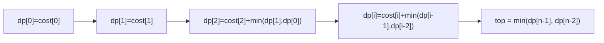

# Climbing stairs (1-D DP) — each step's answer from the last one or two

> **1 of N dynamic-programming flavors.** New to DP? Read the [DP family overview](../) and
> [`recursion`](../../recursion/) first. **This flavor:** the simplest DP — a 1-D `dp[i]` built from
> `dp[i−1]` and `dp[i−2]`, often shrinkable to two variables (O(1) space). Canonical problem: #746 Min Cost Climbing Stairs.

## TL;DR

**Is it 1-D DP? Ask these — all "yes" → yes:**
1. **Do choices line up in a *sequence*** (steps, days, indices) where each position's answer depends on a **fixed few** earlier positions?
2. **Is it "min / max / count of ways"** to reach the end, with overlapping subproblems if you recursed naively?
3. **Can I write `dp[i] = f(dp[i−1], dp[i−2], …)` with clear base cases?** If yes → this. **This one is the decider.**

**Before you code, pin down:** what does `dp[i]` *mean* (cost to *reach* step i? ways to reach it?)? where's the **top** (#746: index `n`, *past* the last step — so the answer is `min(dp[n−1], dp[n−2])`)? base cases for `i = 0, 1`? do you pay on *arrival* or *departure* (define `dp` to match)? can you collapse to O(1) space?

**The lines where bugs hide** (details in *How it works*):
**define `dp[i]` precisely** (cost to reach i) and keep it consistent · **base cases `dp[0]`, `dp[1]`** · the **top is `n`, not `n−1`** — answer is `min(dp[n−1], dp[n−2])`, the classic #746 off-by-one · the O(1) rewrite must **shift the two variables in the right order**.

---

## What it is
You climb stairs taking 1 or 2 steps at a time; stepping on stair `i` costs `cost[i]`; you may start
at stair 0 or 1; the "top" is *past* the last stair. The cheapest way to reach stair `i` is `cost[i]`
plus the cheaper of arriving from `i−1` or `i−2`:

`dp[i] = cost[i] + min(dp[i−1], dp[i−2])`,  with `dp[0] = cost[0]`, `dp[1] = cost[1]`.

The top sits at index `n`, reachable from the last two stairs, so the answer is `min(dp[n−1], dp[n−2])`.

`cost = [10, 15, 20]`: `dp[0]=10`, `dp[1]=15`, `dp[2]=20+min(15,10)=30`. Top = `min(dp[2]=30, dp[1]=15) = 15`.

Naive recursion would recompute the same `dp[i]` exponentially; the table (or two rolling variables)
computes each once → O(n).

## What you track
- `dp[i]` — min cost to **reach** stair `i` (or two rolling variables `a = dp[i−2]`, `b = dp[i−1]`).
- base cases `dp[0] = cost[0]`, `dp[1] = cost[1]`.
- the answer at the **top** — `min(dp[n−1], dp[n−2])`.

## How it works
Pseudocode (#746, O(1) space). The ⚠️ lines are where every bug hides.

```ts
const n = cost.length;
let a = cost[0];                       // dp[0] — reach stair 0
let b = cost[1];                       // dp[1] — reach stair 1  (⚠️ both are base cases)

for (let i = 2; i < n; i++) {
  const cur = cost[i] + Math.min(a, b);// ⚠️ dp[i] = cost[i] + cheaper arrival from i-1 / i-2
  a = b;                               // ⚠️ shift the window forward IN ORDER:
  b = cur;                             //    old dp[i-1] becomes dp[i-2], cur becomes dp[i-1].
}

return Math.min(a, b);                 // ⚠️ the TOP is index n → reach it from the last two stairs.
                                       //    Returning b (dp[n-1]) alone is the classic miss.
```

Why `min(dp[n−1], dp[n−2])` at the end: the top is one or two steps beyond the last stair, and you
pay nothing to step *off* the staircase — so you finish from whichever of the final two stairs was
cheaper to reach.

Lock these in: **clear `dp[i]` meaning**, **both base cases**, **top = `n` → `min(last two)`**, **shift variables in order**.

## Picture


## Where you'll meet it (practice + recognition)

**On LeetCode (and similar platforms):**
- **#746 Min Cost Climbing Stairs** — min cost to reach the top. (This note's code.)
- **#70 Climbing Stairs** — *count the ways* to reach the top: `ways[i] = ways[i−1] + ways[i−2]` — Fibonacci, the same 1-D shape. (`climbStairs` in [`solution.ts`](./solution.ts).)
- **#198 House Robber** — `dp[i] = max(dp[i−1], dp[i−2] + nums[i])`; take-or-skip along a line.
- **#53 Maximum Subarray (Kadane)** — `dp[i] = max(nums[i], dp[i−1] + nums[i])`; running-best, 1-D.

**Real life / other platforms:**
- "Cheapest sequence of upgrades / fewest coins along a path"; daily decisions where today depends on the last day or two.
- Any rolling recurrence you'd otherwise solve with an expensive re-scan.

**Looks like it but ISN'T:**
- **Greedy** "always take the cheaper next step" — fails here; a locally cheap step can force two expensive ones. DP weighs the whole path.
- **Plain recursion** with no repeats → no memo needed; DP only pays off with **overlapping** subproblems (naive stairs recomputes the same index exponentially).

---

Solution code (#746 min-cost + the #70 count-ways twin, fully commented): [`solution.ts`](./solution.ts).
