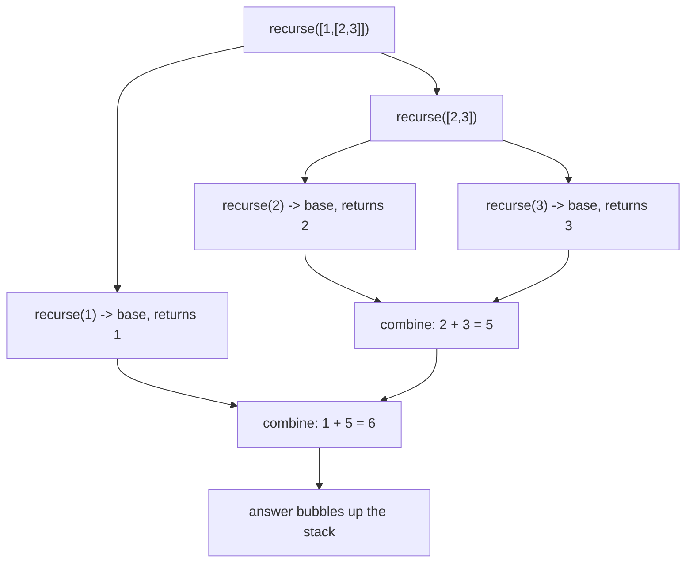

# Recursion (basics) — solve a problem by solving a smaller copy of itself

> **1 of 2 recursion flavors.** New to recursion? This is the one to read first — the call stack,
> the base case, the three parts to lock in. Read the [family overview](../) for the fork.
> **This flavor:** walk nested/branching data and combine sub-answers. Canonical: #104 Max Depth,
> nested-array sum, merge sort. Want the k-th element without a full sort? → [`quickselect`](../quickselect/).

## TL;DR

**Is it recursion? Ask these — all "yes" → yes:**
1. **Answer definable via a *smaller version of the same problem*?** (tree total = node +
   each subtree; folder size = files + each subfolder.)
2. **A *smallest* case you answer outright** — empty list, leaf, `null`, zero? (the base case.)
3. **Data *branches or nests*** — tree, nested JSON, file system, comment thread? Flat list
   walked front-to-back → plain loop, simpler, no stack blowup. **The decider.**

**Before you code, pin down:** **base case** (smallest input returned without recursing)? does
every call **shrink** toward it? how to **combine** sub-answers (add, concat, max, merge, build
node)? how **deep** — skewed tree / huge input **overflow the stack**? (JS dies ~10k frames)
**shared mutable state** (accumulator, `visited`)?

**Lines where bugs hide** (details in *How it works*): **missing/unreachable base** → infinite
recursion → `RangeError: Maximum call stack size exceeded` · step that **doesn't shrink** →
overflow even *with* base · **combine wrong** — return child raw, drop current level ·
**cyclic data, no `visited`** → loops forever · mutate **shared** structure other branches read.

---

## What it is

Function calls **itself** on a smaller piece until small enough to answer directly — answers
stack back up. Natural when data shaped like itself: tree of trees, array of arrays, folders in
folders.

**Call stack** = hidden state. Each call **pauses** caller, pushes frame; base case returns,
frame **pops**, paused caller resumes with answer. Too many pending frames = overflow.

Worked example — sum nested `[1, [2, [3, 4]], 5]`:
- **base:** plain number → return it.
- **recursive:** array → sum of `recurse(each)`.
- → `1 + (2 + (3 + 4)) + 5 = 15`.

### 3 parts to lock in
1. **Base case** — smallest input, no recursion. Missing/unreached → calls never stop.
2. **Progress** — each call passes **strictly smaller** input (child, shorter slice, smaller
   number), or base never reached.
3. **Combine** — fold *this* level into sub-answer. Return sub-answer raw → drop this level —
   recursion's off-by-one.

> **Built on:** nothing — base technique (function + call stack). **Divide-and-conquer** (merge
> sort, binary search) and **backtracking** (subsets, permutations — later note) are recursion
> *applied*; **dynamic programming** = recursion **plus remembering** past answers.

## What you track
- **current piece** — subtree / sub-list / smaller number this call owns.
- **call stack** — implicit: every paused caller awaiting its sub-answer.
- optionally **shared state** — accumulator, or `visited` set for graphs/cyclic data.

## How it works
Pseudocode. ⚠️ lines = where every recursion bug lives.

```ts
function recurse(input) {
  if (isBaseCase(input)) {          // ⚠️ MUST exist and be reachable. No base (or one the
    return baseAnswer(input);       //    shrink never lands on) → calls never stop → overflow.
  }
  const smaller = shrink(input);    // ⚠️ MUST be strictly smaller / closer to base EVERY time.
                                    //    No progress = infinite recursion even WITH a base case.
  const subAnswer = recurse(smaller);
  return combine(input, subAnswer); // ⚠️ fold THIS level in. Returning subAnswer raw drops the
                                    //    current level's contribution.
}
```

Branching data (tree) recurses on **each** child, combines all:

```ts
function maxDepth(node) {
  if (node === null) {              // ⚠️ base: empty subtree → identity value (0)
    return 0;
  }
  // ⚠️ +1 counts THIS node; Math.max picks the deeper child. Drop the +1 and every depth is short.
  return 1 + Math.max(maxDepth(node.left), maxDepth(node.right));
}
```

Recap: **reachable base, strictly-shrinking step, combine (don't drop current level), `visited`
guard on cyclic data.** (See [`solution.ts`](./solution.ts).)

## Picture


## Where you'll meet it (practice + recognition)

**On LeetCode (and similar):**
- **#104 Maximum Depth of Binary Tree** — canonical (`maxDepth` in [`solution.ts`](./solution.ts)):
  base `null → 0`, combine `1 + max(left, right)`.
- **#226 Invert Binary Tree, #112 Path Sum, #100 Same Tree** — tree recursion, different combine.
- **#509 Fibonacci** — the **trap**: naive recursion recomputes subproblems → exponential.
  Memoize past answers → **dynamic programming**.
- **#912 Sort an Array (merge sort), #50 Pow(x,n)** — **divide and conquer**: split, recurse,
  merge. (`mergeSort` in [`solution.ts`](./solution.ts).)

**Real life / any stack:**
- **Walking a file system** — directory holds files *and* directories; recurse into each.
- **Deep clone / deep equal / flatten** of nested JSON (`structuredClone`, `Array.flat(Infinity)`
  — this, built in).
- **Comment thread, nested menu, org chart** in React — component renders children that render
  theirs.
- **Traversing the DOM**, parsing nested expressions, JSON serialization.

**Looks like it but ISN'T:**
- **Plain loop** — flat list walked end-to-end needs no recursion; recursion adds stack cost +
  overflow risk. Tell: data **nested/branching**, or flat?
- **Dynamic programming** — recursion where **same subproblem repeats** (overlapping). Naive
  Fibonacci is the giveaway; fix = memoize → DP. Tell: subproblems **overlap**, or each node
  visited **once**?
- **Backtracking** — recursion that **tries a choice, recurses, then *undoes* it** (subsets,
  permutations, sudoku). Recursion + try/undo. (Later note.)

---

Solution code — nested-array sum (worked example), Max Depth of Binary Tree (#104), merge sort
(divide & conquer), runnable self-check: [`solution.ts`](./solution.ts).
