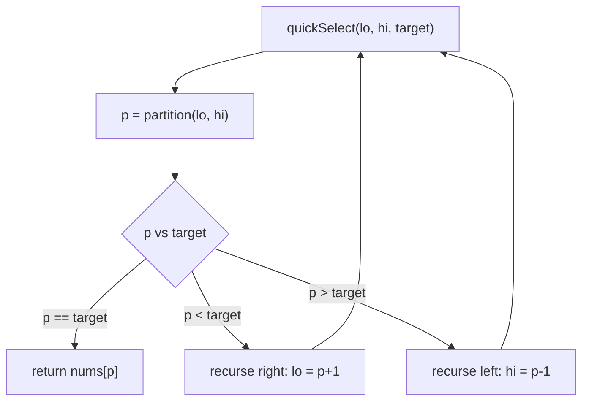

# QuickSelect — partition around a pivot, recurse into only the side that holds k

> **2 of 2 recursion flavors.** New to recursion? Read [`basics`](../basics/) and the
> [family overview](../) first. **This flavor:** divide-and-conquer, but you recurse into **one**
> side, not both — that's what turns sorting's O(n log n) into average **O(n)**. Canonical problem:
> #215 Kth Largest Element in an Array.

## TL;DR

**Is it QuickSelect? Ask these — all "yes" → yes:**
1. **Do I want the k-th smallest / largest** (or the median) — a single **order statistic** — not the whole thing sorted?
2. **Is a full sort (O(n log n)) more than I need**, and an *unsorted* answer is fine?
3. **After one partition, does the pivot's final resting index tell me which *single* side to recurse into?** If "pivot landed at index p; k is on one side, throw the other away" → yes. **This one is the decider.**

**Before you code, pin down:** k-th **largest** or **smallest** (fixes the target index)? is k 1-based (#215 is)? duplicates allowed (fine — partition still works)? may I **mutate / reorder** the input (QuickSelect does — clone first if not)? worst-case O(n²) acceptable, or must I randomize the pivot?

**The lines where bugs hide** (details in *How it works*):
target index = **`n − k`** for the k-th *largest* (ascending order) — the classic off-by-one · **recurse into only ONE side** (`p < target` → right, else left) — recursing both makes it a sort · the **partition invariant** (everything `< pivot` ends up left of it) · **randomize the pivot** or sorted input degrades to O(n²).

---

## What it is
To sort, QuickSort partitions around a pivot then recurses into **both** halves. But if you only
want the k-th element, you don't need both — after partitioning, the pivot sits at its **final
sorted index** `p`, with everything smaller to its left and larger to its right. Compare `p` to the
index you're hunting: if they match, you're done; otherwise the answer is entirely on **one** side,
so recurse into just that one and ignore the other. Discarding half the work each step (on average)
gives **O(n)** average time — versus O(n log n) to fully sort.

For the **k-th largest** in an ascending arrangement, the target index is `n − k` (the largest sits
last, at `n − 1`).

`nums = [3,2,1,5,6,4]`, `k = 2` (2nd largest) → target index `6 − 2 = 4`:
- partition picks a pivot, say it lands at index 3 < 4 → recurse right half `[4..5]`.
- partition there lands the pivot at index 4 = target → return `nums[4] = 5`. (2nd largest is 5.)

## What you track
- `lo` / `hi` — the slice still in play (inclusive).
- `target` — the index the answer must land on: `n − k` for k-th largest.
- `p` — the pivot's final index after a partition; compared to `target` to pick the side.

## How it works
Pseudocode (#215). The ⚠️ lines are where every bug hides.

```ts
// Lomuto partition: pivot = nums[hi]; put everything < pivot to its left; return pivot's final index.
function partition(nums, lo, hi) {
  swap(nums, randomBetween(lo, hi), hi);   // ⚠️ randomize the pivot, or sorted input → O(n²).
  const pivot = nums[hi];
  let i = lo;                              // next slot for a "< pivot" value.
  for (let j = lo; j < hi; j++) {
    if (nums[j] < pivot) {                 // ⚠️ the invariant: smaller values pack to the left of i.
      swap(nums, i, j);
      i++;
    }
  }
  swap(nums, i, hi);                       // pivot drops into its final sorted slot.
  return i;
}

function quickSelect(nums, lo, hi, target) {
  const p = partition(nums, lo, hi);
  if (p === target) return nums[p];        // pivot landed exactly on the answer.
  if (p < target) return quickSelect(nums, p + 1, hi, target);  // ⚠️ recurse RIGHT only…
  return quickSelect(nums, lo, p - 1, target);                  // ⚠️ …or LEFT only — never both.
}

// k-th largest:
return quickSelect(nums, 0, nums.length - 1, nums.length - k);  // ⚠️ target = n - k.
```

Why one side, not two: partition guarantees `nums[p]` is in its final sorted place, so the k-th
element is on a *known* side of `p`. The other side can't contain it — recursing there is wasted
work. Throwing it away each step is the whole speed difference between *select* (O(n) avg) and
*sort* (O(n log n)).

Lock these in: **target = `n − k`**, **recurse one side**, **partition invariant**, **random pivot**.

## Picture


## Where you'll meet it (practice + recognition)

**On LeetCode (and similar platforms):**
- **#215 Kth Largest Element in an Array** — the canonical; partition, recurse one side. (This note's code.)
- **#912 Sort an Array (quicksort)** — the *same* partition, but recurse into **both** sides → a full sort. (`quickSort` in [`solution.ts`](./solution.ts) — the twin.)
- **#973 K Closest Points to Origin** — QuickSelect on distance to grab the k closest without sorting all.
- **#347 Top K Frequent / median problems** — order statistics where a heap or QuickSelect both apply.

**Real life / other platforms:**
- C++ `std::nth_element` — this exact algorithm in the standard library.
- "Show me the 95th-percentile latency" over a big sample, without sorting the whole thing.

**Looks like it but ISN'T:**
- **Heap top-k** (a min-heap of size k) — also finds the k-th largest, in O(n log k) and **without
  mutating** the array, and it works on a **stream**. QuickSelect is faster on a static array (avg
  O(n)) but reorders it. Tell: streaming / must-not-mutate → heap; one-shot on an array you can
  scramble → QuickSelect.
- **Full sort** then index `n − k` — correct but O(n log n); QuickSelect skips sorting the halves you don't need.

---

Solution code (#215 QuickSelect + the QuickSort twin sharing one partition, fully commented): [`solution.ts`](./solution.ts).
