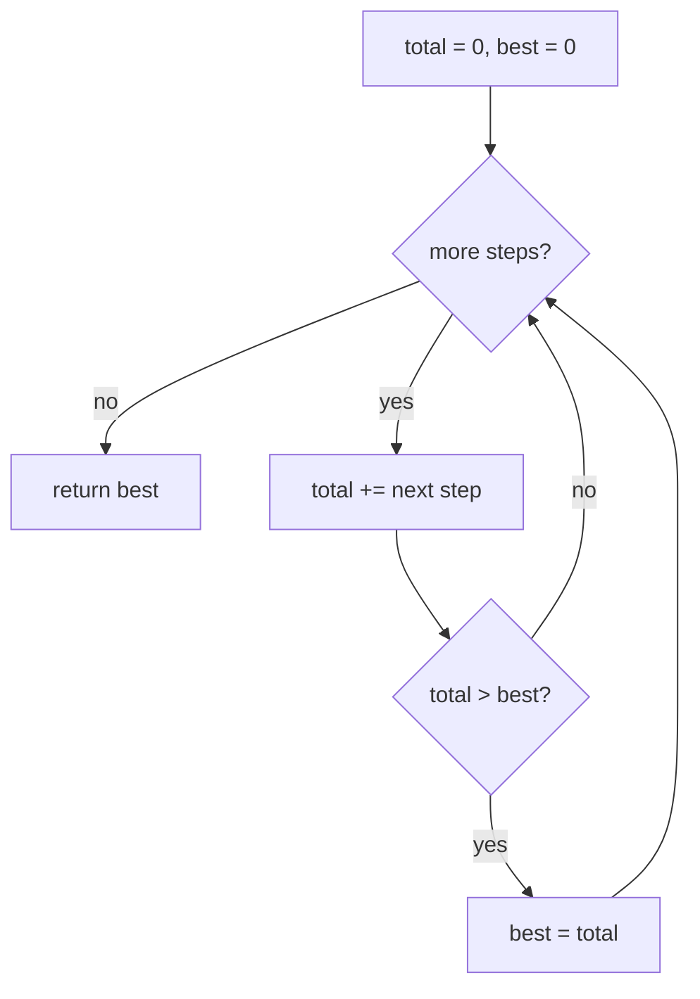

# Running total, keep the best

## TL;DR

**Is it the running-total trick? Ask these — all yes → yes:**
1. **Am I given step-by-step CHANGES?** Deltas — gains, `+/-` events, transactions — handed in order. (A flat list of values, not changes → maybe a different trick.)
2. **Am I asked for the highest / lowest / peak / cumulative value reached?** The answer is a point on the accumulated line, not the line itself.
3. **Can I get the answer by adding as I go and remembering the best, WITHOUT storing every running total?** If one extra running number plus a best-so-far does it, yes. **This one is the decider.** (If you need to *re-query* totals across many ranges later, you need a stored prefix-sum array instead — see below.)

**Before you code, pin down:** does the starting / zero point count? (decides whether `best` seeds at `0`.) could every value be negative, so a negative answer is possible? (changes the seed.) do you need just the peak, or also **where** it happened (the index)? any overflow worry on big totals?

**The lines where bugs hide** (details in *How it works*):
the **seed of `best`** — `0` when the start counts; the first value (or `−Infinity`) when the answer may be negative. This is the #1 bug.

---

## What it is
You're walking a list of step-by-step changes and you want the **highest point you
ever reach** while adding them up. You don't need to remember every point — just two
numbers: where you are **now** (a running total) and the **best** total you've seen.
Add each step to the running total; whenever it beats your best, update the best.

`gain = [-5, 1, 5, 0, -7]`, starting at altitude `0`:
- `+(-5)` → now `-5` (best still `0`)
- `+1` → now `-4` (best `0`)
- `+5` → now `1` (best becomes `1`)
- `+0` → now `1` (best `1`)
- `+(-7)` → now `-6` (best `1`)

Answer: `1`.

> Built on: **Prefix Sum** (a running total — each value added on top of the last). The
> extra rule: don't store the whole list of running totals — keep only the latest one
> and the biggest one you've seen.

**Why `best` starts at `0` (the bit worth slowing down for):** the trip begins at
point 0, which sits at altitude `0` and *counts as a real point*. So if every step only
loses altitude, the highest you were ever at is the start — `0`. Seeding `best = 0`
covers that case for free. But if the start *didn't* count and totals could go negative,
seeding `0` would be a lie — you'd report `0` when the real best is negative. That's the
seed bug.

## What you track
- `total` — the running sum so far (starts at `0`).
- `best` — the highest `total` seen (starts at `0`, because the start point counts).

## How it works
Pseudocode. The one ⚠️ line is where every bug in this trick hides — the rest is a
plain loop.

```
total = 0
best  = 0                     // ⚠️ THE SEED. 0 works only because the start point
                              //    counts as a real point at altitude 0. If the
                              //    start did NOT count and totals could go negative,
                              //    seeding 0 reports a fake 0 instead of the true
                              //    (negative) best. Then seed the first value, or
                              //    -Infinity. Getting this wrong is the #1 bug.

for each step in changes:
    total = total + step      // add the delta to the running total
    if total > best:
        best = total          // beat the record → remember it

return best                   // the highest total ever reached
```

Lock the seed in and the rest can't go wrong:
**`best` seeds `0` when the start counts, the first value (or `−Infinity`) when the answer may be negative.**

## Picture


## Where you'll meet it (practice + recognition)

**On LeetCode (and similar platforms):**
- **#1732 Find the Highest Altitude** — `gain[i]` is the altitude change between points; start at `0`; return the highest altitude reached (this note's code).
- **#53 Maximum Subarray** — Kadane's: a running-sum cousin that **resets to 0 when the total goes negative**, then keeps the best. Same "add, keep the peak", plus a reset.
- **#303 Range Sum Query — Immutable** — many repeated sum-of-a-range questions, so you store a **prefix-sum array** up front and answer each query in `O(1)`. The sibling that *does* keep every total.

**Real life / other platforms:**
- **Peak concurrent connections** — `+1` on connect, `−1` on disconnect, in order; track the max (this note's twin).
- A running **account balance** and its highest point.
- **Max queue depth** over time (enqueue `+1`, dequeue `−1`, remember the worst).
- **Cumulative scroll offset** — sum row heights as you go; the running total *is* the offset.

**Looks like it but ISN'T:**
- If you need **repeated sum-of-a-range queries**, build a **prefix-sum ARRAY** instead — a sibling idea that stores every running total so each range answer is a single subtraction. (#303 above.)
- If it's **"best contiguous subarray sum"**, that's **Kadane** — the same running-sum loop but it **resets the total to 0 the moment it goes negative**. The reset is the tell.

---

Solution code (both disguises, fully commented): [`solution.ts`](./solution.ts).
