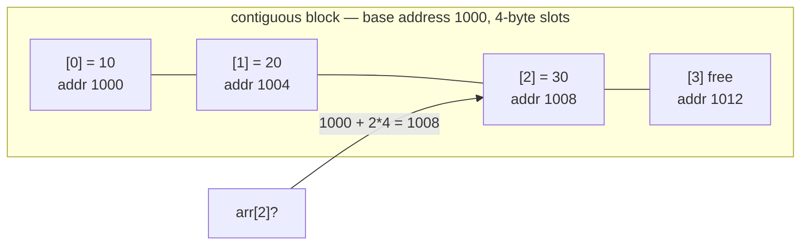

# Array — one contiguous block of memory, reached by position

> **A `structures/` note (sibling shape to the trick notes).** New here? Read the
> [structures overview](../) first — it explains the abstraction↔metal idea and why algorithms
> depend on the structure underneath. **This structure:** items packed back-to-back in memory, so
> "give me item `i`" is free (O(1)) but opening a hole in the middle is slow (O(n)).

## TL;DR

**Reach for an array when — any yes → candidate; the decider settles it:**
1. Items have a natural **position** you'll address by number (the `i`-th thing)?
2. You mostly **read by index** or **append at the end** — rarely insert/remove in the *middle* or *front*?
3. **Do your algorithms need "give me item `i`" to be free?** Binary search, two-pointers, sliding
   window, prefix-sum all assume O(1) index — they fall apart without it. **The decider.** (Lots of
   middle/front insert-remove instead → linked list / deque.)

**Before you use it, pin down:** fixed size or growing? inserts/removes at the **end** (cheap) or
**middle/front** (O(n))? will indices be **sparse** (holes)? need it **sorted** (unlocks binary
search)? elements a **uniform type** (lets the engine keep it fast)?

**Where it bites** (details in *What it costs*): `unshift` / middle `splice` / middle insert =
**O(n) shift** · assigning a far index (`a[1000] = x` on a short array) makes it **sparse** → V8
de-opts to a hash, index is **no longer O(1)** · `delete a[i]` leaves a **hole** (use `splice`) ·
`.length` is **writable** — setting it smaller silently truncates.

## What it really is (abstraction vs the metal)

A row of equal-size **slots packed with no gaps**, starting at one base address. To find slot `i`
the machine computes `base + i * slot_size` — **one multiply, one add, jump straight there.** No
scanning. *That* is why indexing is O(1), and it's the single fact every array algorithm leans on.

Tiny worked example — `[10, 20, 30]`, each slot 4 bytes, base `1000`:
- `arr[2]` → address `1000 + 2*4 = 1008` → read it. Didn't touch slots 0 or 1.

**The abstraction vs the metal.** A C array is *exactly* that block. A JS `Array` is **not** — the
engine (V8) gives you the contiguous-block behaviour **only when it can** (a "packed elements"
array). Leave holes (`a[100] = x` on a 3-item array) or mix types badly and it **silently** falls
back to a hash-map-backed "dictionary elements" array — now `arr[i]` is a hash lookup, not a pointer
jump. You never see the switch; you feel it as code that mysteriously got slower. (For the *true*
block, JS has **typed arrays** — `Int32Array`, `Float64Array` — fixed type, fixed width, real
contiguous memory.) Same lesson as a "file": the language hands you a clean abstraction over a
messy physical reality, and the reality **leaks through as cost**.

## What you track

- **base** — where the block starts (the engine holds this; you never see it).
- **length** — how many slots are live.
- **capacity** — how many slots are *allocated* (≥ length). The gap between them is why append is
  usually free but occasionally triggers a copy. (See `DynamicArray` in [`solution.ts`](./solution.ts).)

## What it costs (and why)

| Operation | Cost | Why — rooted in the packed block |
|---|---|---|
| `arr[i]` read / write | **O(1)** | address math `base + i*stride` → jump, no scan |
| `push` (append) | **amortized O(1)** | usually a free slot; when full, allocate a 2× block and copy all → rare O(n), averaged out |
| `pop` (remove end) | **O(1)** | just drop the last live slot |
| `unshift` / insert at front | **O(n)** | every element shifts one slot right to open room |
| `splice` / insert-remove in middle | **O(n)** | shift every *later* element by one (half the array on average) |
| search by value (unsorted) | **O(n)** | no shortcut — look at each slot |
| search by value (**sorted**) | **O(log n)** | now binary search applies — see below |

"Amortized O(1)" = a single `push` can be O(n) (the copy), but across `n` pushes the copies total
~`2n` → O(1) *each on average*. Doubling is what makes the copies rare. `DynamicArray` in
[`solution.ts`](./solution.ts) builds this by hand: 5 pushes trigger only 2 resizes.

## What it unlocks (algorithms that depend on it)

Every one of these needs the array's **O(1) random access** — give them a linked list and they
break:

- **[Binary search](../../techniques/search/binary-search/find-target/)** — probes the *middle*
  index each step. O(1) index is what makes "jump to mid" free; on a linked list, finding mid is
  O(n) and the whole O(log n) win evaporates. (Also needs the array **sorted**.)
- **[Two pointers — opposite ends](../../techniques/two-pointers/opposite-ends/)** — reads
  `arr[left]` and `arr[right]` and walks them inward; both jumps are O(1).
- **[Sliding window](../../techniques/two-pointers/sliding-window/)** — adds the entrant `arr[r]`,
  drops the leaver `arr[l]` in O(1) each as the window slides.
- **[Prefix sum](../../techniques/prefix-sum/highest-altitude/)** — the cumulative array *is* an
  array; `prefix[i]` answers a range query in O(1).
- **Sorting** (merge/quick) and anything **divide-and-conquer** over a slice — relies on cheap
  index + cheap sub-slice.

## Picture

## Where you'll meet it (practice + recognition)

**In JS/TS:**
- `[]` + `arr[i]`, `push`/`pop` (the everyday dynamic array). `unshift`/`shift`/`splice` are the
  **O(n)** ones — reach for them rarely on big lists.
- **Typed arrays** (`Int32Array`, `Uint8Array`, `Float64Array`) — the real fixed-width contiguous
  block; used for binary data, canvas pixels, audio, WebGL.

**Real life / any stack:**
- Image pixels, audio samples, video frames — flat buffers indexed by position.
- A page of DB rows, a CSV loaded into memory, a ring buffer of recent events.
- Anything you'll **binary-search** or run a **moving average** over.

**Looks like it but ISN'T:**
- **Linked list** — O(1) insert/remove *anywhere* (just relink), but O(n) to reach the `i`-th node
  (no address math — you walk the chain). **Opposite tradeoff.** Tell: do you mostly *index*
  (→ array) or mostly *splice in the middle* (→ linked list)?
- **Hash map** — O(1) by **key/name**, but **no order** and no "i-th". Tell: address items by
  **position** (→ array) or by **label** (→ hash map)? See [`techniques/hashing/two-sum`](../../techniques/hashing/two-sum/).

---
Solution code — `DynamicArray<T>` (backing buffer + capacity doubling), runnable self-check:
[`solution.ts`](./solution.ts).
