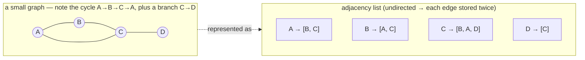

# Graph — dots joined by lines, no "one parent" rule, cycles allowed

> **A `structures/` note (sibling shape to the trick notes).** New here? Read the
> [structures overview](../) first — it explains the abstraction↔metal idea and why algorithms
> depend on the structure underneath. **This structure:** vertices (dots) joined by edges (lines) —
> a tree without the one-parent rule, so it can loop back on itself (cycles), which forces every
> traversal to remember where it's been.

## TL;DR

**Reach for a graph when — any yes → candidate; the decider settles it:**
1. Your data is **things + connections** between them (people→friends, cities→roads, tasks→deps)?
2. A thing can connect to **many** others, and those connections can **loop back** (A→B→C→A)?
3. **Is the question about paths, reachability, or ordering across those connections?** "Can I get
   from X to Y?", "shortest route?", "what order respects the deps?", "which clusters connect?" —
   that's BFS/DFS/topo-sort/union-find territory, and they all want a graph underneath. **The
   decider.** (Strict one-parent hierarchy, no loops → that's a [tree](../trees/), simpler.)

**Before you use it, pin down:** **directed** (one-way edges, A→B ≠ B→A — Twitter follows) or
**undirected** (mutual — Facebook friends)? **weighted** (edges carry a cost/distance — for
Dijkstra) or unweighted (every hop = 1)? **dense** (edges ≈ V², near every-pair) or **sparse**
(edges ≈ V, few per node — picks your representation)? **cyclic** (can loop) or guaranteed acyclic
(a DAG — topo-sort applies)?

**Where it bites** (details below): traversal with **no `visited` set** → a cycle loops you
**forever** · adjacency **matrix** on a sparse graph wastes **O(V²)** memory (mostly zeros) ·
adjacency **list** makes "is there an edge A→B?" **O(degree)**, not O(1) · in an **undirected**
graph an edge is **two** directed entries (A→B *and* B→A) — forget one and half your edges vanish.

## What it really is (abstraction vs the metal)

A graph is just **two sets**: vertices (the dots) and edges (the lines joining pairs of dots).
There's no single "shape" in memory — it's whatever you choose to store the edges in, and that
choice *is* the cost story. Two ways:

- **Adjacency LIST** — a **map of `vertex → list of its neighbours`**. Sparse-friendly: you only
  store edges that actually exist. Space **O(V + E)** (one entry per vertex + one per edge). This is
  the default and what [`solution.ts`](./solution.ts) builds.
- **Adjacency MATRIX** — a **V×V grid of 0/1**, where cell `[a][b] = 1` means "edge a→b". "Is there
  an edge?" is **O(1)** (one cell read), but space is **O(V²)** *no matter how few edges* — wasteful
  when sparse (a 10 000-node social graph = 100M cells, almost all 0).

Tiny worked example — vertices `A, B, C`, edges `A–B`, `B–C` (undirected):
- **list:** `{ A: [B], B: [A, C], C: [B] }` — note `A–B` shows up in **both** A's and B's lists.
- **matrix:** rows/cols `A B C` → `A:[0,1,0] B:[1,0,1] C:[0,1,0]` — symmetric because undirected.

**Why cycles change everything.** A graph can loop: `A→B→C→A`. A traversal that just "follows
neighbours" will walk A→B→C→A→B→C→… **forever**. The fix is a **`visited` set**: before you
process a vertex, check "seen it?" — if yes, skip. That one set is the whole reason graph traversal
is harder than tree traversal (a tree has no loops, so it needs no `visited`). See
[`../set/`](../set/) for the O(1) "seen it?" check, and [`../../paradigms/recursion/`](../../paradigms/recursion/)
for why DFS-the-recursion needs it to stop.

## What you track

- **vertices** — the dots (nodes). Often the map's **keys**.
- **edges** — the lines. In the list rep, the **values** (each key's neighbour array).
- **directed?** — is `A→B` stored without `B→A`? Undirected = store **both** directions.
- **visited** — the set of vertices already seen during a traversal. **Non-optional** the moment a
  cycle is possible — it's what makes the walk terminate.

## What it costs (and why) — adjacency list

| Operation | Cost | Why — rooted in `map of vertex → neighbour list` |
|---|---|---|
| add vertex | **O(1)** | one new key with an empty list |
| add edge | **O(1)** | push onto one (or two, if undirected) neighbour lists |
| has-edge A→B? | **O(degree of A)** | scan A's neighbour list — *vs* **O(1)** for a matrix (one cell) |
| list neighbours of A | **O(degree of A)** | hand back A's list directly |
| **BFS** / **DFS** (visit all reachable) | **O(V + E)** | touch each vertex once + walk each edge once |
| space | **O(V + E)** list · **O(V²)** matrix | list stores only real edges; matrix reserves every possible pair |

The headline: **list vs matrix is the sparse-vs-dense tradeoff.** Sparse (few edges)? List —
O(V+E) space, and you rarely need O(1) edge lookups. Dense (near every pair connected) or you query
"is A→B?" constantly? Matrix — the O(V²) space isn't wasted and O(1) lookup pays off.

## What it unlocks (algorithms that need it)

A graph is the *substrate*; these structures/paradigms ride on top of it:

- **[Set](../set/)** — the `visited` set that **stops cycles** dead. Without it, every traversal
  below loops forever. The single most important companion to a graph.
- **[Recursion](../../paradigms/recursion/)** — **DFS is recursion over neighbours**: "visit me,
  then recurse into each unvisited neighbour." The call stack *is* the descent; `visited` is the
  base case that prevents infinite recursion on a cycle.
- **[Queue / deque](../queue/)** — **BFS uses a FIFO queue** (first-in-first-out line) to expand the
  graph **level by level** (all 1 hop away, then all 2 hops…). FIFO order is what makes BFS find the
  **fewest-hops** path on an unweighted graph.
- **[Heap](../heap/)** — **Dijkstra uses a min-heap** to always expand the **nearest** unvisited
  frontier vertex next. On a *weighted* graph "fewest hops" ≠ "shortest distance", so you need the
  heap to keep pulling the cheapest-so-far node.

**Name-only (live under [`techniques/`](../../techniques/), or classic LeetCode):**
- **BFS shortest path** — LeetCode #1091 (shortest path in binary matrix), #127 (Word Ladder).
- **DFS / connected components** — #200 (Number of Islands).
- **Topological sort** (order a DAG by deps) — #207 (Course Schedule).
- **Union-find** (merge & query clusters) — #547 (Number of Provinces).
- **Dijkstra / A\*** (shortest path, weighted) — the min-heap algorithms above.

## Picture

## Where you'll meet it (practice + recognition)

**Real life / any stack:**
- **Social networks** — users = vertices, follows/friendships = edges (directed for follows,
  undirected for friends). "People you may know" = neighbours-of-neighbours.
- **Road maps / routing** — intersections = vertices, roads = weighted edges; GPS = Dijkstra/A\*.
- **Dependency / build graphs** — modules or tasks = vertices, "depends on" = directed edges;
  build order = topological sort; a **cycle = an impossible build** (circular dependency).
- **Web links** — pages = vertices, hyperlinks = directed edges (this is what PageRank crawls).

**Looks like it but ISN'T:**
- **Tree** — a tree *is* a graph, but a restricted one: **no cycles** and **exactly one parent** per
  node. That's why a tree needs **no `visited` set** (you can't loop back) and a general graph does.
  Tell: can a node be reached by **two different paths** / loop back to itself? Yes → graph; no,
  strict hierarchy → [tree](../trees/).
- **Array / matrix** — the **adjacency-matrix** representation literally *is* a 2D
  [array](../array/); the dense-vs-sparse memory tradeoff above is exactly "should this be a flat
  grid or a map of lists?" Tell: edges near every-pair (→ matrix/array) or few-per-node (→ list)?
- **Linked list** — a **path graph** (A→B→C→D, each node one next) is a degenerate graph; a linked
  list is that special case with no branching and no cycles. (Name-only.)

---
Solution code — `Graph<T>` (adjacency-list `Map`, `addVertex`/`addEdge`/`neighbours`, plus `bfs`
and `dfs` whose self-check proves a **cycle does not loop forever**):
[`solution.ts`](./solution.ts).
