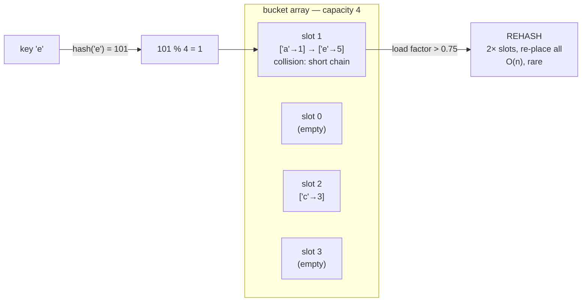

# Hash map — store and find by key in O(1), a labelled drawer over hashed buckets

> **A `structures/` note (sibling shape to the trick notes).** New here? Read the
> [structures overview](../) first — it explains the abstraction↔metal idea and why algorithms
> depend on the structure underneath. **This structure:** a hash function turns a key into a slot
> number, so "give me the value for *this key*" is free (O(1) average) — no scanning — but the
> price is **no order** and an occasional **rehash** that touches everything (O(n)).

## TL;DR

**Reach for a hash map when — any yes → candidate; the decider settles it:**
1. You look things up by a **key / name / id** (not by position `i`)?
2. You need **"have I seen this?"** or **"what's stored under X?"** to be instant, on data that grows?
3. **Do your algorithms need O(1) lookup-by-key, and you don't care about order?** Two-sum's "seen
   the complement?", group-by's "which bucket?", memoization's "computed this already?" all collapse
   to a hash-map probe — replace it with a list and each becomes an O(n) scan. **The decider.** (Need
   items in **sorted / positional order** instead → array / balanced tree.)

**Before you use it, pin down:** keys a **uniform hashable type** (string/number) or **objects**
(→ `Map`, never `{}`)? need **insertion order** preserved (→ `Map`)? roughly **how many entries**
(presize to dodge rehashes)? could an adversary feed **colliding keys** (DoS via worst-case O(n))?
just **keys, no values** (→ a Set)?

**Where it bites** (details in *What it costs*): crossing the **load factor** triggers a
**rehash** — one insert silently goes O(n) (re-places every entry) · a **weak hash or colliding
keys** pile everything into one bucket → lookups degrade to **O(n)** · **plain object `{}`**
coerces keys to **strings** (`obj[1]` === `obj["1"]`) and carries **prototype keys** (`obj.toString`
is truthy unprovoked) → use `Map` · iteration order is **insertion order in `Map`**, *not* sorted —
there is **no "i-th" entry**.

## What it really is (abstraction vs the metal)

A **labelled drawer**: instead of scanning every drawer for a label, you *compute* which drawer the
label points to and open exactly that one. Two parts:

- A **hash function** turns a key into a number (same key → same number, always). Fold it into a
  slot: `bucket = hash(key) % capacity`. That `%` is the "jump straight to the drawer" step — **no
  scan.** *That* is why get/set are O(1), and it's the fact every hash algorithm leans on.
- A **bucket array** of `capacity` slots. Different keys can fold to the **same** slot (a
  **collision** — infinitely many keys, finitely many slots). Fix: **separate chaining** — each slot
  holds a short list, you walk that one short list.

Tiny worked example — capacity 4, `hash("a")=97`, `hash("e")=101`:
- `"a"` → `97 % 4 = 1` → drop into slot 1. `"e"` → `101 % 4 = 1` → **same slot** → slot 1's list is
  now `["a","e"]`. Looking up `"e"`: go to slot 1, walk the 2-item list, found. Still ~O(1).

**The abstraction vs the metal.** You write `map.get(k)` and it feels like one step. Underneath sits
the bucket array, the chains, and the **rehash**: as entries pile up, every chain lengthens and
lookups creep toward O(n) — so once the **load factor** (entries ÷ capacity) crosses a threshold
(~0.75), the engine allocates a **bigger** bucket array and **re-places every entry** (their
`% capacity` slots changed). V8 hides all of this. **JS hands you two flavours:** a plain object
`{}` is *not* a clean hash map — it **string-coerces keys** and carries **prototype keys**, so it
leaks; a real **`Map`** keeps the key's **type** (`1 !== "1"`), holds **any** key, preserves
**insertion order**, and has no prototype traps. Same lesson as a "file": a clean abstraction over a
messy reality, and the reality **leaks through as cost** (the rehash) **and as gotchas** (object
keys).

## What you track

- **buckets** — the slot array; each slot a short list of `{ key, value }` (the engine holds this).
- **count** — how many entries are live.
- **capacity** — how many slots are allocated. **count ÷ capacity = load factor** — the dial that,
  when it crosses ~0.75, triggers the rehash. (See `HashMap` in [`solution.ts`](./solution.ts).)

## What it costs (and why)

| Operation | Cost | Why — rooted in buckets + hashing |
|---|---|---|
| `get` / `has` by key | **O(1) average** | hash → one slot → walk a short chain (length ≈ load factor) |
| `set` (insert / overwrite) | **amortized O(1)** | same hash→slot→short-chain; occasionally trips a rehash → that one is O(n), averaged out |
| `delete` by key | **O(1) average** | hash to the slot, splice the one entry out of its short list |
| any op, **worst case** | **O(n)** | all keys collide into one bucket (weak hash / adversarial keys) → one length-`n` chain to walk |
| **rehash** (cross load factor) | **O(n)** (rare) | allocate a 2× bucket array and re-place **every** entry — their `% capacity` slots changed |
| space | **O(n)** | one entry stored per key, plus slack slots |
| "give me the i-th" / sorted scan | **not supported** | no positional layout, no order — that's the array's / tree's job |

"Amortized O(1)" = a single `set` can be O(n) (the rehash copy), but across `n` inserts the rehashes
total ~`2n` work → O(1) *each on average* — exactly the array's doubling trick. `HashMap` in
[`solution.ts`](./solution.ts) executes it: 50 inserts into a capacity-4 map trigger a handful of
doublings, every value still retrievable; a capacity-1 map forces a real collision, both keys
survive.

## What it unlocks (algorithms that depend on it)

Every one of these needs the hash map's **O(1) lookup-by-key** — give them a plain list and the
inner check becomes O(n), blowing the whole algorithm up:

- **[Two-sum / "seen the complement?"](../../techniques/hashing/two-sum/)** — as you scan, ask "is
  `target − x` already in the map?" O(1) per element → O(n) total. Without the map it's an O(n²)
  double loop.
- **[Group-by / bucketing](../../techniques/hashing/grouping/)** — `key → list of items that share
  it`; one pass drops each item into its bucket in O(1) (e.g. anagrams keyed by sorted letters).
- **[Memoization → dynamic programming](../../paradigms/dynamic-programming/)** — cache `args → result` in a
  map; "computed this already?" is an O(1) probe that turns exponential re-computation into linear.
- **Counting / frequency tally** — `value → count`, `map.set(v, (map.get(v) ?? 0) + 1)` in O(1).
- **Dedupe** — drop everything into a map/set keyed by the dup-defining field, read out unique.
- **Caching / idempotency guard** — `requestId → response`; "have I handled this id?" in O(1).

## Picture

## Where you'll meet it (practice + recognition)

**In JS/TS:**
- **`Map`** — the real hash map: any key type, key type preserved (`1 !== "1"`), insertion order,
  no prototype traps. `.set` / `.get` / `.has` / `.delete` / `.size`. **Default choice.**
- **`Set`** — same machinery, **keys only, no values** ("have I seen it?", dedupe).
- **Plain object `{}`** — looks like a map but **string-coerces keys** and inherits **prototype
  keys**; only safe for fixed string-keyed config, and even then `Object.create(null)` dodges the
  prototype traps. Reach for `Map` for dynamic keys.

**Real life / any stack:**
- A database **index** / cache (Redis is a giant hash map), a **session store** keyed by token.
- **Deduplication** of records, **counting** word/event frequencies, **idempotency keys** on a
  payment endpoint.
- Any "look it up by id/name instantly" — user-by-email, config-by-key, feature-flag-by-name.

**Looks like it but ISN'T:**
- **Array** — addressed by **position** (`arr[i]` is O(1)), but **search by value is O(n)** and it
  keeps **order**. A hash map is keyed by **label** with **no order**. Tell: do you address items by
  **number `i`** (→ array) or by **name/key** (→ hash map)? See [`../array/`](../array/).
- **Set** — same hashing, but stores **keys only** ("is it present?"), not **key → value**. Tell:
  do you need a **value back** for the key (→ map) or just **membership** (→ set)?
- **Plain object `{}`** — *not* a true hash map in JS: **string-coerced keys** (`{}[1]` and `{}["1"]`
  are the same slot) and **prototype keys** (`obj.toString` truthy unprovoked). Tell: dynamic /
  non-string / object keys, or need insertion order → use **`Map`**, not `{}`.

---
Solution code — `HashMap<K, V>` (bucket array + separate chaining + load-factor rehash, collision
and rehash both proven), runnable self-check: [`solution.ts`](./solution.ts).
