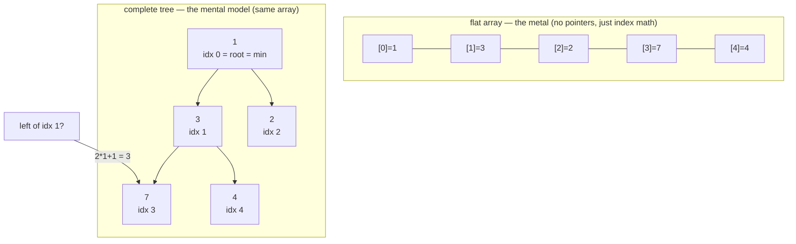

# Heap — always hands you the smallest (or biggest) next, a tree packed into a flat array

> **A `structures/` note (sibling shape to the trick notes).** New here? Read the
> [structures overview](../) first — it explains the abstraction↔metal idea and why algorithms
> depend on the structure underneath. **This structure:** a complete binary tree stored in a plain
> array, kept in *partial* order so "give me the smallest" is free (O(1)) and push/pop cost only
> O(log n) — but finding anything *other* than the min is O(n).

## TL;DR

**Reach for a heap when — any yes → candidate; the decider settles it:**
1. You repeatedly need the **current smallest** (or biggest) item, and the set keeps **changing**
   (you add/remove as you go)?
2. You'd otherwise **re-sort** or **re-scan** the whole collection every time just to grab one
   extreme — wasteful?
3. **Do you need only the extreme cheaply, and never random access or range scans?** A heap gives
   O(1) peek + O(log n) push/pop, but *only the min/max is cheap* — everything else is O(n). **The
   decider.** (Need the k-th item, a range, or search by value → sorted array / BST instead.)

**Before you use it, pin down:** **min or max** on top (the comparator decides — flip it to flip
the heap)? do you only need **peek** (read) or also **pop** (remove)? how do **ties** break (heaps
don't promise stable order among equals)? building from a known array up front (**heapify**, O(n))
or pushing one at a time (n×O(log n))? do you ever need to **find/remove an arbitrary** item
(that's the O(n) cliff — maybe you want a different structure)?

**Where it bites** (details in *What it costs*): reading the array **left-to-right is NOT sorted**
— it's partial order, only `arr[0]` is guaranteed · **searching for a non-min value is O(n)** (no
shortcut — partial order tells you nothing about where it lives) · **JS has no built-in heap** —
roll one or pull a library, a bare array's `sort()` on every change is O(n log n) each time ·
forgetting to move the **last** element to the root on pop (then sift) breaks the complete-tree
shape.

## What it really is (abstraction vs the metal)

A **complete binary tree** — every level full top-to-bottom, left-to-right, last level filled from
the left — with one rule: **each parent ≤ both its children** (min-heap). That "no gaps" shape is
the trick: a complete tree maps onto a **flat array by position alone**, so there are **no
left/right pointers** — just index arithmetic.

- **parent of `i`** = `(i - 1) >> 1` (`>> 1` = integer divide-by-2)
- **left child of `i`** = `2*i + 1` · **right child** = `2*i + 2`

From any node you *jump* to its parent or children with one shift/multiply — same cache-friendly
contiguous block as an array.

Tiny worked example — push `[5, 3, 8, 1]` into a min-heap, end state `[1, 3, 8, 5]`:
- `arr[0] = 1` → the root, the min, peek answers in O(1).
- `arr[1] = 3`, `arr[2] = 8` are 1's children (both ≥ 1 ✓). `arr[3] = 5` is 3's left child (≥ 3 ✓).
- Note `8` (left subtree) > `5` (down the other branch): **siblings/cousins are unordered.**

**The abstraction vs the metal.** The *tree* is a mental model; the *metal* is `arr` + index math —
no nodes, no pointers. And the order is **partial, not total**: only the path-to-root invariant
holds (parent ≤ child), so the array is **not sorted** and you can't binary-search it. You get a
cheap answer to exactly **one** question — "what's the min?" — and pay O(n) for any other. JS gives
you `Array.prototype.sort` and `Map`, but **no heap** — the abstraction simply isn't in the
language; you build it (below) or import one (a `PriorityQueue` is a heap wearing a different name).

## What you track

- **the array** — the complete tree, packed by position. `heap[0]` is the root = the min.
- **comparator** — `compare(a, b) < 0` means "a sits closer to the root" (a is smaller / higher
  priority). This single function decides **min-heap vs max-heap** — flip its sign to flip the heap.
- **size** — `heap.length`; the boundary between live slots and "off the end" (children past it
  don't exist). (See `MinHeap` in [`solution.ts`](./solution.ts).)

## What it costs (and why)

| Operation | Cost | Why — rooted in the complete tree + partial order |
|---|---|---|
| `peek` (the min/max) | **O(1)** | it's always `arr[0]` — the root. No scan. |
| `push` (insert) | **O(log n)** | append at the end (stays complete), then **sift up** — swap with parent while smaller, along **one root-to-leaf path**. Height of a complete tree = log₂n. |
| `pop` (remove min/max) | **O(log n)** | take `arr[0]`, move the **last** item to the root (stays complete), then **sift down** — swap with the smaller child while bigger, again **one path**. |
| build / **heapify** from an array | **O(n)** | sift-down each node bottom-up; the math works out to linear, *cheaper* than n separate O(log n) pushes. |
| **search for an arbitrary value** | **O(n)** | **the cliff** — partial order gives no hint where a non-min sits, so you scan everything. |

Only **one** operation is cheap because the heap maintains only **one** invariant (parent ≤ child).
A sorted array maintains *total* order — costlier to keep, but it buys you O(1) random access and
O(log n) search. A heap deliberately keeps less order to make push/pop fast. `MinHeap` in
[`solution.ts`](./solution.ts) builds this by hand: sift-up on push, sift-down on pop, comparator
chosen at construction.

## What it unlocks (algorithms that depend on it)

Each of these needs **cheap repeated access to the extreme** of a *changing* set — re-sorting every
step would be O(n log n) each; a heap makes each step O(log n). (A **priority queue** is normally a
heap underneath.)

- **Top-k** — keep a heap of size k; the smallest in it is the cutoff (LeetCode #215 Kth Largest
  Element, #347 Top K Frequent Elements).
- **Merge k sorted lists** — a heap of the k list-heads always coughs up the next-smallest
  (LeetCode #23 Merge k Sorted Lists).
- **Running median** — two heaps (a max-heap of the low half, a min-heap of the high half), median
  reads off the tops (LeetCode #295 Find Median from Data Stream).
- **Dijkstra shortest path** — a priority queue pulls the nearest unvisited node each step.
- **Heapsort** — heapify, then pop n times → sorted output, O(n log n) in place.
- **Task scheduler** — pop the most-frequent / highest-priority task next (LeetCode #621).

## Picture

## Where you'll meet it (practice + recognition)

**In JS/TS:**
- **No built-in.** No `Heap`, no `PriorityQueue` in the standard library. You **roll your own** (an
  array + sift-up/down, like [`solution.ts`](./solution.ts)) or pull a library. Reaching for a plain
  array and calling `.sort()` on every change is the trap — that's O(n log n) *each time* vs the
  heap's O(log n) per op.

**Real life / any stack:**
- An **event/task queue** that always runs the highest-priority job next.
- A **leaderboard top-10** that updates as scores stream in (keep a size-10 heap).
- **Bandwidth / packet scheduling**, OS run-queues, A* / Dijkstra in pathfinding and maps.

**Looks like it but ISN'T:**
- **Sorted array** — *fully* ordered: O(1) random access, O(log n) binary search, O(n) to insert
  (shift), and O(n log n) to build. A heap is *partial* order: O(log n) insert, but **only the min
  is cheap** and you can't binary-search it. Tell: do you query the **extreme repeatedly while
  inserting** (→ heap), or do you build **once and then random-access / search** (→ sorted array)?
  See [`../array/`](../array/).
- **BST (binary search tree)** — orders **left < node < right**, so you can search by value and do
  range scans in O(log n). A heap has **no left/right value order**, so it can do *neither* — only
  "give me the min". Tell: need to **find a specific value or a range** (→ BST), or only the
  **extreme** (→ heap)?
- **Priority queue** — not a rival: a heap **is** the usual implementation of one. The PQ is the
  interface ("give me the highest priority"), the heap is the machinery.

---
Solution code — `MinHeap<T>` (comparator-driven, sift-up/down with the parent/child index math),
runnable self-check: [`solution.ts`](./solution.ts).
