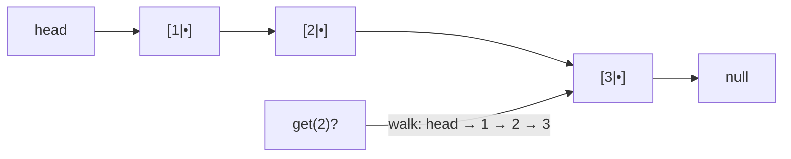

# Linked list — nodes chained by pointers, no positions to jump to

> **A `structures/` note (sibling shape to the trick notes).** New here? Read the
> [structures overview](../) first — it explains the abstraction↔metal idea and why algorithms
> depend on the structure underneath. **This structure:** each item is a node holding a value + a
> pointer to the next one, so inserting/removing is O(1) (relink two pointers) but reaching the
> `i`-th item is O(n) (walk the chain) — the **opposite** tradeoff to an [array](../array/).

## TL;DR

**Reach for a linked list when — any yes → candidate; the decider settles it:**
1. You mostly **insert / remove at the ends or at a node you already hold** — and rarely need "the `i`-th item"?
2. The collection **grows and shrinks a lot** and you never want to shift everything to make room?
3. **Do you have a reference to *where* the change happens** (a node, the head/tail), so the splice is O(1)? If you'd be **indexing by number** instead, you wanted an array. **The decider.**

**Before you use it, pin down:** singly or **doubly** linked (need to walk backward / delete a node given only itself → doubly)? keep a **tail** pointer (O(1) append) or head only? is there a **dummy/sentinel** head to kill edge cases? could it have a **cycle** (then "walk to the end" never stops)?

**Where it bites** (details in *What it costs*): **indexing** the `i`-th node is **O(n)** — no address math, you walk · **lose the `next` before saving it** and the rest of the chain is gone · doubly-linked edits must fix **`prev` too** · "find the end" loops **forever** on an accidental cycle.

## What it really is (abstraction vs the metal)

A chain of **nodes**. Each node is a little object holding a value plus a `next` pointer (a memory
address) to the following node — and that's the key difference from an array: the nodes can sit
**anywhere** in memory, scattered, wired together only by those pointers. The last node points at
`null`. You hold the **head** (first node); everything else is reached by *following pointers*.

```text
head → [1|•] → [2|•] → [3|•] → null
        val next
```

Tiny worked example — reach the 3rd item of `1 → 2 → 3`:
- start at head (`1`), follow `next` to `2`, follow `next` to `3`. **Three hops**, not one jump.

**The abstraction vs the metal.** An array gets item `i` with one multiply-add (`base + i*stride`)
because its slots are packed contiguously. A linked list **has no base + stride** — its nodes are
scattered, so there's nothing to compute; you must chase pointers from the head. That single fact —
*no address math* — is the whole story: it's why insert/remove is cheap (nobody shifts, you just
re-point two arrows) and why random access is expensive (you walk). A **doubly** linked list adds a
`prev` pointer per node so you can walk backward and delete a node given only itself. JS has no
built-in linked list (you build it from node objects); the closest native cousins are things wired
by reference — the DOM tree, a `Map`'s insertion order, a prototype chain.

## What you track

- **head** — the first node (your only guaranteed handle); `null` when empty.
- **tail** *(optional)* — the last node, kept so `addLast` is O(1) instead of O(n).
- each node's **`next`** (and **`prev`** if doubly linked) — the pointers you rewire on every edit.
- **size** *(optional)* — a running count, so `length` doesn't require a walk.

## What it costs (and why)

| Operation | Cost | Why — rooted in "pointers, no address math" |
|---|---|---|
| `addFirst` (prepend) | **O(1)** | make a node, point it at the old head, move head — no shifting |
| `addLast` (append) | **O(1)** *with a tail pointer*, else **O(n)** | relink the tail; without a tail ref you must walk to find the end |
| remove / insert **at a known node** | **O(1)** | re-point the neighbours' arrows; nothing else moves |
| `get(i)` / index | **O(n)** | no `base + i*stride` — walk `i` hops from the head |
| search by value | **O(n)** | follow the chain, checking each node |
| space | **O(n)** | one node object per item — **more overhead than an array** (a pointer per node, plus allocation scatter) |

The trade vs an array: a linked list **wins** at "insert/remove without shifting" and **loses** at
"give me item `i`." Arrays are the mirror image. Pick by which one your algorithm leans on.

## What it unlocks (algorithms that depend on it)

The classic linked-list interview moves — all about **rewiring pointers in the right order** without
losing the chain. They live under `techniques/`; this note links to them:

- **[Reverse a list](../../techniques/linked-list/reverse/)** — flip every `next`; the prev/curr/next
  dance, and the building block for the rest. (#206)
- **[M-to-N reversal](../../techniques/linked-list/mn-reversal/)** — reverse only positions `m..n`, in
  place, with a dummy head. (#92)
- **[Flatten a multilevel DLL](../../techniques/linked-list/merge-multilevel-dll/)** — splice each
  `child` list inline, depth-first, fixing `prev` too. (#430)
- **[Fast & slow pointers](../../techniques/two-pointers/fast-slow/)** — two cursors at different
  speeds detect a **cycle**, find its start, or find the **middle**. (#141 / #142 / #876) — it's a
  two-pointers *movement* whose home turf is the linked list.

## Picture



## Where you'll meet it (practice + recognition)

**In JS/TS:**
- No built-in — you build it from `{ val, next }` node objects (see [`solution.ts`](./solution.ts)).
- Reference-wired native structures behave list-like: the **DOM** (`nextSibling`/`parentNode`), a
  **prototype chain**, a `Map`'s **insertion order**.

**Real life / any stack:**
- An **LRU cache** = a doubly linked list (recency order) + a hash map (O(1) find) — the canonical pairing.
- Undo trails, music/playlist "next track", a train of carriages, `git`'s commit parents.

**Looks like it but ISN'T:**
- **Array** — O(1) index by address math, but O(n) to insert in the middle. **Opposite tradeoff.**
  Tell: mostly *index by number* (→ array) or mostly *splice at a node you hold* (→ linked list)? See [array](../array/).
- **Stack / queue** — you can *build* either from list nodes, but those are **disciplines** (one-end /
  two-end access), not the general "walk and rewire" structure. See [stack](../stack/), [queue](../queue/).

---
Solution code — a hand-built `LinkedList` (addFirst O(1) · addLast with a tail · get walks O(n)),
runnable self-check that *executes* the cost story: [`solution.ts`](./solution.ts).
