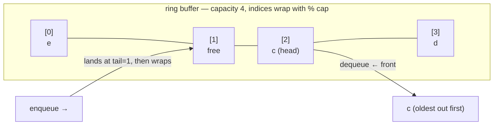

# Queue — a line: add at the back, remove from the front (FIFO)

> **A `structures/` note (sibling shape to the trick notes).** New here? Read the
> [structures overview](../) first — it explains the abstraction↔metal idea and why algorithms
> depend on the structure underneath. **This structure:** a line — joins at the **back**, leaves
> from the **front**, in arrival order (FIFO, first-in-first-out); done right it's O(1) both ends.

## TL;DR

**Reach for a queue when — any yes → candidate; the decider settles it:**
1. Items must be handled in **arrival order** — oldest first, fairness, no jumping the line?
2. You add at **one end** and remove from the **other** (never the middle)?
3. **Do you take from the FRONT (oldest) while adding to the BACK?** That's FIFO — the queue.
   **The decider.** (Take from the *same* end you add to → that's LIFO, a [stack](../stack/), not a
   queue.)

**Before you use it, pin down:** bounded or unbounded (cap the backlog, or grow forever)? one
producer/one consumer or many? need **both** ends (then it's a deque)? what happens on **empty** —
throw, block, or return null? need **priority** (jump the line by rank → that's a heap, not a plain
queue)?

**Where it bites** (details in *What it costs*): the naive `arr.shift()` queue is **O(n) per
dequeue** — every remaining element re-indexes, sliding one slot left — so N dequeues = **O(n²)**,
the cliff · a fixed ring buffer **silently drops or overwrites** when full unless you grow it ·
forgetting to **wrap** an index (`% capacity`) reads stale/empty slots · tracking only head+tail
without a **count** can't tell *full* from *empty* (both look like head == tail).

## What it really is (abstraction vs the metal)

A **line at a counter.** New arrivals join the back; the cashier serves the front; nobody who came
later gets served first. Two moves: **enqueue** (join the back) and **dequeue** (leave the front).

Tiny worked example — enqueue `a`, `b`, `c`, then dequeue twice:
- after enqueues: front → `a, b, c` ← back
- dequeue → `a` (the oldest), then `b`. Left holding `c`. **Order out = order in.**

**The abstraction vs the metal.** JS hands you **no real queue.** The obvious build — a plain array,
`push` to enqueue, `shift` to dequeue — *looks* correct but leaks cost: `shift()` removes index 0,
which forces **every remaining element to re-index** (slide one slot left to close the gap) — that's
O(n), the same packed-block shift that makes array front-insert slow. Loop it and you get O(n²)
where you expected O(n).

Done on the metal it's a **ring buffer** (circular array): a fixed block plus two indices — **head**
(front) and **tail** (next free back slot) — that **wrap** with `% capacity`. Nothing ever shifts;
when tail runs off the end it reappears at slot 0 and reuses the space dequeued items freed. That's
how enqueue/dequeue become true O(1). Generalize to **both ends** (add/remove at front *and* back)
and you have a **deque** (double-ended queue).

## What you track

- **head** — index of the front item (next to dequeue).
- **tail** — index of the next free back slot (where the next enqueue lands).
- **count** — how many items are live. Needed to tell **full from empty** — with only head/tail,
  both states show `head == tail` and you can't distinguish them.
- **capacity** — slots allocated. Full when `count == capacity` → grow (double + re-lay-out).
  (See `Queue` in [`solution.ts`](./solution.ts).)

## What it costs (and why)

| Operation | Cost | Why — rooted in the ring buffer |
|---|---|---|
| `enqueue` (add back) | **amortized O(1)** | drop value at `tail`, advance `tail` with `% cap`; only the rare full→double copy is O(n), averaged out |
| `dequeue` (remove front) | **O(1)** | read `head`, advance `head` with `% cap` — **no element moves** |
| `peek` (front) | **O(1)** | just read slot `head` |
| `isEmpty` / `size` | **O(1)** | read `count` |
| naive `arr.shift()` dequeue | **O(n)** ⛔ | removing index 0 re-indexes every later element (shift left) — **THE cliff**, N dequeues → O(n²) |
| space | **O(n)** | one slot per live item (+ slack capacity) |

"Amortized O(1)" for enqueue = a single enqueue can trigger the O(n) grow-and-copy, but doubling
makes that rare: n enqueues do ~2n copies total → O(1) each on average. Same averaging argument as a
dynamic array. `Queue` in [`solution.ts`](./solution.ts) executes it — and forces `tail` to **wrap
past 0** so you can watch FIFO survive a scrambled storage layout.

## What it unlocks (algorithms that depend on it)

The defining win — **O(1) take-from-front in arrival order** — is what these lean on; give them the
O(n) `shift()` queue and they blow up to O(n²):

- **[Sliding window](../../techniques/two-pointers/sliding-window/)** — the **monotonic-deque**
  variant for *sliding-window-maximum* is a queue open at **both ends**: push candidates at the
  back, pop stale ones from the back, drop the expired max from the front — each in O(1).
- **BFS / level-order traversal** (LeetCode **#102** binary tree level order, **#1091** shortest
  path in a binary matrix) — visit nodes in waves; the frontier *is* a queue, FIFO guarantees you
  finish a level before the next.
- **Task scheduling & the event-loop task queue** — callbacks (timers, I/O, messages) join the
  back, the loop pulls from the front in arrival order; FIFO is why `setTimeout(fn, 0)` runs after
  already-queued work.
- **Rate limiting** (token/leaky bucket), **producer–consumer buffers** — bound the backlog, hand
  work off oldest-first between a fast producer and a slow consumer.

## Picture

## Where you'll meet it (practice + recognition)

**In JS/TS:**
- No built-in queue. The everyday hack is `arr.push()` + `arr.shift()` — **fine for tiny lists,
  the O(n²) cliff on big ones.** For real work build a ring buffer (see `solution.ts`) or use a
  library's deque/linked-list queue.
- `Promise` microtask queue and the macrotask/event-loop queue — FIFO queues baked into the runtime.

**Real life / any stack:**
- Print spooler, message brokers (SQS, RabbitMQ, Kafka partitions), job/worker backlogs (BullMQ),
  keystroke/event buffers, network packet buffers.
- Any "process oldest first / first-come-first-served" pipeline.

**Looks like it but ISN'T:**
- **[Stack](../stack/)** — push/pop the **same** end (LIFO, last-in-first-out). **Opposite order.**
  Tell: serve the **oldest** waiting item (→ queue) or the **newest** (→ stack)?
- **[Array](../array/)** — using one as a queue via `shift()` is the **O(n)-per-dequeue trap**;
  arrays are for O(1) *indexing*, not front-removal. Tell: address by **position** (→ array) or
  strictly **add-back/remove-front** (→ ring-buffer queue)?
- **Deque** — a queue open at **both** ends (add/remove front *and* back). A plain queue is one-way;
  this **generalizes to a deque** when you need the other end too (e.g. sliding-window max).

---
Solution code — `Queue<T>` (ring buffer: head/tail/count, wrap with `% cap`, double-on-full),
runnable self-check that forces wrap-around: [`solution.ts`](./solution.ts).
