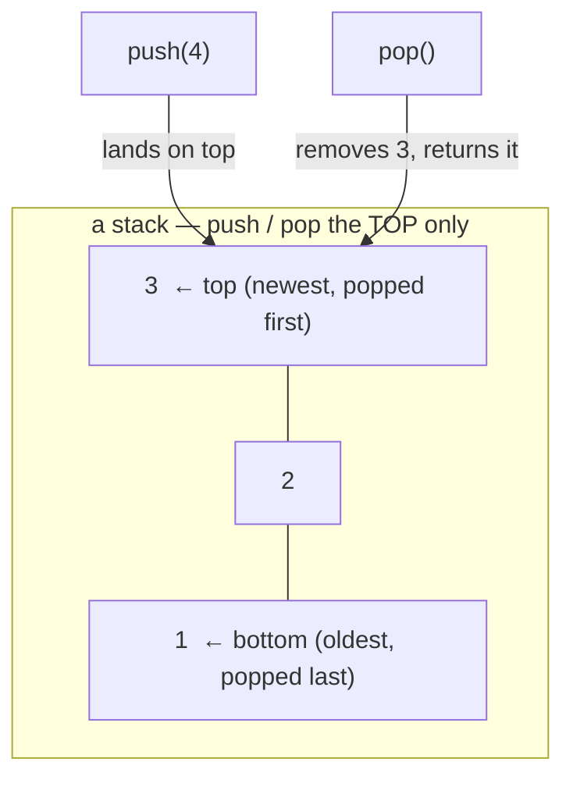

# Stack — a pile you push onto and pop off the top only (LIFO)

> **A `structures/` note (sibling shape to the trick notes).** New here? Read the
> [structures overview](../) first — it explains the abstraction↔metal idea and why algorithms
> depend on the structure underneath. **This structure:** items stacked like plates — you only ever
> touch the **top**, so the **last one in is the first one out** (LIFO), and both push and pop are O(1).

## TL;DR

**Reach for a stack when — any yes → candidate; the decider settles it:**
1. You only ever add or remove at **one end** — never reach into the middle or the bottom?
2. The thing you process next is the thing you saw **most recently** (newest first, not oldest first)?
3. **Does the problem need "most-recent-first" / nesting-must-close-in-reverse-order?** Matching
   brackets, undo, walking *into* the deepest branch first (DFS) — all are last-in-first-out by
   nature. **The decider.** (Need *oldest* first instead → queue, the opposite.)

**Before you use it, pin down:** what's an **empty pop** — error, or a sentinel like `null`? do you
also need to **peek** (look at top without removing)? is the natural recursion **too deep** (→ swap
the call stack for an explicit stack to dodge overflow)? bounded size, or grow freely?

**Where it bites** (details in *What it costs*): **pop / peek on empty** is the classic crash —
decide up front (throw vs `null`) · reaching for anything but the top means it's **not a stack** —
you've picked the wrong tool · **recursing too deep** blows the *call stack* (`RangeError: Maximum
call stack size exceeded`) — the runtime's own stack has a ceiling.

## What it really is (abstraction vs the metal)

A **pile**. Three operations, all at the top: **push** (drop one on top), **pop** (take the top
off), **peek** (look at the top, leave it). The rule — *last in, first out* — falls straight out of
"top only": the most recent thing you pushed sits on top, so it's the first you pop.

Tiny worked example — push `1`, `2`, `3`, then pop twice:
- after pushes, top→bottom is `3, 2, 1`.
- pop → `3` (newest). pop → `2`. Left with `1`. Reverse order of how they went in.

**The abstraction vs the metal.** A stack is an *abstraction* — "top-only access" — not a layout.
The cheapest backing is **just an array used at one end**: `arr.push` / `arr.pop` are already O(1)
(append / drop-the-last, no shifting — see [array](../array/)), so a JS array *is* a stack if you
promise yourself never to index into it. (Don't use `shift`/`unshift` for a stack — those touch the
*front* and are O(n).) **The realest stack of all is the CALL STACK** the engine runs your code on:
every function call pushes a **frame** (its locals, where to return to); `return` pops it. That's
literally LIFO — the function that started most recently finishes first. Recurse too deep and you
overflow that fixed-size stack → `RangeError: Maximum call stack size exceeded`. So recursion isn't
*like* a stack; it *runs on* one (see [recursion](../../paradigms/recursion/)). By design there's
**no random access** — no "give me the 3rd item"; if you need that, you wanted an array.

## What you track

- **the items** — the backing array (top = last element).
- **top / size** — where the top is; `size === 0` means empty (the thing you must guard before pop/peek).

## What it costs (and why)

| Operation | Cost | Why — rooted in "top only" |
|---|---|---|
| `push` (add to top) | **O(1)** | append one slot at the end (array doubles rarely — amortized O(1)) |
| `pop` (remove top) | **O(1)** | drop the last slot, hand it back — nothing shifts |
| `peek` (read top) | **O(1)** | just read the last slot, don't touch it |
| search (find a value) | **O(n)** | not what a stack is for — you'd scan every item |
| space | **O(n)** | one slot per stored item |

The whole appeal: the two operations you actually use — push and pop — are **both O(1)**, every
time. Nothing in a stack ever forces a shift, because you never open a hole in the middle.

## What it unlocks (algorithms that depend on it)

- **[Recursion](../../paradigms/recursion/)** — depth-first by nature *is* recursion, and the
  **call stack driving every recursion is literally a stack**. When the recursion would go too deep
  and overflow that built-in stack, you rewrite it as a loop with **your own explicit stack** —
  same LIFO order, but heap-backed so it can't blow the call-stack ceiling. (Iterative DFS is
  exactly this move.)

Name-only (built elsewhere or not yet):
- **Balanced brackets** — push each opener, pop+match on each closer (LeetCode **#20** Valid
  Parentheses). The canonical "why LIFO": the most-recently-opened bracket must close first. (Built
  in [`solution.ts`](./solution.ts) as `isBalanced`.)
- **Monotonic stack / next-greater-element** — keep a stack that stays sorted; pop smaller ones as
  a bigger value arrives (LeetCode **#496**, **#739**).
- **Expression evaluation** — evaluate Reverse Polish Notation by pushing operands, popping on each
  operator (LeetCode **#150**).
- **Undo / redo** — each action pushed; undo = pop the latest. Newest-first is exactly LIFO.
- **Browser back button** — pages pushed as you navigate; Back pops the most recent.
- **Iterative DFS** — explicit stack replacing the call stack (see above).

## Picture

## Where you'll meet it (practice + recognition)

**In JS/TS:**
- A plain array + **`push` / `pop`** is a stack — both O(1). (`arr[arr.length - 1]` to peek.) Just
  never `shift`/`unshift` or index the middle, or you've left stack-land.
- The **call stack** itself — every nested function call; you see it in any stack trace, top frame
  = where you are now.

**Real life / any stack:**
- A pile of plates / a spring-loaded tray dispenser — take from the top, add to the top.
- Undo history in an editor, the browser Back button, a "recently viewed" that pops the newest.
- Parsing nested things — brackets, HTML/JSX tags, JSON — where each open must close in reverse order.

**Looks like it but ISN'T:**
- **Queue / deque** — also one-in-one-out, but **FIFO**: you remove from the *opposite* end you add
  to, so the **oldest** comes out first (a checkout line), not the newest. Tell: process **newest
  first** (→ stack) or **oldest first** (→ queue)?
- **Array** — same array can *back* a stack, but a stack is a **discipline** (top only); an array
  gives you **random access** `arr[i]`. Tell: do you reach into the middle by index (→ array) or
  only touch one end (→ stack)? See [array](../array/).

---
Solution code — `Stack<T>` (push / pop / peek / isEmpty / size over an array) + `isBalanced` proving
why brackets need LIFO, runnable self-check: [`solution.ts`](./solution.ts).
