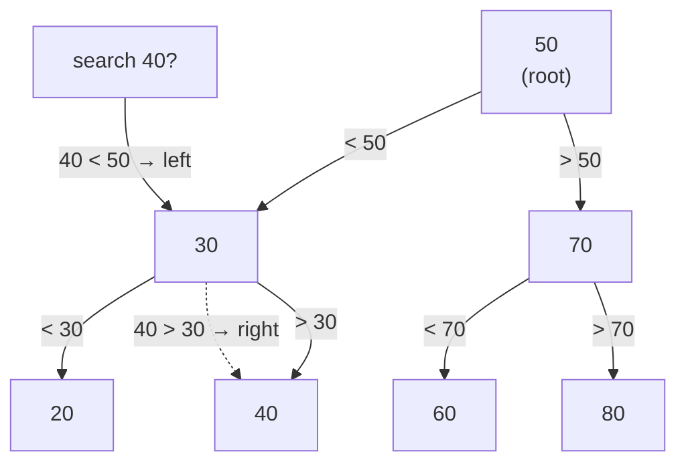

# Tree / BST — a branching chart you keep in order, so search & insert stay O(log n)

> **A `structures/` note (sibling shape to the trick notes).** New here? Read the
> [structures overview](../) first — it explains the abstraction↔metal idea and why algorithms
> depend on the structure underneath. **This structure:** a tree of nodes joined by pointers; this
> note centers on the **binary search tree (BST)** — order it `left < node < right` and search,
> insert, delete each cost O(log n) (when balanced), like binary search but cheap to update.

## TL;DR

**Reach for a BST when — any yes → candidate; the decider settles it:**
1. You keep a **changing set of keys** and need it **sorted** — fast lookup *and* cheap insert/remove
   as it churns (a sorted array gives lookup but O(n) inserts; a hash map gives lookup but no order)?
2. You need **ordered operations** a hash map can't do — "smallest/largest", "next key after X",
   "every key between A and B" (range scan), "walk in sorted order"?
3. **Do you need both `O(log n)` search AND ordered iteration over data that keeps changing?** That
   exact pair is what a BST exists for. **The decider.** (Need only O(1) by-key and *no* order → hash
   map. Need only min/max and no search → heap.)

**Before you use it, pin down:** is it **balanced** (or could inputs arrive **sorted** → the cliff)?
do you need **duplicates** (multiset) or unique keys (a set)? will you really do **range / ordered**
queries, or just point lookups (then a hash map is faster)? in production, which **self-balancing**
flavour (red-black for an ordered map, B-tree for a disk index)?

**Where it bites** (details in *What it costs*): insert **already-sorted** data into a plain BST and
it **degenerates into a linked list** → every op O(n) — the cliff · each node is a **scattered
pointer hop**, not a packed stride → **cache-unfriendly**, slower constant than an array even at the
same Big-O · a naive recursive traversal on a deep/skewed tree can **blow the call stack** ·
**delete** is the fiddly op (a node with two children must be replaced by its in-order
successor/predecessor).

## What it really is (abstraction vs the metal)

A **node** is a little box holding a value plus two **pointers**: `left` and `right` (either can be
`null` = no child there). A tree is these boxes wired together — one **root** at top, children
hanging below. Unlike an array's one contiguous block, the boxes are **scattered across memory** and
reached *only by following pointers*. That's the metal: a hop from parent to child is a **random
memory jump**, not a stride down a packed row — so a tree is **cache-unfriendly** (the CPU can't
pre-fetch the next node), the price for cheap structural edits.

A **binary search tree** adds one rule — the **invariant** — at *every* node:

> **everything in the left subtree `<` node `<` everything in the right subtree.**

That ordering is the whole payoff. To **find** a value: compare at the root; smaller → go left,
bigger → go right; repeat. Each step throws away **half** the remaining tree — *exactly* like binary
search on a sorted array. But where the sorted array pays O(n) to insert (shift everything), the BST
just walks to an empty slot and **hangs a new node — no shifting**. Search like binary search,
updates cheap: that's the trade.

Tiny worked example — insert `50, 30, 70, 20, 40`:

```
        50
       /  \
     30    70
    /  \
  20    40
```

- Search `40`: at `50` it's smaller → left to `30`; at `30` it's bigger → right to `40`. Found in 3
  hops, never touched the `70` side.
- Walk **in-order** (left, self, right) → `20, 30, 40, 50, 70` — sorted, for free.

**The cliff (the abstraction leaking).** "O(log n)" assumes the tree stays **balanced** — short and
bushy. Insert **already-sorted** data (`1,2,3,4,5…`) and every value is bigger than the last, so it
always hangs off the right: the tree becomes a one-sided chain — a **linked list** of height `n`.
Now search/insert are **O(n)** and the ordering bought nothing. Real systems never ship a plain BST;
they use **self-balancing** trees (AVL, red-black) or **B-trees** (database indexes) that
rotate/rebalance on insert to *guarantee* height ~log n. (We name these — building one is its own
note.)

## What you track

- **root** — pointer to the top node (or `null` when empty). The one handle into the whole tree.
- **per node**: `value`, `left` pointer, `right` pointer — each `null` when there's no child.
- **a comparator** `compare(a, b)` — defines the order (`<0` a-before-b, `0` equal, `>0` after). It,
  not the type, decides left-vs-right, so the same tree orders numbers, strings, or records.
- **height** (longest root-to-leaf hop count) — the number that *is* the cost: ~`log n` bushy, `n`
  skewed. (Exposed by `height()` in [`solution.ts`](./solution.ts) to make the cliff measurable.)

## What it costs (and why)

| Operation | Cost | Why — rooted in the ordered pointer tree |
|---|---|---|
| search (`has`) | **O(log n)** balanced / **O(n)** skewed | compare → commit to one side, discard the other half each hop; height hops total |
| insert | **O(log n)** balanced / **O(n)** skewed | same walk to an empty slot, then hang a node — **no shifting** (unlike a sorted array) |
| delete | **O(log n)** balanced / **O(n)** skewed | find it, then relink; two-child case swaps in the in-order successor — fiddly but no shift |
| `min` / `max` | **O(log n)** balanced / **O(n)** skewed | smallest = walk left to the end; largest = walk right to the end |
| in-order traversal | **O(n)** | visit every node once (left, self, right) → emits values **sorted**, free |
| space | **O(n)** | one node box (value + 2 pointers) per element, scattered in memory |

The two columns *are* the lesson: a BST is only O(log n) **while balanced**. Sorted-order inserts
push it to the right column — **the cliff** — which is why production uses self-balancing variants.
[`solution.ts`](./solution.ts) executes both: 8 ascending inserts → `height() === 8` (a chain); the
same 8 values in balanced order → `height() === 4`.

## What it unlocks (algorithms / structures that need it)

- **[Binary search](../../techniques/search/binary-search/find-target/)** — a BST is binary search
  turned into a **living, cheap-to-update structure**. The array version needs the data pre-sorted
  and pays O(n) to insert; the BST keeps the same "halve each step" search while letting you add and
  remove keys in O(log n). Same idea, different trade.
- **[Recursion](../../paradigms/recursion/)** — traversal (**in-order**, **pre-order**,
  **post-order**) is textbook recursion: "do the node, then recurse on each subtree." The whole shape
  is *solve a smaller copy of the same problem on each child*.
- **[Binary-tree techniques](../../techniques/trees/)** — the classic interview walks built on this
  structure: [max depth](../../techniques/trees/max-depth/) (#104), [level order](../../techniques/trees/level-order/)
  (#102, BFS), [right side view](../../techniques/trees/right-side-view/) (#199),
  [count complete](../../techniques/trees/count-complete/) (#222), [validate BST](../../techniques/trees/validate-bst/) (#98).
- **Ordered map / sorted set** (name-only) — `std::map`, Java `TreeMap`, the structure behind
  "iterate keys in order" and **range queries** (`[A, B]`). Backed by a self-balancing BST.
- **Database indexes** (name-only) — a **B-tree** (a fat, disk-friendly cousin of the BST) is how an
  index answers `WHERE x BETWEEN a AND b` and `ORDER BY` without scanning the table.
- **Autocomplete** (name-only) — a **trie** (prefix tree, a different cousin) walks letters down the
  tree to find every word with a given prefix.
- **Interval / segment trees** (name-only) — trees that answer range-aggregate queries
  ("sum/min over `[i, j]`") in O(log n).

## Picture



Invariant at every node: **left subtree < node < right subtree.** In-order walk →
`20, 30, 40, 50, 60, 70, 80` (sorted).

## Where you'll meet it (recognition)

**Real life / any stack:**
- A **leaderboard / sorted index** that keeps changing — insert a score, still query rank/range in
  O(log n) (a self-balancing BST or its B-tree cousin).
- **Database indexes** — the B-tree behind `ORDER BY`, `BETWEEN`, range scans.
- **Ordered maps / sorted sets** in standard libraries (`TreeMap`, `std::map`) — anytime you need
  keys *and* their order.
- A **file-system directory tree** or **DOM** — branching parent→children (a general tree, not a BST:
  no `<`/`>` ordering, but the same node-and-pointers shape and recursive traversal).

**Looks like it but ISN'T:**
- **Heap** — also a binary tree, but the rule is only **parent ≤ children** (min-heap), *not* a
  left/right ordering. So a heap hands you the **min (or max) in O(1)** and that's it — **no search,
  no sorted scan, no range query**. Tell: need only "give me the smallest next" → heap; need
  *ordered search* → BST. (Heap is a sibling note in this batch — `../heap/`.)
- **[Hash map](../hashmap/)** — O(1) by key vs the BST's O(log n), so faster for **point lookups** —
  but **unordered**: no min/max, no "next key", no range. Tell: only by-key get/set → hash map;
  need order or ranges → BST.
- **Self-balancing trees** (name-only: **AVL**, **red-black**, **B-tree**) — *why production never
  uses a plain BST.* Same invariant and O(log n) operations, plus rotations on insert/delete that
  **guarantee** the tree stays balanced — closing the cliff that a plain BST falls off on sorted
  input. Tell: "real system, must guarantee O(log n)" → reach for one of these, not the bare BST.

---
Solution code — `BST<T>` (comparator-driven; `insert` / `has` / `inorder` / `min` / `max` /
`height`), with a self-check that **executes the skew cliff** (sorted inserts → `height === n`):
[`solution.ts`](./solution.ts).
