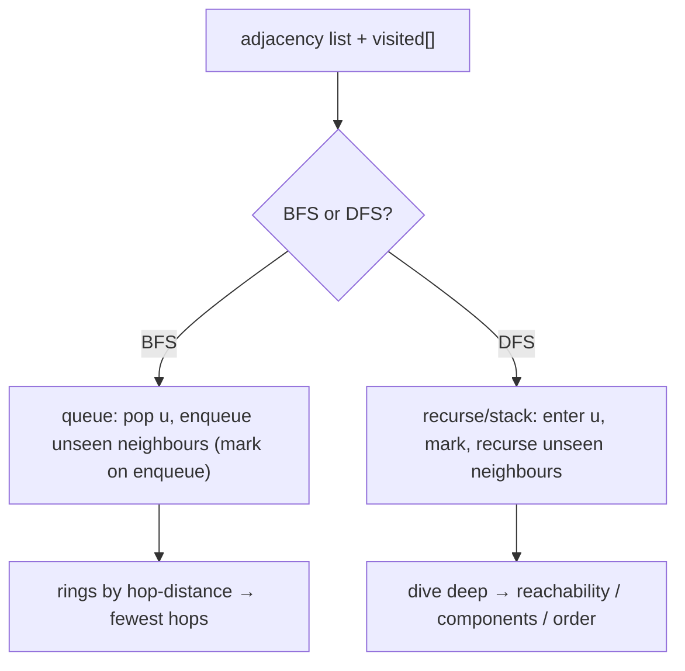

# BFS & DFS — the two ways to walk a graph, with a `visited` guard

> **1 of 4 graph techniques.** New here? Read the [graph techniques overview](../) and the
> [graph structure note](../../../structures/graphs/) first. **This one:** the two base walks every
> other graph algorithm is built on — **BFS** (a queue, expands by hops) and **DFS** (recursion / a
> stack, dives deep) — both gated by a `visited` set. Canonical: #1971 Find if Path Exists, #323 Connected Components.

## TL;DR

**Is it a plain BFS/DFS traversal? Ask these — all "yes" → yes:**
1. **Do I just need to *reach* / *visit* nodes** — "is there a path", "how many components", "fewest hops on an unweighted graph"?
2. **Are edges unweighted** (every step the same), or do I only care about connectivity?
3. **Will a `visited` set keep me from looping on cycles?** If "walk neighbours, skip seen ones" answers it → yes. **This one is the decider.** (Weights → Dijkstra; ordering a DAG → topo sort.)

**Before you code, pin down:** directed or undirected (undirected → add edges both ways)? nodes `0..n-1` or arbitrary labels? need *fewest hops* (→ BFS) or just *reachable / all components* (→ DFS)? could recursion go too deep (→ iterative DFS / BFS)?

**The lines where bugs hide** (details in *How it works*):
**mark `visited` when you ENQUEUE (BFS) / on entry (DFS)** — not when you dequeue/finish, or you queue the same node many times · build the adjacency list **both ways** for undirected graphs · a `visited` guard is **mandatory** (a graph can cycle) · loop over **all** nodes when counting components (the graph may be disconnected).

---

## What it is
Turn the edges into an **adjacency list** (node → its neighbours). Then walk:
- **BFS** uses a **queue**: visit a node, enqueue its unseen neighbours, repeat. It expands in
  **rings of equal hop-distance**, so it finds the **fewest-hops** path on an unweighted graph.
- **DFS** uses **recursion** (or an explicit stack): go as deep as possible down one neighbour
  before backtracking. Great for **reachability**, **connected components**, and ordering.

Both mark each node **visited** so a cycle doesn't loop forever, and both run in **O(V + E)**.

`edges = [[0,1],[1,2],[3,4]]`, undirected: components are `{0,1,2}` and `{3,4}` → **2 components**;
a path exists from `0` to `2` but not `0` to `4`.

## What you track
- the **adjacency list** (`Map`/array of neighbour lists).
- a **`visited`** set/array — marked as nodes enter the frontier.
- (BFS) a **queue**; (DFS) the **call stack** or an explicit stack; (components) a **count**.

## How it works
Pseudocode. The ⚠️ lines are where every bug hides.

```ts
// BFS reachability / fewest hops from `src`
function bfs(adj, src, n) {
  const visited = new Array(n).fill(false);
  const queue = [src];
  visited[src] = true;                  // ⚠️ mark on ENQUEUE, not on dequeue — else a node with
                                        //    two parents gets queued twice.
  while (queue.length) {
    const u = queue.shift();            // (use an index pointer on big graphs; shift() is O(n))
    for (const v of adj[u]) {
      if (!visited[v]) {                // ⚠️ the visited guard — without it, cycles loop forever.
        visited[v] = true;
        queue.push(v);
      }
    }
  }
  return visited;                       // who's reachable from src
}

// DFS — count connected components over the WHOLE graph
function countComponents(adj, n) {
  const visited = new Array(n).fill(false);
  let comps = 0;
  for (let s = 0; s < n; s++) {          // ⚠️ start from EVERY node — the graph may be disconnected.
    if (!visited[s]) {
      comps++;
      dfs(adj, s, visited);              // sink the whole component
    }
  }
  return comps;
}
```

Why mark-on-enqueue: in BFS, a node reachable from several already-queued nodes would be enqueued
once per parent if you only marked it when popped — blowing up the queue and the time. Marking the
instant it enters keeps each node in the queue at most once.

Lock these in: **mark visited on enqueue/entry**, **adjacency both ways if undirected**, **visited guard always**, **scan all nodes for components**.

## Picture


## Where you'll meet it (practice + recognition)

**On LeetCode (and similar platforms):**
- **#1971 Find if Path Exists in Graph** — BFS/DFS reachability. (`validPath` in [`solution.ts`](./solution.ts).)
- **#323 Number of Connected Components** — DFS from every unvisited node, count. (`countComponents` in [`solution.ts`](./solution.ts).)
- **#133 Clone Graph / #785 Is Graph Bipartite** — DFS/BFS carrying extra state (a copy map, a 2-colouring).
- **#127 Word Ladder** — BFS for fewest transformations (shortest unweighted path).

**Real life / other platforms:**
- "Are these two users connected" / friend-of-friend; crawling links; dependency reachability.
- Garbage collection mark phase (reachable objects); spreading/percolation on a network.

**Looks like it but ISN'T:**
- **Weighted** shortest path → **Dijkstra** ([`dijkstra`](../dijkstra/)) — BFS rings assume equal-cost steps.
- **Ordering by prerequisites** → **topological sort** ([`topological-sort`](../topological-sort/)) — needs in-degrees / a DAG, not just a visit.
- A **grid** → the same walks with implicit neighbours → [`techniques/grid`](../grid/).

---

Solution code (#1971 BFS + #323 DFS components, fully commented): [`solution.ts`](./solution.ts).
