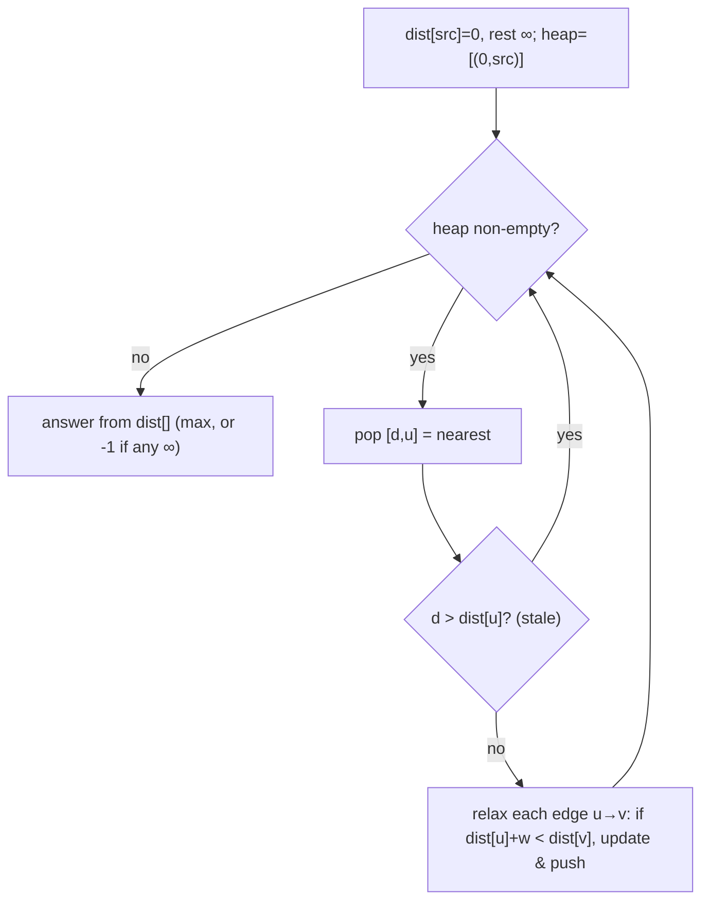

# Dijkstra — BFS with a min-heap for shortest paths on a weighted graph

> **3 of 4 graph techniques.** New here? Read the [graph techniques overview](../), [`bfs-dfs`](../bfs-dfs/),
> and the [heap structure note](../../../structures/heap/) first. **This one:** when edges have
> **weights**, "fewest hops" ≠ "shortest distance" — so replace BFS's queue with a **min-heap** that
> always expands the **nearest unsettled** node. Canonical problem: #743 Network Delay Time.

## TL;DR

**Is it Dijkstra? Ask these — all "yes" → yes:**
1. **Do edges have **non-negative weights** (distances, times, costs)** — not all equal?
2. **Do I want the *shortest total distance*** from a source (to one node, or to all)?
3. **Can I always settle the *closest remaining* node next?** If "pull the min-distance frontier node from a heap, relax its edges, repeat" → yes. **This one is the decider.** (Equal weights → plain BFS. Negative edges → Bellman-Ford, not this.)

**Before you code, pin down:** are weights **non-negative** (Dijkstra breaks on negatives)? one target or all nodes? directed or undirected? node labels (1-indexed in #743)? answer is a single distance, the max (all-received time), or a full dist map?

**The lines where bugs hide** (details in *How it works*):
**`dist[source] = 0`, everything else `∞`** · the heap holds `[distance, node]` and pops the **smallest distance** · **skip stale pops** (`d > dist[node]` → ignore) instead of a `visited` set · **relax**: `if (dist[u] + w < dist[v]) update and push` · unreachable nodes stay `∞` → report `-1`.

---

## What it is
BFS finds fewest *hops* because every step costs 1. With **weights**, the cheapest route may take
*more* hops, so a FIFO queue is wrong. Dijkstra fixes this by always expanding the **nearest
not-yet-finalized** node — a **min-heap** (priority queue) keyed on current best distance hands it to
you. When a node is popped with its smallest distance, that distance is **final** (true for
non-negative weights). You then **relax** its edges: if going through it gives a neighbour a shorter
distance, update and push the neighbour back with the new distance.

`#743`: signal starts at node `k`; each node's shortest distance is when it receives the signal; the
answer is the **largest** of those (the last to hear), or `-1` if someone never does.

## What you track
- a **`dist` array** — best-known distance to each node (`0` at source, `∞` elsewhere).
- a **min-heap** of `[distance, node]`, popping the smallest distance.
- (no separate `visited` needed) — a popped entry whose `d` exceeds `dist[node]` is **stale**, skip it.

## How it works
Pseudocode (#743). The ⚠️ lines are where every bug hides.

```ts
const dist = new Array(n + 1).fill(Infinity);
dist[k] = 0;                                  // ⚠️ source distance 0; all others ∞.
const heap = new MinHeap();                   // ordered by distance
heap.push([0, k]);

while (!heap.isEmpty()) {
  const [d, u] = heap.pop();                  // ⚠️ smallest distance first.
  if (d > dist[u]) continue;                  // ⚠️ STALE entry (we already found u cheaper) → skip.
  for (const [v, w] of adj[u]) {
    if (dist[u] + w < dist[v]) {              // ⚠️ RELAX: a shorter route to v through u?
      dist[v] = dist[u] + w;
      heap.push([dist[v], v]);                //    push v with its improved distance.
    }
  }
}

// #743: time for ALL to receive = the farthest shortest-distance.
const ans = Math.max(...dist.slice(1));       // nodes 1..n
return ans === Infinity ? -1 : ans;           // ⚠️ someone unreachable → -1.
```

Why popping the nearest settles it: with **non-negative** weights, you can't later find a shorter
route to a node than the smallest distance currently in the heap for it — any detour only adds
length. So the first (smallest-distance) pop of a node is final. (Negative edges break this — use
Bellman-Ford.) The "skip stale" check replaces a visited set: a node may sit in the heap several
times with different distances; we honour only the smallest.

Lock these in: **`dist[src]=0`/rest `∞`**, **min-heap by distance**, **skip stale pops**, **relax with `dist[u]+w`**, **unreachable → `-1`**.

## Picture


## Where you'll meet it (practice + recognition)

**On LeetCode (and similar platforms):**
- **#743 Network Delay Time** — time for a signal to reach all nodes (max shortest-distance). (This note's code.)
- **#1631 Path With Minimum Effort / #778 Swim in Rising Water** — Dijkstra on a grid with a "max edge along path" cost.
- **#787 Cheapest Flights Within K Stops** — Dijkstra/Bellman-Ford with a hop limit.
- **#1514 Path with Maximum Probability** — Dijkstra maximizing a product (a max-heap variant).

**Real life / other platforms:**
- **GPS / routing** shortest travel time; network packet **least-latency** path; cheapest multi-hop fare.
- Any "least total cost through a weighted network" where costs are non-negative.

**Looks like it but ISN'T:**
- **Unweighted** (or all-equal) edges → plain **BFS** ([`bfs-dfs`](../bfs-dfs/)) is simpler and just as correct; the heap is wasted.
- **Negative** edge weights → Dijkstra is wrong; use **Bellman-Ford**.
- Only an **ordering** by dependency, no distances → [`topological-sort`](../topological-sort/).

---

Solution code (#743 Dijkstra + a compact inline min-heap, fully commented): [`solution.ts`](./solution.ts).
