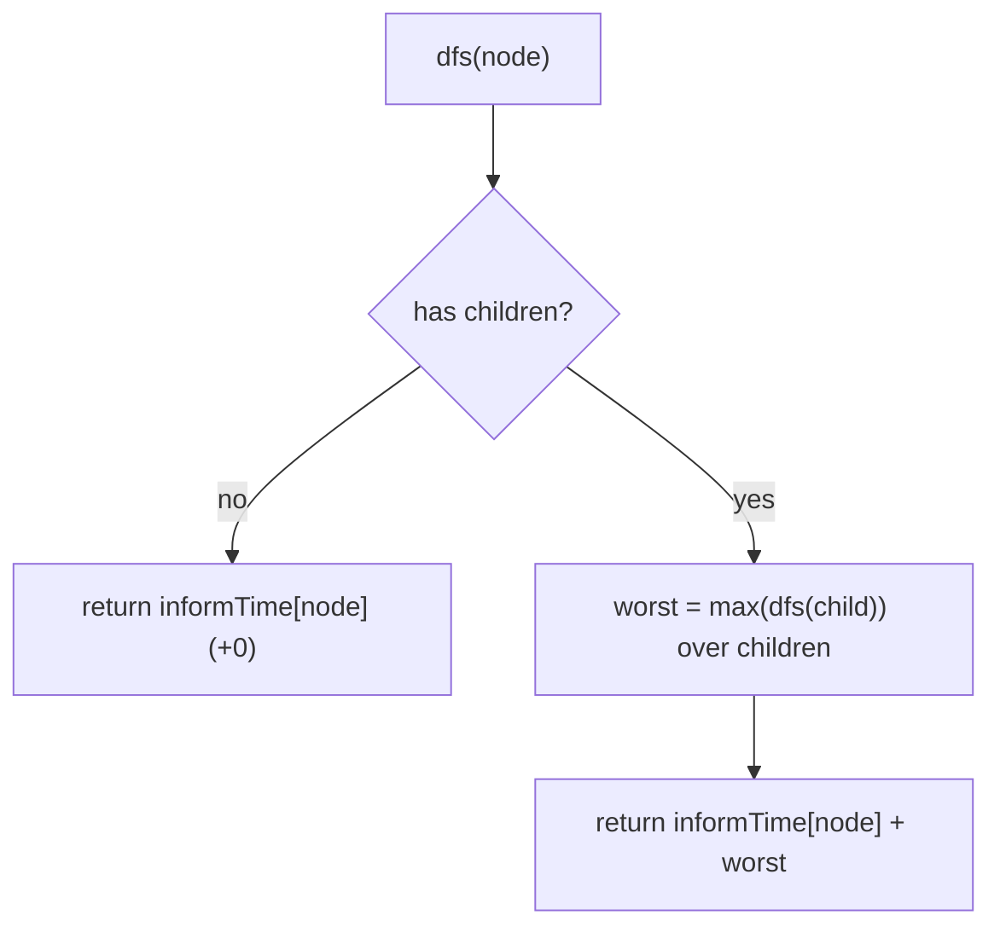

# Inform all employees — DFS the org tree for the longest weighted path

> **4 of 4 graph techniques.** New here? Read the [graph techniques overview](../) and [`bfs-dfs`](../bfs-dfs/)
> first — and note this is really a **tree** DFS (see [`techniques/trees`](../trees/)), since an org
> chart has one manager per person. **This one:** the message reaches everyone only when the *slowest*
> chain finishes — the **longest root-to-leaf sum** of inform-times. Canonical problem: #1376 Time Needed to Inform All Employees.

## TL;DR

**Is it the longest-weighted-path DFS? Ask these — all "yes" → yes:**
1. **Is there a *hierarchy* (a tree)** — each node has one parent (a manager), one root (the head)?
2. **Does a delay accumulate **down** each path**, and the answer is the **slowest** path (max), not the sum of all?
3. **Can I DFS from the root, adding this node's time and taking the max child result?** If "longest accumulated chain wins" → yes. **This one is the decider.**

**Before you code, pin down:** how is the tree given (a `manager[]` parent array → build `children[]`)? `informTime[i]` is the time for `i` to tell *its* subordinates (charged once, not per subordinate)? a leaf adds `0` (no one to inform)? could the chain be deep (recursion depth)?

**The lines where bugs hide** (details in *How it works*):
**build `children[]` from `manager[]`** (invert the parent array) · DFS returns `informTime[node] + max(child results)` · a **leaf returns 0** (`informTime` of a manager-with-no-reports is irrelevant downward) · take the **max** over children, not the sum (informing is parallel — the slowest branch gates it).

---

## What it is
Each employee reports to one manager, so the company is a **tree** rooted at the head. When a manager
spends `informTime` telling their direct reports, all those reports hear at the *same* moment (in
parallel) — so the time for the message to reach the *whole* company is set by the **slowest chain**
from the head down to some employee: the maximum, over all root-to-leaf paths, of the summed
inform-times along the path.

DFS from the head: a node's "time to inform everyone beneath it" is its own `informTime` plus the
**worst** (max) of its children's such times. A leaf (no reports) contributes `0`.

`n=6, head=2, manager=[2,2,-1,2,2,2], informTime=[0,0,1,0,0,0]`: head `2` informs its 5 reports in
`1` minute; none of them have reports → answer **1**.

## What you track
- **`children[]`** — built by inverting `manager[]` (`children[manager[i]].push(i)`).
- a DFS that returns, for each node, `informTime[node] + max(child times)`.
- the **answer** = the DFS result at the head.

## How it works
Pseudocode (#1376). The ⚠️ lines are where every bug hides.

```ts
const children = Array.from({length: n}, () => []);
for (let i = 0; i < n; i++) {
  if (manager[i] !== -1) children[manager[i]].push(i);   // ⚠️ invert parent → children.
}

function dfs(node) {
  let worst = 0;
  for (const child of children[node]) {
    worst = Math.max(worst, dfs(child));   // ⚠️ MAX over children (parallel), not sum.
  }
  return informTime[node] + worst;         // ⚠️ this node's time + slowest subtree.
                                           //    a leaf has no children → returns informTime+0
                                           //    (and a true leaf's informTime is 0).
}

return dfs(headID);
```

Why max, not sum: a manager tells *all* direct reports during one `informTime` window — those
subtrees then propagate **concurrently**. The company is fully informed when the last (deepest /
slowest) chain finishes, which is the maximum path total, not the combined total.

Lock these in: **invert `manager[]` to `children[]`**, **`informTime[node] + max(children)`**, **leaf → 0**, **max not sum**.

## Picture


## Where you'll meet it (practice + recognition)

**On LeetCode (and similar platforms):**
- **#1376 Time Needed to Inform All Employees** — longest weighted root-to-leaf path. (This note's code.)
- **#104 Maximum Depth** — the unweighted cousin (`1 + max(left, right)`) → [`trees/max-depth`](../../trees/max-depth/).
- **#543 Diameter of Binary Tree / #124 Max Path Sum** — "best path" DFS where each node combines child results.
- **#1245 Tree Diameter** — longest path in a general tree, same DFS-of-max-children shape.

**Real life / other platforms:**
- "When does a broadcast finish" down an org chart / distribution tree where each level adds latency.
- Critical-path style "slowest branch gates completion" over a hierarchy.

**Looks like it but ISN'T:**
- **Sum of all** times (everyone informed sequentially) — wrong; informing is parallel, so it's the **max** path.
- A **weighted shortest path** on a general graph → [`dijkstra`](../dijkstra/); here it's a tree and you want the **longest** accumulated chain, not the shortest.

---

Solution code (fully commented): [`solution.ts`](./solution.ts).
