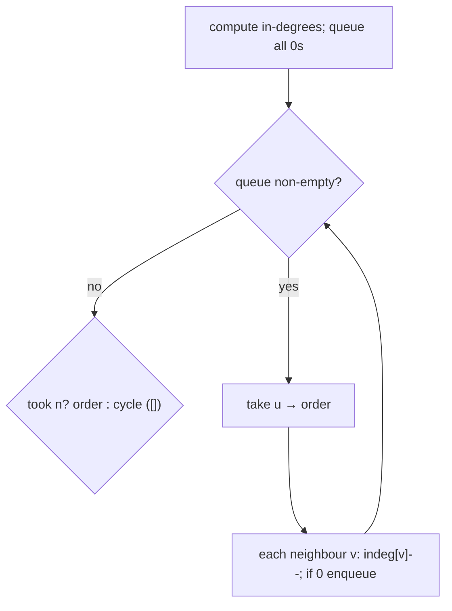

# Topological sort — peel off in-degree-zero nodes (Kahn's BFS)

> **2 of 4 graph techniques.** New here? Read the [graph techniques overview](../) and
> [`bfs-dfs`](../bfs-dfs/) first. **This one:** order a **directed acyclic graph** (DAG) so every
> edge points "forward" — repeatedly take a node with **no remaining prerequisites** (in-degree 0).
> If you can't take all of them, there's a **cycle**. Canonical problem: #207 Course Schedule.

## TL;DR

**Is it topological sort? Ask these — all "yes" → yes:**
1. **Are there *directed dependencies*** — "X must come before Y" (prerequisites, build order, task deps)?
2. **Do I want a valid *ordering*, or to detect an impossible *cycle***?
3. **Can I repeatedly remove something with *nothing left before it***? If "take an in-degree-0 node, remove it, repeat" → yes. **This one is the decider.**

**Before you code, pin down:** which way does an edge point — does `[a, b]` mean "a before b" or "b is a prerequisite of a" (#207: to take `a` you need `b` → edge `b → a`)? do I return the order (#210) or just feasibility (#207)? are nodes `0..n-1`? can there be duplicate edges?

**The lines where bugs hide** (details in *How it works*):
**get the edge direction right** (prereq → dependent) and bump **in-degree of the dependent** · seed the queue with **all in-degree-0** nodes · when you remove a node, **decrement each neighbour's in-degree** and enqueue those hitting 0 · **processed count < n ⇒ a cycle** (the only way to detect it here).

---

## What it is
Kahn's algorithm. Compute each node's **in-degree** (how many prerequisites point at it). Any node
with in-degree 0 has nothing blocking it — take it. Removing it "satisfies" one prerequisite for each
node it points to, so decrement their in-degrees; any that drop to 0 are now takeable. Keep peeling.
If you manage to take **all `n`** nodes, that order is a valid topological order. If you get stuck
with nodes still > 0 in-degree, they're tangled in a **cycle** — no valid order exists.

`3 courses, prereqs [[1,0],[2,1]]` (take 0 before 1, 1 before 2):
- in-degrees: `0→0, 1→1, 2→1`. Queue starts `[0]`.
- take `0` → decrement `1` to 0 → queue `[1]`. take `1` → decrement `2` to 0. take `2`.
- took all 3 → order `[0,1,2]`, feasible.

A cycle `[[1,0],[0,1]]`: both in-degree 1, queue starts empty → 0 taken < 2 → **cycle**, infeasible.

## What you track
- the **adjacency list** (prerequisite → the courses that depend on it).
- an **in-degree** count per node.
- a **queue** of in-degree-0 nodes, and the **order** (or just a processed **count**).

## How it works
Pseudocode (#207 / #210, Kahn). The ⚠️ lines are where every bug hides.

```ts
const adj = Array.from({length: n}, () => []);
const indeg = new Array(n).fill(0);
for (const [course, prereq] of prerequisites) {   // ⚠️ #207: [a, b] = b BEFORE a.
  adj[prereq].push(course);                        //    edge prereq → course …
  indeg[course]++;                                 //    … so the DEPENDENT's in-degree grows.
}

const queue = [];
for (let i = 0; i < n; i++) if (indeg[i] === 0) queue.push(i);   // ⚠️ seed ALL in-degree-0.

const order = [];
let head = 0;
while (head < queue.length) {
  const u = queue[head++];
  order.push(u);
  for (const v of adj[u]) {
    indeg[v]--;                       // ⚠️ removing u satisfies one prereq of v …
    if (indeg[v] === 0) queue.push(v); //    … enqueue v once it's fully unblocked.
  }
}

return order.length === n ? order : [];   // ⚠️ took fewer than n → a CYCLE → no valid order.
```

Why count-less-than-n means a cycle: in a DAG, peeling always exposes a new in-degree-0 node until
everything is gone. If peeling stalls with nodes remaining, those nodes form a loop where each waits
on another — none can ever reach in-degree 0.

Lock these in: **edge direction prereq→dependent**, **seed all in-degree-0**, **decrement + enqueue on 0**, **processed < n ⇒ cycle**.

## Picture


## Where you'll meet it (practice + recognition)

**On LeetCode (and similar platforms):**
- **#207 Course Schedule** — can you finish all courses (no dependency cycle)? (`canFinish` in [`solution.ts`](./solution.ts).)
- **#210 Course Schedule II** — return *an* order, or `[]` if impossible. (`findOrder` in [`solution.ts`](./solution.ts).)
- **#269 Alien Dictionary** — derive letter order from sorted words, then topo-sort it.
- **#310 Minimum Height Trees** — a "peel the leaves" variant on an undirected tree.

**Real life / other platforms:**
- **Build systems** (`make`, bundlers) ordering tasks by dependency; package install order; spreadsheet recalculation order.
- Course/curriculum prerequisites; pipeline stage scheduling.

**Looks like it but ISN'T:**
- A graph **with cycles** where you still want an order → topo sort *reports* the cycle, it can't order it (use SCCs/Tarjan instead).
- **Shortest path** (weighted) → [`dijkstra`](../dijkstra/); topo sort is about *order*, not distance (though it enables DAG shortest-path as a follow-on).

---

Solution code (#207 feasibility + #210 the actual order, fully commented): [`solution.ts`](./solution.ts).
