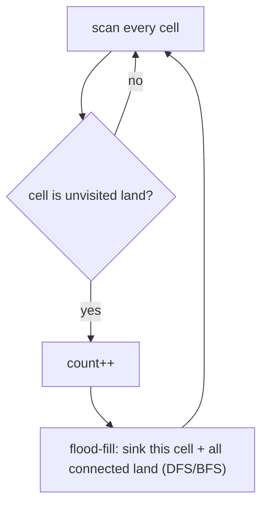

# Number of islands — flood-fill each blob, count how many times you start

> **1 of 3 grid techniques.** New here? Read the [grid techniques overview](../) first — the `DIRS`
> deltas, the bounds check, the `visited` mark. **This one:** scan every cell; each time you hit
> unvisited land, **flood-fill** its whole connected blob (DFS or BFS) and count `+1`. Canonical
> problem: #200 Number of Islands.

## TL;DR

**Is it a flood-fill / connected-components count? Ask these — all "yes" → yes:**
1. **Are cells grouped into *connected regions*** by adjacency (land touching land)?
2. **Do I want *how many* regions** (or their sizes), not a shortest path?
3. **Can I erase a whole region the moment I find it**, so I never recount it? If "DFS/BFS from each new start, sink everything reachable, count the starts" → yes. **This one is the decider.**

**Before you code, pin down:** 4-directional or 8 (diagonals)? may I **mutate** the grid to mark visited, or need a separate `visited` set? what counts as land (`'1'` chars vs numbers)? huge grid → DFS recursion could overflow → use BFS / explicit stack?

**The lines where bugs hide** (details in *How it works*):
**mark visited *immediately* when you enter a cell** (before recursing) or you re-enter and loop/overcount · **bounds-check before** reading `grid[nr][nc]` · only `+1` per *new* unvisited-land start, never per cell · 4 directions, not diagonal (unless asked).

---

## What it is
Walk every cell. When you find land you haven't seen, you've found a new island — count it, then
**flood-fill**: visit that cell and recursively (DFS) or via a queue (BFS) every land cell connected
to it, marking each visited (or sinking it to water) so it's never counted again. The number of
*times you had to start a fill* is the number of islands.

`grid` (`1` = land):
```
1 1 0 0        first fill starts top-left, sinks the whole 4-cell blob  → count 1
1 1 0 0        next unvisited land is the lone 1 at bottom-right         → count 2
0 0 0 1
```
Answer: **2**.

## What you track
- the **scan** position `(r, c)` over all cells.
- a **visited mark** — easiest is sinking land to `'0'` in place; or a separate `visited` matrix.
- **count** — incremented once per fill *start*.

## How it works
Pseudocode (#200, DFS flood-fill). The ⚠️ lines are where every bug hides.

```ts
let count = 0;
for (let r = 0; r < R; r++) {
  for (let c = 0; c < C; c++) {
    if (grid[r][c] === "1") {     // unvisited land → a new island
      count++;
      sink(r, c);                 // flood-fill the whole blob away
    }
  }
}
return count;

function sink(r, c) {
  if (r < 0 || r >= R || c < 0 || c >= C) return;   // ⚠️ bounds FIRST, before reading the cell.
  if (grid[r][c] !== "1") return;                   // water or already sunk → stop.
  grid[r][c] = "0";                                 // ⚠️ mark visited IMMEDIATELY (here), or the
                                                    //    four recursive calls re-enter forever.
  sink(r + 1, c); sink(r - 1, c);                   // 4-directional spread.
  sink(r, c + 1); sink(r, c - 1);
}
```

Why count-the-starts works: each `sink` erases an *entire* connected region, so the next land you
encounter in the scan must belong to a *different* island. The outer scan therefore triggers one
fill per island — exactly the count.

Lock these in: **mark visited on entry**, **bounds-check first**, **`+1` per fill start**, **4 directions**.

## Picture


## Where you'll meet it (practice + recognition)

**On LeetCode (and similar platforms):**
- **#200 Number of Islands** — count connected land regions. (This note's code.)
- **#695 Max Area of Island** — same flood-fill, but return the *largest* region's size. (`maxAreaOfIsland` in [`solution.ts`](./solution.ts).)
- **#1254 Number of Closed Islands / #130 Surrounded Regions** — flood-fill from the borders first, then count/flip what's left.
- **#547 Number of Provinces** — the same connected-components idea on an *explicit* graph → [`graphs`](../../graphs/).

**Real life / other platforms:**
- The paint-bucket **fill tool**; counting blobs in an image (connected-component labeling).
- Flood-risk / contiguous-region analysis on a raster map.

**Looks like it but ISN'T:** **shortest spread time / nearest distance** on a grid → that's a
*layered* BFS, not a reachability fill — [`rotting-oranges`](../rotting-oranges/) /
[`walls-and-gates`](../walls-and-gates/). The tell: counting/area of regions (→ this) vs distance/time (→ BFS layers).

---

Solution code (#200 + the #695 max-area twin, fully commented): [`solution.ts`](./solution.ts).
