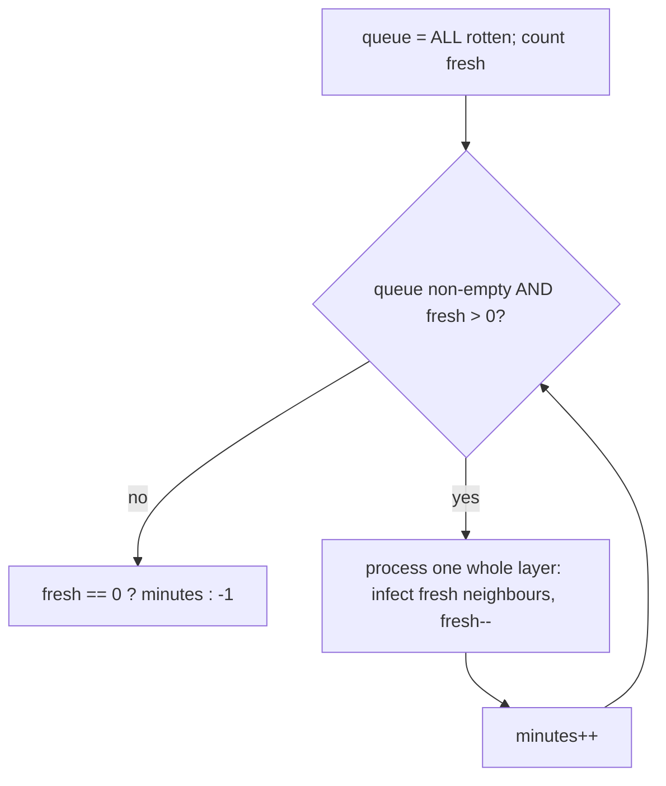

# Rotting oranges — multi-source BFS, the answer is the number of layers

> **2 of 3 grid techniques.** New here? Read the [grid techniques overview](../) first.
> **This one:** rot spreads from **every** rotten orange at once, one ring per minute — so seed the
> BFS queue with *all* sources before looping, and the number of BFS **layers** is the time.
> Canonical problem: #994 Rotting Oranges.

## TL;DR

**Is it multi-source BFS? Ask these — all "yes" → yes:**
1. **Does something *spread* one step per round** from possibly **many** starting points simultaneously?
2. **Do I want the *time/rounds* until everything is reached** (or that it's impossible)?
3. **Can I start BFS from *all* sources at once** instead of one at a time? If "seed the queue with every source, then count layers" → yes. **This one is the decider.**

**Before you code, pin down:** what are the cell states (0 empty, 1 fresh, 2 rotten in #994)? answer in minutes/rounds? what if there are **no fresh** to begin with (→ 0)? what if some fresh are **unreachable** (→ -1)? 4-directional?

**The lines where bugs hide** (details in *How it works*):
**enqueue ALL initial sources before the loop** (that's what "multi-source" means) · **count fresh up front** · process **one whole layer per minute** (snapshot the queue size) · only increment time on a layer that actually **infects something** · **leftover fresh → −1**, none → return the minutes.

---

## What it is
If rot spread from a single orange you'd BFS from it. But it spreads from **all** rotten oranges
**simultaneously** — so put every rotten orange in the queue *before* you start. Then BFS in
**layers**: each round, every currently-rotten cell infects its fresh neighbours, which become the
next layer. One layer = one minute. When the queue drains, if any fresh remain they were
unreachable → `-1`; otherwise the number of layers elapsed is the answer.

```
2 1 1        min0: the single 2 is the source
1 1 0   →    min1: its neighbours rot   min2: their neighbours …   min4: last orange rots
0 1 1        answer: 4
```

## What you track
- a **queue** seeded with **all** rotten cells (the multi-source frontier).
- **fresh** — a running count of fresh oranges; spread decrements it, `0` means done.
- **minutes** — incremented once per BFS layer that infects new cells.

## How it works
Pseudocode (#994). The ⚠️ lines are where every bug hides.

```ts
const queue = [];
let fresh = 0;
for each cell:                       // ⚠️ seed ALL sources first, and count fresh.
  if (cell === 2) queue.push([r, c]);
  if (cell === 1) fresh++;

let minutes = 0;
while (queue.length > 0 && fresh > 0) {   // ⚠️ stop early once no fresh remain.
  const layerSize = queue.length;          // ⚠️ snapshot — one full layer = one minute.
  for (let i = 0; i < layerSize; i++) {
    const [r, c] = queue.shift();
    for (const [nr, nc] of neighbours(r, c)) {
      if (inBounds(nr, nc) && grid[nr][nc] === 1) {   // ⚠️ bounds + only fresh get infected.
        grid[nr][nc] = 2;            // mark rotten now, so it isn't infected twice.
        fresh--;
        queue.push([nr, nc]);
      }
    }
  }
  minutes++;                         // ⚠️ this layer infected something → a minute passed.
}

return fresh === 0 ? minutes : -1;   // ⚠️ leftover fresh = unreachable → -1.
```

Why multi-source works: seeding every source at distance 0 means the BFS frontier is the set of
cells at the *same* time-distance from their nearest source. Layer `k` is exactly "everything that
rots at minute `k`" — no need to run a separate BFS per orange and merge.

Lock these in: **seed all sources**, **count fresh**, **layer = minute (snapshot size)**, **leftover fresh → −1**.

## Picture


## Where you'll meet it (practice + recognition)

**On LeetCode (and similar platforms):**
- **#994 Rotting Oranges** — time for rot to spread from all sources. (This note's code.)
- **#286 Walls and Gates** — multi-source BFS from every gate to fill nearest-distances → [`walls-and-gates`](../walls-and-gates/).
- **#1162 As Far from Land as Possible** — multi-source BFS from all land; the *last* layer is the farthest water.
- **#542 01 Matrix** — distance of each cell to the nearest `0`; multi-source BFS from every `0`.

**Real life / other platforms:**
- Infection / fire / flood **spread simulations**; cache/CDN warm-up rippling from many edges.
- "Time for a broadcast to reach every node" when many nodes seed at once.

**Looks like it but ISN'T:** **counting regions** (no time, just reachability) → flood-fill
[`number-of-islands`](../number-of-islands/). And **single-source** shortest path with *weights* →
Dijkstra [`graphs/dijkstra`](../../graphs/dijkstra/); plain BFS layers only work when every step costs the same.

---

Solution code (fully commented): [`solution.ts`](./solution.ts).
