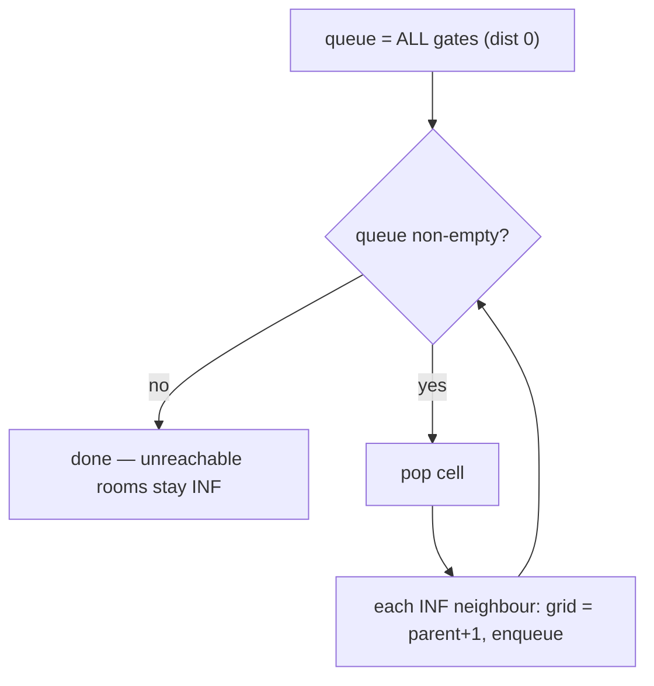

# Walls and gates — multi-source BFS from every gate fills nearest distances

> **3 of 3 grid techniques.** New here? Read the [grid techniques overview](../) and its sibling
> [`rotting-oranges`](../rotting-oranges/) (the same multi-source BFS). **This one:** start BFS from
> **all gates at once**; the first time BFS reaches a room, that's its distance to the *nearest*
> gate. Canonical problem: #286 Walls and Gates.

## TL;DR

**Is it the nearest-of-many BFS? Ask these — all "yes" → yes:**
1. **Do I need each cell's distance to the *nearest* of several targets** (gates), through open space?
2. **Are all steps the same cost** (one per move), so BFS gives true shortest distance?
3. **Can I BFS outward from *all* targets at once** instead of running a search per cell? If "seed every gate at distance 0, fill on first visit" → yes. **This one is the decider.**

**Before you code, pin down:** cell encodings (#286: `-1` wall, `0` gate, `2³¹−1` = `INF` empty room)? fill in place? unreachable rooms stay `INF`? 4-directional?

**The lines where bugs hide** (details in *How it works*):
**seed the queue with EVERY gate** before looping · only fill a room that's still `INF` (skip walls `-1` and already-filled rooms) — that "first visit only" is what guarantees *shortest* and prevents re-queueing · distance = **parent + 1** · bounds-check first.

---

## What it is
You could BFS from each empty room to find its nearest gate — but that's a search per room. Flip it:
BFS outward from **all gates simultaneously**. Because BFS expands in rings of equal distance, the
**first** time the wave reaches a room is along a shortest path from the *closest* gate — so you
write the distance once, on first visit, and never touch it again.

```
INF  -1   0  INF        0 = gate, -1 = wall, INF = empty
INF INF INF  -1    →    fill each INF with hops to the nearest gate
INF  -1 INF  -1         (rooms BFS can't reach stay INF)
  0  -1 INF INF
```

## What you track
- a **queue** seeded with **all** gate cells.
- the grid itself as the **distance map** — a room is "unfilled" while it's still `INF`.
- each step writes `grid[neighbour] = grid[current] + 1`.

## How it works
Pseudocode (#286). The ⚠️ lines are where every bug hides.

```ts
const INF = 2147483647;
const queue = [];
for each cell:
  if (grid[r][c] === 0) queue.push([r, c]);   // ⚠️ seed EVERY gate (multi-source).

while (queue.length > 0) {
  const [r, c] = queue.shift();
  for (const [nr, nc] of neighbours(r, c)) {
    if (inBounds(nr, nc) && grid[nr][nc] === INF) {   // ⚠️ ONLY unfilled rooms: skips walls (-1)
                                                      //    and already-filled rooms → first visit
                                                      //    wins (shortest) and no re-queueing.
      grid[nr][nc] = grid[r][c] + 1;          // ⚠️ distance = parent + 1.
      queue.push([nr, nc]);
    }
  }
}
// unreachable rooms remain INF.
```

Why "fill only `INF`" is the whole correctness argument: a room is filled the first time any wave
touches it, and BFS guarantees that first touch is along the globally shortest path from the nearest
gate. Re-touching it later would be a longer path — so we refuse (it's no longer `INF`), which also
stops the queue from exploding.

Lock these in: **seed all gates**, **fill only `INF` rooms**, **parent + 1**, **bounds first**.

## Picture


## Where you'll meet it (practice + recognition)

**On LeetCode (and similar platforms):**
- **#286 Walls and Gates** — fill each room with hops to the nearest gate. (This note's code.)
- **#542 01 Matrix** — distance of each cell to the nearest `0`; the *identical* multi-source BFS, seeded from every `0`.
- **#994 Rotting Oranges** — same engine, but you want the *total time* (last layer) not a per-cell map → [`rotting-oranges`](../rotting-oranges/).
- **#1162 As Far from Land as Possible** — multi-source from all land; report the maximum filled distance.

**Real life / other platforms:**
- "Distance to the nearest exit / hospital / charger" over a walkable map.
- Service-area maps: nearest depot for every block, computed in one sweep.

**Looks like it but ISN'T:** **weighted** nearest-facility (roads have different costs) → that's
Dijkstra, not plain BFS → [`graphs/dijkstra`](../../graphs/dijkstra/). BFS-rings only give true
distance when every move costs the same.

---

Solution code (fully commented): [`solution.ts`](./solution.ts).
