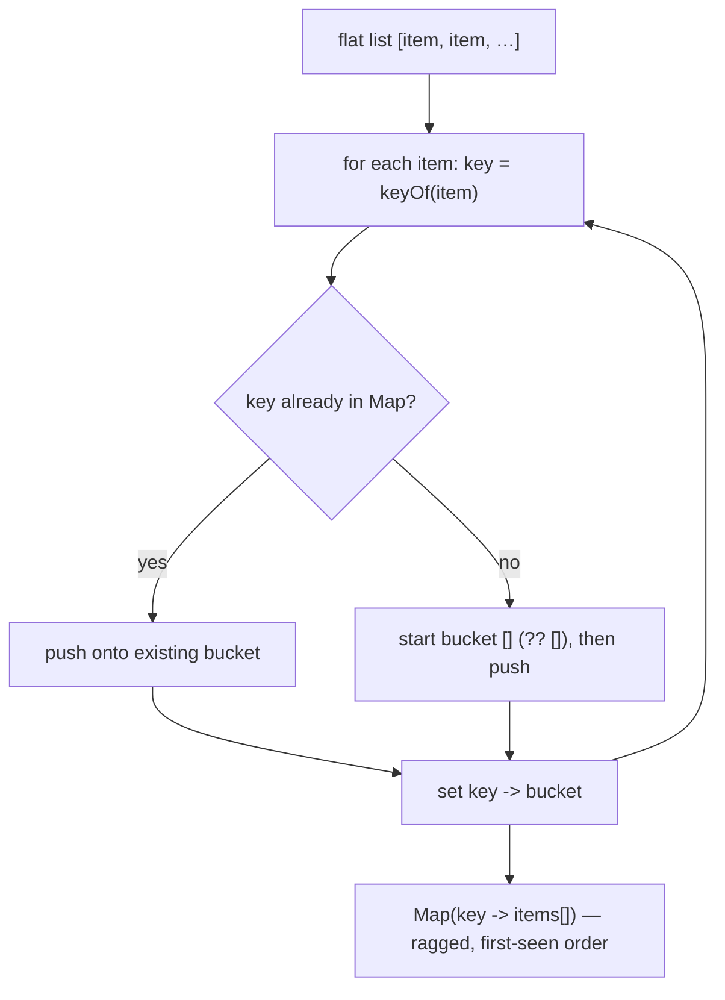

# Group-by — bucket a flat list by a key into `Map<key, items[]>`

## TL;DR

**Is it group-by? Ask these — all "yes" → yes:**
1. **Do you have a *flat* list you want split into groups?**
2. **Is each group defined by a *key derived from the item*** — a field (`order.customerId`),
   or something computed (`word` → its sorted letters)?
3. **Do you keep the *items* in each group (a list)** — not just a count, and not reshaped into
   a rectangular grid? If you only want *how many* per bucket, that's **counting**; if you want a
   2D table with blanks, that's **pivot**. **This one is the decider.**

**Before you code, pin down:** what's the **key type** (string, number, or a composite) — and so
**`Map`, not `{}`** (an object only does string keys and trips on `__proto__`)? does **order**
matter — first-seen key order, or sorted? what about an item whose key is **missing/undefined** —
own bucket, default bucket, or skip? do you need the buckets **sorted** (by key, or within each)?

**The lines where bugs hide** (details in *How it works*): use a **`Map`**, never a plain object
(string-coerced keys · inherited `__proto__`/`constructor` keys · integer-like keys silently
**reordered**) · `get(key) ?? []` **before** push, or the first item of each group throws/drops ·
`keyOf` must be **total** (returns a key for *every* item) and return **one stable type**.

---

## What it is

Walk the list once. For each item compute a **key**, and drop the item into that key's bucket.
You finish with a map from each key to the list of items that share it. That's the whole move —
it's the plain-list cousin of SQL `GROUP BY`, and the foundation the pivot grid is built on.

A tiny worked example — numbers by parity:

```ts
groupBy([1, 2, 3, 4], (n) => (n % 2 === 0 ? "even" : "odd"))
//   => Map { "odd" => [1, 3], "even" => [2, 4] }
```

### Things to lock in
1. **`Map`, not `{}`.** A plain object coerces keys to strings, inherits keys like `__proto__`
   and `constructor` that collide with real data, and **reorders** integer-like keys to ascending
   (so `{2,1}` iterates `1,2`). A `Map` takes any key type, has no prototype, and keeps **first-seen**
   order.
2. **Default the bucket.** `get(key) ?? []` — the first item of a new group has no bucket yet.
3. **Buckets are ragged.** Different groups have different lengths, and that's fine — group-by
   never pads. (Padding into a rectangle is *pivot*.)

> **Built on:** nothing — this is a base hashing technique (a labelled-drawer `Map`).
> **Pivot** (`frontend/tables/popular-timeslots`) is built on *this*: group-by first, then place
> each bucket into a rectangular grid with blanks for the gaps.

## What you track
- `groups` — the `Map<key, items[]>`: each key's bucket, in first-seen key order.
- `keyOf` — the function turning an item into its group key. Total + deterministic.

## How it works
Pseudocode (TypeScript). The three ⚠️ lines are where every group-by bug hides.

```ts
function groupBy<T, K>(items: readonly T[], keyOf: (item: T) => K): Map<K, T[]> {
  const groups = new Map<K, T[]>();          // ⚠️ Map, NOT {} — string-coercion, __proto__
                                             //    collisions, and integer-key reordering all
                                             //    vanish with a real Map
  for (const item of items) {
    const key = keyOf(item);                 // ⚠️ total + deterministic: a key for EVERY item,
                                             //    one stable type (a stray undefined lumps
                                             //    items into a phantom shared bucket)
    const bucket = groups.get(key) ?? [];    // ⚠️ default [] — a first-seen key has no bucket;
                                             //    push onto undefined → crash / dropped item
    bucket.push(item);
    groups.set(key, bucket);                 // write the bucket back (needed the first time)
  }
  return groups;
}
```

Lock these in: **`Map` over `{}`**, **`?? []` before push**, **a total `keyOf`** — and the buckets
come out ragged and in first-seen order. (See [`solution.ts`](./solution.ts).)

## Picture


## Where you'll meet it (practice + recognition)

**On LeetCode (and similar):**
- **#49 Group Anagrams** — the canonical group-by: key = a word's **sorted letters**, so anagrams
  collide into the same bucket. (This note's [`solution.ts`](./solution.ts).)
- **#249 Group Shifted Strings**, **#1399 Count Largest Group** — same shape, a different derived key.

**Real life / any stack:**
- **`Object.groupBy` / `Map.groupBy`** (native JS) and **lodash `_.groupBy`** — this primitive,
  shipped. Knowing it by hand tells you exactly what they return (and why `Map.groupBy` exists:
  non-string keys).
- **SQL `GROUP BY … array_agg(...)`**, **pandas `df.groupby`** — the database/dataframe twins.
  (Plain `GROUP BY COUNT(*)` is the *counting* cousin — it collapses to a number.)
- **Bucketing log lines by level**, orders by customer, transactions by month — the
  [`solution.ts`](./solution.ts) twin groups logs by severity.

**Looks like it but ISN'T:**
- **Counting / frequency** — you keep a `Map<key, number>`, not `Map<key, items[]>`. The tell:
  do you still need the *items* afterward (group-by) or just the *tally* (counting)?
- **Pivot** ([`popular-timeslots`](../../../frontend/tables/popular-timeslots/)) — a **rectangular**
  grid with blanks for missing `(row, col)` cells. The tell: does the output stay a rectangle?
  Pivot → yes; group-by → ragged, no blanks. Pivot is group-by **plus** the grid step.

---

Solution code — the generic `groupBy` primitive, Group Anagrams (#49), and a log-lines twin, with
a runnable self-check: [`solution.ts`](./solution.ts).
