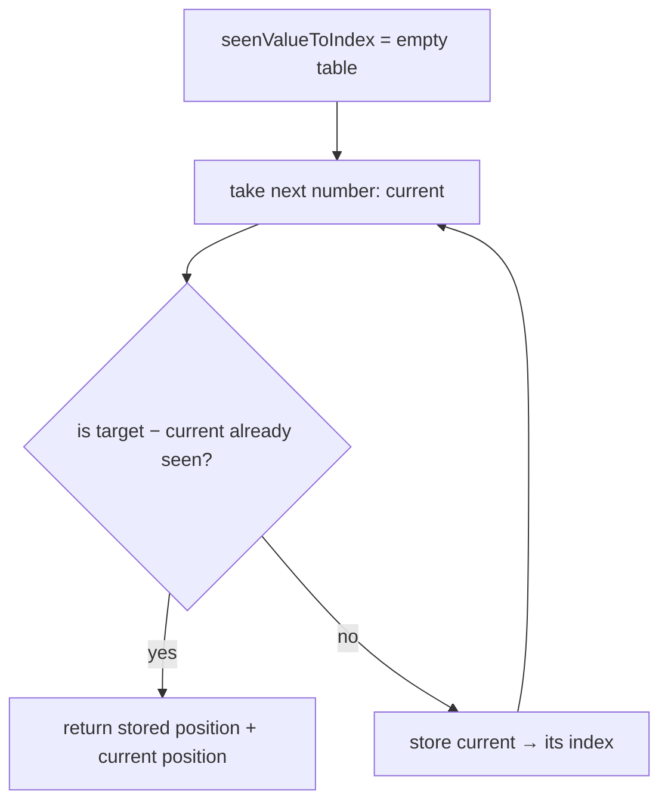

# Two Sum — "have I seen the partner I need?" (hashmap)

## TL;DR

**Is it the hashmap trick? Ask these — all "yes" → yes:**
1. **Am I looking for a pair / a match / "have I seen this" / a duplicate?** The job is to connect one item to another item.
2. **Is the data UNsorted?** If it were sorted, two converging pointers would do it in `O(1)` space — that's a different trick.
3. **For each item, can I name the EXACT partner I need (e.g. `target − x`) and ask a lookup table for it in one step?** If you can write down what you're looking for and check for it instantly, this is it. **This one is the decider.**

**Before you code, pin down:** exactly one answer, or could there be many / none? may I reuse the same element? (Two Sum: no.) do you want the **indices** or the **values**?

**The line where bugs hide** (details in *How it works*): **CHECK the table for the partner *before* you STORE the current item.** Storing first lets a number pair with itself — and storing-as-you-go is also exactly why a real duplicate like `[3,3]` still works. Key the table by **value → index**.

---

## What it is
Walk the list **once**. As you go, keep a lookup table of everything you've already
seen. Before moving past an item, ask the table for the **exact partner you need** — so
the answer is one instant lookup instead of a whole second loop. The table answers in
one step (`O(1)`), so the entire thing is one pass (`O(n)`).

`nums = [2, 7, 11, 15]`, `target = 9`:
- `x = 2`, partner needed is `9 − 2 = 7`. Table empty → not there. Store `2 → index 0`.
- `x = 7`, partner needed is `9 − 7 = 2`. Table has `2` at index `0` → found it. Return `[0, 1]`.

## What you track
- `seen` — one hashmap (`Map`), **key = a value you've seen, value = the index it was at**.
- For pure duplicate detection you don't need the index, only "yes/no" — a `Set` is enough.

## How it works
Pseudocode. The one ⚠️ line is where every bug in this trick lives — read it slowly;
the rest is filler.

```ts
const seenValueToIndex = new Map<number, number>(); // number → where we saw it
for (let i = 0; i < nums.length; i++) {
  const current = nums[i];                  // number we're on
  const partnerNeeded = target - current;   // what completes the pair
  // ⚠️ check BEFORE storing, else current pairs with itself ([3,3])
  if (seenValueToIndex.has(partnerNeeded)) {
    return [seenValueToIndex.get(partnerNeeded)!, i];
  }
  seenValueToIndex.set(current, i);         // record it, move on
}

// fell through → no pair exists (LeetCode guarantees one, so this never hits)
```

Why one pass can't miss a pair: you check *before* you store, so the **second** number
of a valid pair is the one that finds the **first** (already sitting in the table). And
`[3,3]` works *because* you store as you go — the first `3` is in the table by the time
you reach the second.

Lock this in and it can't pair a number with itself or miss a duplicate:
**check the table for `partnerNeeded` BEFORE storing the current item; key by value → index.**

## Picture


## Where you'll meet it (practice + recognition)

**On LeetCode (and similar platforms):**
- **#1 Two Sum** — return the indices of the two numbers that add up to `target` (this note's code). Partner needed is `target − nums[i]`; table is `value → index`.
- **#217 Contains Duplicate** — is any value repeated? Walk once, store each value in a `Set`; if it's already there, that's your duplicate. Partner needed is *the same value again*.
- **#242 Valid Anagram** — count letters of one word into a table (`letter → count`), then check the other word draws those counts back down to zero. Same table, used for **counting** instead of pairing.

**Real life / other platforms:**
- **Dedupe by id** — filter a list down to unique items by keeping a `Set`/`Map` of ids you've already emitted.
- **Webhook replay / idempotency guard** — store every processed request id; if an incoming id is already seen, reject it (someone replayed the event). The "partner" is just the same id again.
- **Joining two datasets by key** — index one side into a `Map` by key, then look each row of the other side up in one step, instead of a nested loop. `O(n²)` → `O(n)`.

**Looks like it but ISN'T:** if the array is **SORTED**, don't build a table — walk two
pointers inward from both ends, `O(1)` space: see [`two-pointers/opposite-ends`](../../two-pointers/opposite-ends/README.md).
Same question ("two things that sum to a target"), different trick — picked purely by
whether the input is sorted.

---

Solution code (both disguises, fully commented): [`solution.ts`](./solution.ts).
