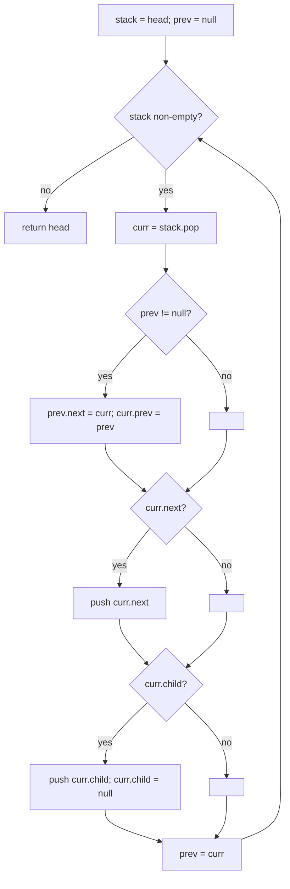

# Flatten a multilevel doubly linked list — splice each child list inline, depth-first

> **3 of 3 linked-list moves.** New here? Read the [family overview](../) first — especially the
> "doubly-linked means fix `prev` too" note. **This move:** some nodes have a `child` list
> hanging off them; flatten everything into one single-level doubly linked list, depth-first.
> Canonical problem: #430 Flatten a Multilevel Doubly Linked List.

## TL;DR

**Is it the flatten-multilevel trick? Ask these — all "yes" → yes:**
1. **Is it a doubly linked list whose nodes can have a `child`** pointing to another such list?
2. **Do I need one flat level**, with each child list inserted **right after its parent** and **before** the parent's old `next` (depth-first)?
3. **Must I fix `prev` pointers too** and **null out every `child`** as I go? If both → this is it. **This one is the decider.**

**Before you code, pin down:** is it doubly linked (so `prev` matters)? where exactly does a child go — immediately after its parent, ahead of the parent's `next`? must `child` be set to `null` after splicing (yes, #430 requires it)? is the head's `prev` always `null`?

**The lines where bugs hide** (details in *How it works*):
push the parent's **`next` before its `child`** so the child comes out first (depth-first) · wire **both** `prev.next = curr` **and** `curr.prev = prev` · **`child = null`** after splicing · the very first node's `prev` must stay `null`.

---

## What it is
Picture a list where some nodes drop down into a sub-list (a `child`). "Flatten" means: wherever
a node has a child, the **entire child list** should appear *between* that node and whatever came
after it — and recursively for children of children. The result is a normal one-level doubly
linked list.

The clean way is a **stack** (the explicit version of depth-first). Walk the list; when a node has
a child, you must visit the *whole* child branch before the node's own `next` — so stash the `next`
on a stack, dive into the child, and pick the `next` back up when the branch runs dry.

```text
1—2—3—4—5—6        flatten →  1—2—3—7—8—11—12—9—10—4—5—6
      |
      7—8—9—10
          |
          11—12
```

## What you track
- a **stack** of nodes still owed a visit (parents' `next` branches, set aside while you dive into children).
- `prev` — the last node already placed in the flat list; the next popped node links right after it.
- for each node: its `next` (push for later) and `child` (push to visit *first*, then clear).

## How it works
Pseudocode (stack / depth-first). The ⚠️ lines are where every bug hides.

```ts
if (head === null) return null;
const stack = [head];
let prev = null;

while (stack.length > 0) {
  const curr = stack.pop();

  if (prev !== null) {
    prev.next = curr;             // ⚠️ doubly linked: wire BOTH directions…
    curr.prev = prev;             // ⚠️ …forgetting curr.prev is the classic #430 miss.
  }

  if (curr.next !== null) stack.push(curr.next);   // ⚠️ push `next` FIRST…
  if (curr.child !== null) {
    stack.push(curr.child);       // ⚠️ …then `child`, so child POPS first → depth-first order.
    curr.child = null;            // ⚠️ #430 requires every child pointer cleared.
  }

  prev = curr;
}

return head;                      // head.prev was never reassigned → stays null. ✅
```

Why push `next` before `child`: a stack is last-in-first-out, so the **last** thing pushed is the
**next** thing handled. Pushing `next` then `child` makes `child` pop first — you fully explore the
child branch before returning to the parent's `next`. That LIFO ordering *is* the depth-first walk.

Lock these in: **push `next` then `child`**, **wire `next` and `prev` both**, **clear `child`**,
**leave the head's `prev` null**.

## Picture


## Where you'll meet it (practice + recognition)

**On LeetCode (and similar platforms):**
- **#430 Flatten a Multilevel Doubly Linked List** — splice each child inline, depth-first, fix `prev`. (This note's code.)
- **#114 Flatten Binary Tree to Linked List** — same depth-first "inline the left subtree before the right" splice, on a tree.
- **#341 Flatten Nested List Iterator** — a stack flattening arbitrarily nested lists on demand; same LIFO depth-first idea (`flattenNested` in [`solution.ts`](./solution.ts) is the bare-bones version).

**Real life / other platforms:**
- Flattening a nested menu / comment thread / file tree into a single rendered list, depth-first.
- Inlining nested JSON arrays, or "expand each group's items right where the group sat."

**Looks like it but ISN'T:** **merging two already-sorted lists** (#21) also walks linked nodes,
but it interleaves two inputs by value — a [`two-pointers`](../../two-pointers/)
merge, not a depth-first splice of nested children. Tell them apart: nested `child` levels → this;
two flat sorted inputs → merge.

---

Solution code (#430 + the nested-list twin, fully commented): [`solution.ts`](./solution.ts).
