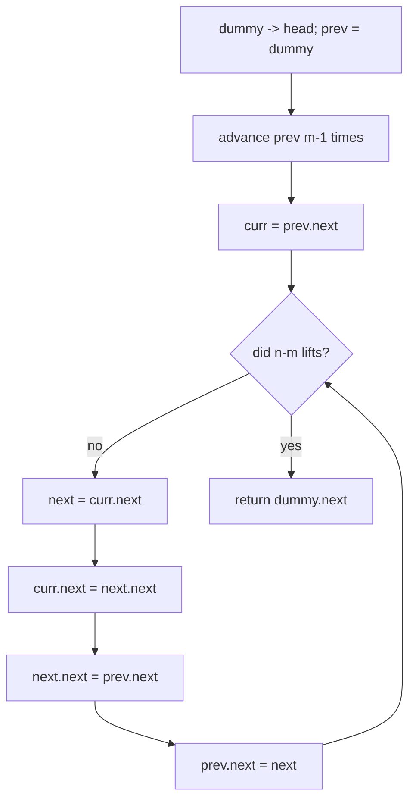

# M-to-N reversal — reverse just positions `m..n`, splice it back, one pass

> **2 of 3 linked-list moves.** New here? Read the [family overview](../) first, and make sure
> [`reverse`](../reverse/) (the full-list flip) is solid — this is that flip, confined to a window.
> **This move:** reverse only the nodes from position `m` to `n` (1-indexed), leaving the rest
> intact, in a single pass. Canonical problem: #92 Reverse Linked List II.

## TL;DR

**Is it the m-to-n reversal trick? Ask these — all "yes" → yes:**
1. **Do I reverse only a *contiguous slice* of the list** (positions `m..n`), not the whole thing?
2. **Must the nodes *before* `m` and *after* `n` stay connected** to the flipped middle?
3. **Is it one pass, in place** — no copying values into an array? If yes, reach for the dummy-head + head-insertion splice. **This one is the decider.**

**Before you code, pin down:** are `m`/`n` 1-indexed (#92 is)? is `m == 1` possible (the first node changes → that's why you need a dummy)? `m == n` (reverse nothing)? are they within bounds (problem usually guarantees it)?

**The lines where bugs hide** (details in *How it works*):
a **dummy node before head** so `m == 1` isn't a special case · advance `prev` **exactly `m − 1`** times (it must stop *before* position `m`) · loop **exactly `n − m`** times · the **three-line splice** order — pull `curr.next` out and head-insert it right after `prev`.

---

## What it is
Put a **dummy** node in front of the head so you always have a stable handle on "the node before
the reversed part," even when that part starts at position 1. Walk `prev` to the node just before
`m`. Then, `n − m` times, **lift the node right after `curr`** out of the chain and **re-insert it
immediately after `prev`** (head-insertion). Each lift drags one node to the front of the window,
which reverses the window in place.

`1 → 2 → 3 → 4 → 5`, `m=2`, `n=4`:
- `prev` = node `1` (just before position 2); `curr` = node `2` (first to be reversed, it ends up last).
- lift `3`, insert after `1` → `1 → 3 → 2 → 4 → 5`
- lift `4`, insert after `1` → `1 → 4 → 3 → 2 → 5`
- done (2 lifts = `n − m`). Result `1 → 4 → 3 → 2 → 5`.

## What you track
- `dummy` — a sentinel before the head; `dummy.next` is the answer (handles `m == 1`).
- `prev` — the fixed node just **before** the reversed window; everything re-inserts right after it.
- `curr` — the node that was first in the window and slowly sinks to its end.
- `next` — the node being lifted out and head-inserted this step.

## How it works
Pseudocode (#92). The ⚠️ lines are where every bug hides.

```ts
const dummy = new ListNode(0);
dummy.next = head;
let prev = dummy;

for (let i = 0; i < m - 1; i++) {     // ⚠️ advance EXACTLY m-1 steps → prev sits just before
  prev = prev.next;                   //    position m. One too many/few shifts the whole window.
}

const curr = prev.next;               // first node of the window (will become its last).

for (let i = 0; i < n - m; i++) {     // ⚠️ EXACTLY n-m lifts. Off by one over/under-reverses.
  const next = curr.next;             // the node to lift out and move to the window's front.
  curr.next = next.next;              // ⚠️ splice `next` OUT: curr skips over it…
  next.next = prev.next;             // ⚠️ …point `next` at the current window front…
  prev.next = next;                  // ⚠️ …and hook it right after prev. Order matters: do these
}                                     //    three in this sequence or you lose a link / make a loop.

return dummy.next;                    // ⚠️ return dummy.next, not head — head may no longer be first.
```

Why head-insertion reverses: each step takes the node *just after* the (sinking) `curr` and
yanks it to the very front of the window. Repeatedly moving "the next one" to the front turns the
window inside out — without ever touching the nodes outside `[m, n]`.

Lock these in: **dummy before head**, **`prev` advances `m − 1`**, **`n − m` lifts**, **the
three-line splice in order**, **return `dummy.next`**.

## Picture


## Where you'll meet it (practice + recognition)

**On LeetCode (and similar platforms):**
- **#92 Reverse Linked List II** — reverse positions `m..n` in one pass. (This note's code.)
- **#25 Reverse Nodes in k-Group** — chop the list into blocks of `k` and reverse each; this same windowed reversal, repeated.
- **#24 Swap Nodes in Pairs** — the `k = 2` special case (reverse every adjacent pair).
- **#206 Reverse Linked List** — the whole-list version this is built on → [`reverse`](../reverse/).

**Real life / other platforms:**
- Re-ordering a bounded slice of a linked structure (a playlist segment, a doubly-linked editor buffer) without rebuilding the whole chain.
- Any "operate on a sub-range in place, keep the surroundings wired" task — the dummy-head pattern shows up across linked-structure edits.

**Looks like it but ISN'T:** reversing a sub-array by **index** — there you'd swap ends inward
([`opposite-ends`](../../two-pointers/opposite-ends/)); a list can't index, so it's
this splice. And reversing the **whole** list is the simpler [`reverse`](../reverse/) — no dummy,
no counting.

---

Solution code (fully commented): [`solution.ts`](./solution.ts).
