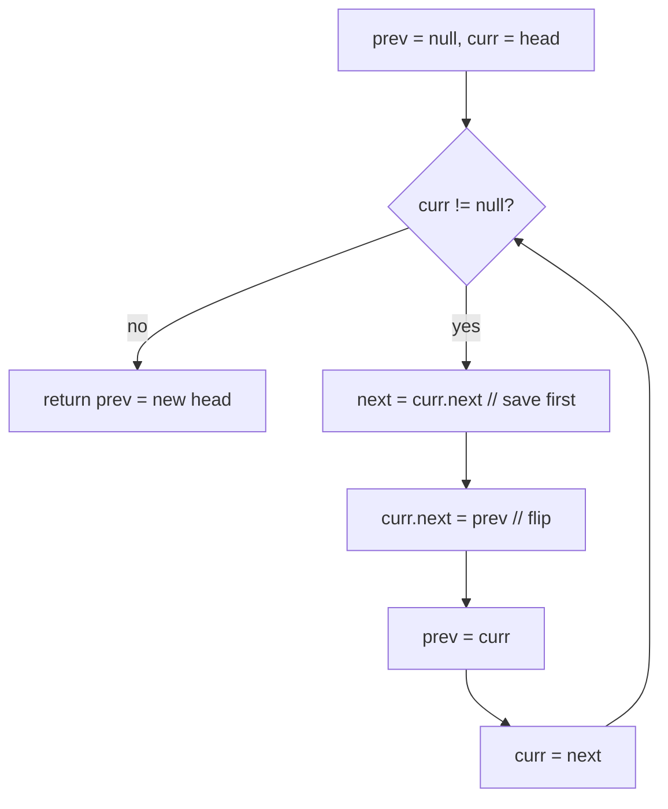

# Reverse a linked list — flip every `next`, one node at a time

> **1 of 3 linked-list moves.** New to linked lists? Read the [structure note](../../../structures/linked-list/)
> (what a node / `next` pointer is) and the [family overview](../) (why "save before you overwrite" is the golden rule) first.
> **This move:** walk the list once, flipping each node's `next` to point at the node behind it.
> Canonical problem: #206 Reverse Linked List. It's also the building block for the rest of the family.

## TL;DR

**Is it the reverse-pointers trick? Ask these — all "yes" → yes:**
1. **Do I need the chain pointing the *other way*** — last node becomes the new head?
2. **Can I only walk *forward*** (singly linked, no `prev`), so I must remember where I came from?
3. **As I flip each `next`, will I lose the rest of the list unless I save it first?** If the fix is "stash `next` before rewiring" → this is it. **This one is the decider.**

**Before you code, pin down:** reverse in place (rewire) or return a new list? singly or doubly linked (doubly → also fix `prev`)? empty list / single node — return as-is? do I need the new head returned (yes — it's the old tail)?

**The lines where bugs hide** (details in *How it works*):
**save `next` before** flipping (`const next = curr.next`) · `curr.next = prev` is the flip · advance **both** `prev` and `curr` · **return `prev`** at the end, not `curr` (which is `null`).

---

## What it is
Each node points to the next one. To reverse, walk the list with three references and, at each
node, **turn its arrow around** to point at the node *behind* it. You need three things in hand:
`prev` (the node already flipped), `curr` (the one you're flipping now), and a saved `next` (so
you don't lose the unflipped remainder the instant you overwrite `curr.next`).

`1 → 2 → 3 → null`:
- `curr=1`: save `next=2`, set `1.next=null`, `prev=1`, `curr=2`.
- `curr=2`: save `next=3`, set `2.next=1`, `prev=2`, `curr=3`.
- `curr=3`: save `next=null`, set `3.next=2`, `prev=3`, `curr=null` → stop.
- new head is `prev` = `3`: `3 → 2 → 1 → null`.

## What you track
- `prev` — the part already reversed (starts `null`; ends as the **new head**).
- `curr` — the node being flipped right now.
- `next` — a one-step stash of `curr.next`, saved **before** the flip so the tail isn't lost.

## How it works
Pseudocode (iterative — the one to know cold). The ⚠️ lines are where every bug hides.

```ts
let prev = null;                  // ⚠️ start null — the old head's next must end up null.
let curr = head;

while (curr !== null) {
  const next = curr.next;         // ⚠️ SAVE next BEFORE rewiring. Skip this and the next line
                                  //    throws away the entire rest of the list.
  curr.next = prev;               // the flip: point this node backward.
  prev = curr;                    // advance the reversed part…
  curr = next;                    // …and step onto the saved next node.
}

return prev;                      // ⚠️ return prev, NOT curr. curr is null here; prev is the
                                  //    last node we flipped = the new head.
```

Recursive version (same idea, the call stack holds `prev` for you): recurse to the tail, then on
the way back set `head.next.next = head` and `head.next = null`. Watch the base case
(`head == null || head.next == null` → return `head`) and the same "don't lose the link" care.

Lock these in: **save `next` first**, **flip with `curr.next = prev`**, **advance both**, **return `prev`**.

## Picture


## Where you'll meet it (practice + recognition)

**On LeetCode (and similar platforms):**
- **#206 Reverse Linked List** — the canonical; iterative prev/curr/next, or the recursive twin. (This note's code.)
- **#92 Reverse Linked List II** — reverse only positions `m..n`; reuse this flip inside a sublist → [`mn-reversal`](../mn-reversal/).
- **#25 Reverse Nodes in k-Group** — reverse every block of `k`; this flip, repeated per group.
- **#234 Palindrome Linked List** — reverse the back half, then walk both halves inward.

**Real life / other platforms:**
- Reversing any singly-linked chain in place (an undo trail, a parser's token list) without an extra array.
- The mental model for "process a stream backward when you can only read it forward — remember as you go."

**Looks like it but ISN'T:** reversing an **array** in place — there you swap the two ends and
walk inward ([`opposite-ends`](../../two-pointers/opposite-ends/)), because an array
*can* index from both sides. A singly linked list can't, so it's this pointer-rewiring dance instead.

---

Solution code (iterative + recursive, fully commented): [`solution.ts`](./solution.ts).
