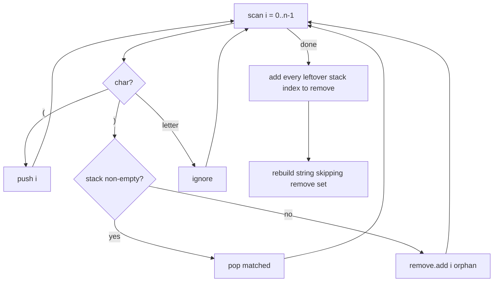

# Minimum remove brackets — stack the unmatched openers, delete what's left over

> **1 of 2 stack-technique moves.** New here? Read the [stack techniques overview](../) and the
> [stack structure note](../../../structures/stack/) (push / pop / LIFO) first.
> **This move:** scan once, pushing the **index** of every unmatched `(`; a `)` with nothing to
> match is itself unmatched. Whatever's left over (in the stack, plus the orphan `)`s) is exactly
> the minimum set to delete. Canonical problem: #1249 Minimum Remove to Make Valid Parentheses.

## TL;DR

**Is it the min-remove-brackets trick? Ask these — all "yes" → yes:**
1. **Do I need to *delete the fewest* characters to make brackets valid** (not just *check* validity)?
2. **Do I need to know *which positions* to drop**, not merely how many?
3. **Is an unmatched bracket exactly one a stack never paired?** Push each opener's index; a closer either cancels the top opener or is itself an orphan. Leftovers = the deletions. **This one is the decider.**

**Before you code, pin down:** which chars are brackets vs payload (letters stay)? one bracket type or several (#1249 is just `()`)? return *a* valid string (any minimal one) or *the count*? do empty / no-brackets pass through unchanged?

**The lines where bugs hide** (details in *How it works*):
push the **index**, not the char · on `)` **pop if the stack is non-empty, else mark this `)` for removal** · after the scan **every index still in the stack is an unmatched `(`** → also remove · build the result skipping the marked set (a `Set` for O(1) checks).

---

## What it is
Walk the string once. Keep a stack of the **positions** of `(` you haven't matched yet. A `)`
either closes the most recent `(` (pop it — matched) or, if the stack is empty, is an orphan with
no opener (mark its position to delete). When the scan ends, any positions left on the stack are
`(` that never got a `)` (mark them too). Delete exactly the marked positions — nothing more is
needed, nothing less works.

`s = "a)b(c)d"`:
- `a` letter; `)` stack empty → orphan, mark index 1; `b` letter; `(` push index 3; `c` letter;
  `)` pop index 3 (matched); `d` letter.
- marked = {1}. Result drops index 1 → `"ab(c)d"`.

`s = "(("` → both pushed, none matched; leftover stack {0,1} → drop both → `""`.

## What you track
- a **stack of indices** of currently-unmatched `(`.
- a **remove set** — positions to delete: orphan `)`s during the scan, plus whatever's left on the stack after.
- the input chars (letters and matched brackets pass through untouched).

## How it works
Pseudocode (#1249). The ⚠️ lines are where every bug hides.

```ts
const stack = [];          // indices of unmatched '('
const remove = new Set();

for (let i = 0; i < s.length; i++) {
  if (s[i] === "(") {
    stack.push(i);                       // ⚠️ push the INDEX, not "(" — you must know WHERE to cut.
  } else if (s[i] === ")") {
    if (stack.length > 0) {
      stack.pop();                       // matched the most recent "(" → both stay.
    } else {
      remove.add(i);                     // ⚠️ ")" with nothing open → orphan, mark it.
    }
  }
  // letters: ignore — they're never removed.
}

for (const i of stack) remove.add(i);    // ⚠️ leftover "(" never closed → also remove.

let out = "";
for (let i = 0; i < s.length; i++) {
  if (!remove.has(i)) out += s[i];       // keep everything not marked.
}
return out;
```

Why it's minimal: every deletion is forced — an orphan `)` has no opener anywhere, and a leftover
`(` has no closer anywhere, so each *must* go; matched pairs are never touched. You delete exactly
the brackets that can't possibly be part of a valid string.

Lock these in: **push indices**, **orphan `)` → mark**, **leftover stack → mark**, **rebuild skipping the set**.

## Picture


## Where you'll meet it (practice + recognition)

**On LeetCode (and similar platforms):**
- **#1249 Minimum Remove to Make Valid Parentheses** — return a valid string after the fewest deletions. (This note's code.)
- **#921 Minimum Add to Make Parentheses Valid** — same matching, but you only need the *count* (and add, not remove) → a plain counter beats the stack. (`minAddToMakeValid` in [`solution.ts`](./solution.ts).)
- **#20 Valid Parentheses** — just *check* validity (multiple bracket types); pop-and-match, no positions → `isBalanced` in the [structure note](../../../structures/stack/).
- **#1963 Minimum Swaps to Make String Balanced** — reduce to the count of unmatched brackets, then a formula.

**Real life / other platforms:**
- A linter / formatter auto-fixing mismatched brackets or tags with the smallest edit.
- Sanitizing a user-typed expression before evaluating it.

**Looks like it but ISN'T:** if you only need *how many* to add/remove (not *which*), a running
counter of "open so far / unmatched closers" is enough — the stack of positions is overkill. Tell:
do you need the **positions** (→ stack) or just a **count** (→ counter, see `minAddToMakeValid`)?

---

Solution code (#1249 + the count-only #921 twin, fully commented): [`solution.ts`](./solution.ts).
