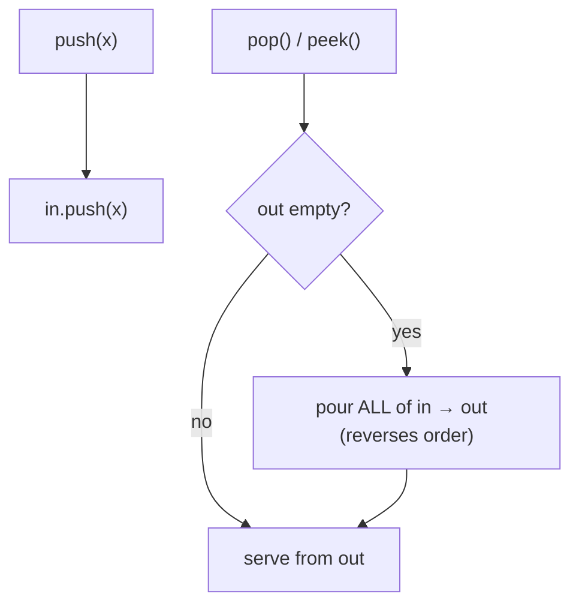

# Queue from two stacks — reverse once, lazily, to turn LIFO into FIFO

> **2 of 2 stack-technique moves.** New here? Read the [stack techniques overview](../) and the
> [stack](../../../structures/stack/) / [queue](../../../structures/queue/) structure notes first.
> **This move:** a stack pops newest-first; pour it into a *second* stack and it pops oldest-first.
> Do that transfer **only when the out-pile is empty**, and each item flips once → amortized O(1).
> Canonical problem: #232 Implement Queue using Stacks.

## TL;DR

**Is it the two-stack-queue trick? Ask these — all "yes" → yes:**
1. **Do I need FIFO (oldest-out) behaviour but I'm only allowed stacks** (push / pop / peek / empty)?
2. **Can I tolerate one occasional O(n) reshuffle** as long as the *average* op is O(1)?
3. **Does pouring stack A into stack B reverse the order** — so B pops in arrival order? If "transfer only when B is empty" keeps order correct → yes. **This one is the decider.**

**Before you code, pin down:** which ops are required (#232: push, pop, peek, empty)? is amortized O(1) acceptable (vs strict O(1))? what should pop/peek on an empty queue do (the problem usually guarantees non-empty)? single-threaded (the lazy transfer isn't concurrency-safe)?

**The lines where bugs hide** (details in *How it works*):
**transfer only when `out` is empty** (transferring early interleaves orders → wrong FIFO) · when you do transfer, **move *all* of `in`** · `peek` reuses the *same* transfer-then-look · `empty` = **both** stacks empty.

---

## What it is
A stack hands back the **newest** item; a queue must hand back the **oldest**. One stack can't do
FIFO. But two can: keep an **`in`** stack (new pushes land here, newest on top) and an **`out`**
stack. When you need to remove/peek and `out` is empty, **pour the whole `in` stack into `out`** —
that reverses it, so `out`'s top is now the *oldest* item. Serve from `out` until it empties, then
pour again.

The trick is the **laziness**: you only pour when `out` runs dry, so a freshly-pushed item isn't
moved until it's actually next in line. Each item is pushed to `in` once and moved to `out` once →
**amortized O(1)** per operation, even though a single `pop` can be O(n).

`push 1, push 2, push 3` → `in = [1,2,3]` (3 on top), `out = []`.
`pop()` → `out` empty, pour → `out = [3,2,1]` (1 on top) → pop `1`. Then `pop()` → `2`, `pop()` → `3`.

## What you track
- **`in`** — a stack catching new pushes (newest on top).
- **`out`** — a stack serving removals (oldest on top, *after* a transfer).
- (implicit) the **transfer rule**: refill `out` from `in` only when `out` is empty.

## How it works
Pseudocode (#232). The ⚠️ lines are where every bug hides.

```ts
class MyQueue {
  in = [];   // new pushes pile here
  out = [];  // removals served here

  push(x) { this.in.push(x); }                 // always cheap.

  // Move everything across ONLY when out is empty.
  transfer() {
    if (this.out.length === 0) {               // ⚠️ guard: transfer only when out is EMPTY.
      while (this.in.length > 0) {             // ⚠️ move ALL of in (not one) so order is preserved.
        this.out.push(this.in.pop());          //    popping in / pushing out reverses → FIFO.
      }
    }
  }

  pop()  { this.transfer(); return this.out.pop(); }    // serve oldest.
  peek() { this.transfer(); return this.out.at(-1); }   // ⚠️ peek reuses the SAME transfer.
  empty() { return this.in.length === 0 && this.out.length === 0; } // ⚠️ BOTH must be empty.
}
```

Why transferring early would break it: if `out` still has older items and you pour newer ones on
top of it, the newer ones would be served before the older — FIFO violated. Only refilling an
**empty** `out` guarantees everything already in `out` (older) leaves before anything in `in`
(newer) is moved.

Lock these in: **transfer only when `out` empty**, **move all of `in`**, **`peek` transfers too**,
**`empty` checks both**.

## Picture


## Where you'll meet it (practice + recognition)

**On LeetCode (and similar platforms):**
- **#232 Implement Queue using Stacks** — FIFO from two LIFO stacks, amortized O(1). (This note's code.)
- **#225 Implement Stack using Queues** — the mirror puzzle (LIFO from FIFO queues); usually one queue rotated, O(n) push or pop.
- **#155 Min Stack** — a different "two structures, one job" design: a stack plus a running-min stack.

**Real life / other platforms:**
- A **batching buffer** — accept items fast on one side, flush them in arrival order on the other.
- The classic **"banker's queue"** in functional languages — two lists, reverse the rear lazily — is exactly this.

**Looks like it but ISN'T:** if you may use a real queue/deque, you don't need this dance at all —
it exists *because* only stacks are allowed. And going the other way (a **stack** from queues) is
#225, the mirror with the opposite cost profile.

---

Solution code (fully commented): [`solution.ts`](./solution.ts).
