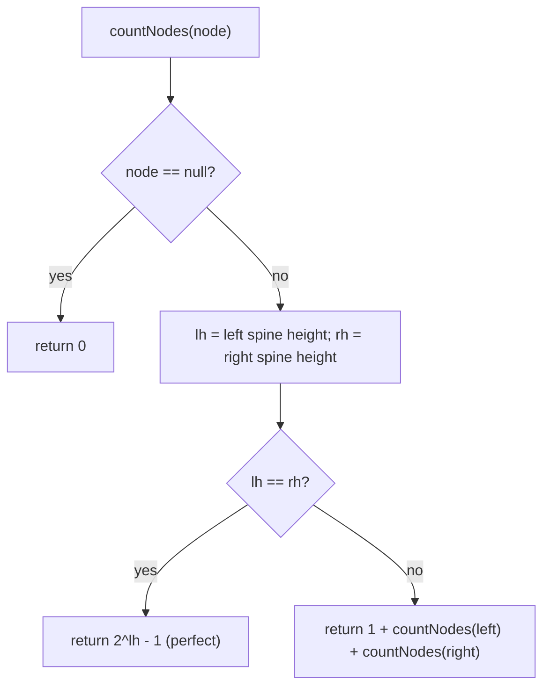

# Count complete tree nodes — use the "perfect subtree" shortcut, beat O(n)

> **4 of 5 binary-tree techniques.** New here? Read the [trees techniques overview](../) and
> [`max-depth`](../max-depth/) first. **This one:** a *complete* tree is almost full, so most
> subtrees are **perfect** and you can count them with `2^h − 1` instead of walking them — giving
> O(log²n), not O(n). Canonical problem: #222 Count Complete Tree Nodes.

## TL;DR

**Is it the complete-count shortcut? Ask these — all "yes" → yes:**
1. **Is the tree *complete*** — every level full except maybe the last, which fills **left to right**?
2. **Do I want the node *count* faster than visiting all n nodes?**
3. **Can I check "is this subtree perfect?" cheaply** by comparing its left-spine and right-spine heights? If equal → perfect → closed-form count. **This one is the decider.**

**Before you code, pin down:** is completeness *guaranteed* (the shortcut needs it — a general tree forces the O(n) walk)? height counted in **nodes** or edges (be consistent)? could `2^h` overflow 32 bits (use `**`, not the 32-bit `<<`)? empty tree → 0?

**The lines where bugs hide** (details in *How it works*):
**left height = walk left-only, right height = walk right-only** · **`leftH === rightH` ⇒ perfect ⇒ `2^h − 1`** (use `2 ** h`, **not** `1 << h` — JS `<<` is 32-bit) · otherwise **recurse both sides + 1** · base `null → 0`.

---

## What it is
A **complete** binary tree is packed: every level is full except possibly the last, which fills from
the left. That packing means: for any node, walk down its **left** edges and its **right** edges. If
both walks have the **same length `h`**, the subtree is **perfect** (totally full) and has exactly
`2^h − 1` nodes — no need to visit them. If the two heights differ, the last level is partial here,
so recurse into both children and add 1 for this node.

Because at most one node per level triggers the "heights differ" recursion, and each height check is
O(log n), the whole thing is **O(log²n)** — far better than counting all n nodes one by one.

```
      1            left spine from root: 1→2→4  (h=3)
    /   \          right spine from root: 1→3→7 (h=3)  → equal → perfect → 2^3 - 1 = 7
   2     3
  / \   / \
 4  5  6   7
```

## What you track
- for the current node: **left-spine height** (go left until null) and **right-spine height** (go right until null).
- if equal → return the closed-form `2^h − 1`.
- else → `1 + count(left) + count(right)`.

## How it works
Pseudocode (#222). The ⚠️ lines are where every bug hides.

```ts
function leftHeight(node)  { let h = 0; while (node) { h++; node = node.left;  } return h; }
function rightHeight(node) { let h = 0; while (node) { h++; node = node.right; } return h; }

function countNodes(node) {
  if (node === null) return 0;                 // ⚠️ base.
  const lh = leftHeight(node);                 // ⚠️ left-ONLY spine.
  const rh = rightHeight(node);                // ⚠️ right-ONLY spine.
  if (lh === rh) {
    return 2 ** lh - 1;                        // ⚠️ perfect subtree → closed form.
                                               //    Use 2 ** lh, NOT (1 << lh): JS << is 32-bit and
                                               //    silently wraps past ~2^31.
  }
  return 1 + countNodes(node.left) + countNodes(node.right);  // ⚠️ partial last level → recurse both.
}
```

Why it's O(log²n): only nodes on the path down to the last level's "fill boundary" ever hit the
recursive branch — that's O(log n) of them — and each pays an O(log n) spine walk. Everything else
is answered by the `2^h − 1` shortcut without descending.

Lock these in: **left-only / right-only spines**, **equal ⇒ `2 ** h − 1`**, **else recurse both + 1**, **`2 **` not `1 <<`**.

## Picture


## Where you'll meet it (practice + recognition)

**On LeetCode (and similar platforms):**
- **#222 Count Complete Tree Nodes** — the O(log²n) shortcut. (This note's code.)
- **A general tree's node count** — no completeness guarantee → you *must* walk all n (O(n)). (`countAll` in [`solution.ts`](./solution.ts) — the contrast.)
- **#919 Complete Binary Tree Inserter** — relies on the same left-to-right completeness to find the next insert slot.

**Real life / other platforms:**
- Sizing an **array-backed heap** (a complete tree) — though there you usually just track `size`.
- Any place a "perfect power-of-two block" can be counted by formula instead of enumeration.

**Looks like it but ISN'T:** counting a **general** (non-complete) binary tree — the `2^h − 1`
shortcut is invalid (a subtree can look perfect on its spines yet be non-complete elsewhere only if
the tree isn't complete). Without the completeness guarantee, fall back to the plain O(n) walk
(`countAll`).

---

Solution code (#222 shortcut + the O(n) general-count contrast, fully commented): [`solution.ts`](./solution.ts).
