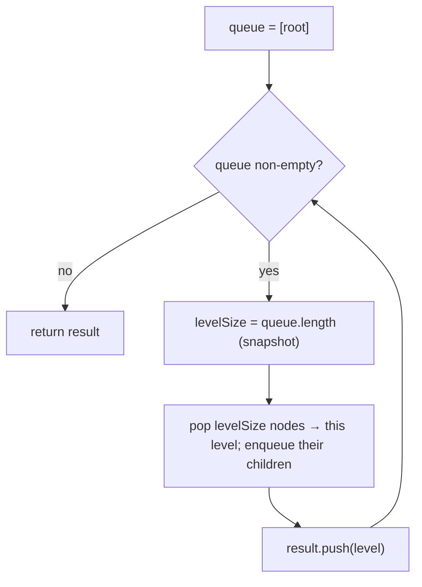

# Level order (BFS) — sweep the tree one level at a time with a queue

> **2 of 5 binary-tree techniques.** New here? Read the [trees techniques overview](../), the
> [tree structure note](../../../structures/trees/), and the [queue](../../../structures/queue/)
> first. **This one:** breadth-first — a FIFO queue holds the current frontier; snapshot its size to
> know where each level ends. Canonical problem: #102 Binary Tree Level Order Traversal.

## TL;DR

**Is it a BFS level-order? Ask these — all "yes" → yes:**
1. **Do I need nodes grouped by *depth*** — "each level as its own list", or "process level by level"?
2. **Does order *within* a level matter** (left-to-right), unlike plain DFS?
3. **Can I use a queue and peel one level per round?** If "snapshot how many are on this level, pop exactly that many, enqueue their children" → yes. **This one is the decider.**

**Before you code, pin down:** output shape — list of per-level lists (#102), bottom-up (#107), or zigzag (#103)? null root → `[]`? left-to-right within a level? could the tree be huge (BFS memory = the widest level)?

**The lines where bugs hide** (details in *How it works*):
**snapshot `levelSize = queue.length` *before* the inner loop** (the queue grows as you enqueue children — read its size once) · loop **exactly `levelSize`** times · enqueue **non-null** children only · use a real FIFO (`shift` from front; for big inputs prefer an index pointer over `Array.shift`, which is O(n)).

---

## What it is
Breadth-first means: finish everything at depth 0, then depth 1, then depth 2… A **queue** holds the
frontier (FIFO — first in, first out — so nodes come out in arrival order, left to right). The key
move is to **freeze the level boundary**: at the start of a round, the queue holds exactly one
level; record its length, then pop that many nodes (collecting their values) while pushing their
children to the back for the *next* round.

`[3, 9, 20, null, null, 15, 7]` → `[[3], [9, 20], [15, 7]]`.

## What you track
- a **queue** of nodes — the current + forming-next frontier.
- `levelSize` — how many nodes belong to the level you're about to drain (snapshot per round).
- the **result** — one list per level.

## How it works
Pseudocode (#102). The ⚠️ lines are where every bug hides.

```ts
if (root === null) return [];
const result = [];
const queue = [root];

while (queue.length > 0) {
  const levelSize = queue.length;     // ⚠️ SNAPSHOT before the loop — the queue grows as you push
                                       //    children, so reading length inside the loop is wrong.
  const level = [];
  for (let i = 0; i < levelSize; i++) {  // ⚠️ exactly levelSize pops = exactly this level.
    const node = queue.shift();        // FIFO: take from the FRONT.
    level.push(node.val);
    if (node.left  !== null) queue.push(node.left);   // ⚠️ enqueue non-null children for next round.
    if (node.right !== null) queue.push(node.right);
  }
  result.push(level);
}
return result;
```

Why the snapshot matters: inside the loop you `push` children, so `queue.length` keeps climbing. If
you looped `while (i < queue.length)` you'd spill the next level into this one. Freezing the count
up front is what cleanly separates the levels.

Lock these in: **snapshot `levelSize` first**, **pop exactly that many**, **enqueue non-null children**, **null root → `[]`**.

## Picture


## Where you'll meet it (practice + recognition)

**On LeetCode (and similar platforms):**
- **#102 Binary Tree Level Order Traversal** — list of per-level lists. (This note's code.)
- **#103 Binary Tree Zigzag Level Order** — same BFS, but reverse every other level. (`zigzagLevelOrder` in [`solution.ts`](./solution.ts).)
- **#107 Level Order Bottom-Up** — same, then reverse the outer list.
- **#199 Right Side View** — keep only the last node of each level → [`right-side-view`](../right-side-view/).
- **#515 Largest Value in Each Row** — max per level instead of the whole list.

**Real life / other platforms:**
- Rendering a tree UI tier by tier; "expand one level at a time."
- Shortest path in an unweighted graph/grid (BFS) — the frontier is the same queue idea (#1091).

**Looks like it but ISN'T:** **DFS** ([`max-depth`](../max-depth/), [`validate-bst`](../validate-bst/))
also visits every node, but dives deep first and doesn't naturally group by level — reach for BFS the
moment "per level" or "shortest hops" appears.

---

Solution code (#102 + the #103 zigzag twin, fully commented): [`solution.ts`](./solution.ts).
