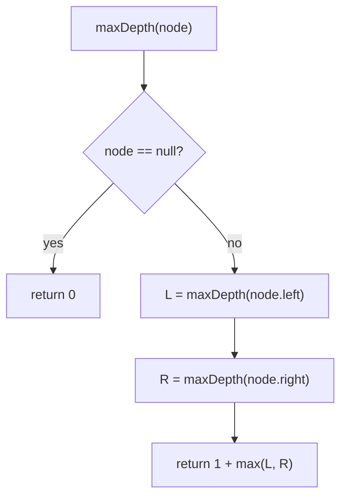

# Max depth — a node's depth is 1 + the deeper child

> **1 of 5 binary-tree techniques.** New here? Read the [trees techniques overview](../) and the
> [tree structure note](../../../structures/trees/) first.
> **This one:** DFS recursion — the depth of a tree is `1 + max(depth of left, depth of right)`,
> with an empty subtree counting `0`. Canonical problem: #104 Maximum Depth of Binary Tree.

## TL;DR

**Is it the max-depth DFS shape? Ask these — all "yes" → yes:**
1. **Is the answer for a node expressible from the answers for its children** (depth = node + deeper child)?
2. **Does an empty subtree have an obvious base value** (`null → 0`)?
3. **Can I just recurse left and right and combine?** If "solve each child the same way, fold with `1 + max`" → yes. **This one is the decider.**

**Before you code, pin down:** depth = number of *nodes* on the longest path (#104) or number of *edges* (then a leaf is 0)? balanced or possibly skewed (deep recursion → stack risk → use the BFS version)? is `min` depth wanted instead (different — a one-child node is a trap)?

**The lines where bugs hide** (details in *How it works*):
**base `null → 0`** · **`1 +`** counts the current node — drop it and every depth is short by the height · `max` for *max* depth (but **min depth must special-case a missing child**, see the twin).

---

## What it is
The deepest a tree goes is one (for the current node) plus however deep its deeper child goes. An
empty subtree contributes `0`. That's the entire recurrence — textbook recursion, since a tree is
made of subtrees.

`[3, 9, 20, null, null, 15, 7]`:
```
    3
   / \
  9   20
     /  \
    15   7
```
- `depth(9) = 1`; `depth(15) = depth(7) = 1`; `depth(20) = 1 + max(1, 1) = 2`.
- `depth(3) = 1 + max(depth(9)=1, depth(20)=2) = 3`.

## What you track
- the **current node** (each call owns one subtree).
- the two child depths, combined as `1 + max(left, right)`.
- (BFS variant) a **queue** and a level counter.

## How it works
Pseudocode (#104). The ⚠️ lines are where every bug hides.

```ts
function maxDepth(node) {
  if (node === null) {                 // ⚠️ base: empty subtree contributes 0.
    return 0;
  }
  // ⚠️ 1 + counts THIS node; max picks the deeper side. Drop the +1 → every depth short.
  return 1 + Math.max(maxDepth(node.left), maxDepth(node.right));
}
```

The **iterative BFS** alternative (use it when the tree may be deeply skewed and recursion could
overflow the call stack): push the root, then repeatedly process a whole level (snapshot the queue
size first), enqueueing children; each level processed adds 1 to the depth.

Lock these in: **`null → 0`**, **`1 + max(left, right)`**, and remember **min depth is *not* just `min`** (next).

## Picture


## Where you'll meet it (practice + recognition)

**On LeetCode (and similar platforms):**
- **#104 Maximum Depth of Binary Tree** — the canonical `1 + max`. (This note's code.)
- **#111 Minimum Depth** — looks like `1 + min`, but a node with **one** child must take the *present* child's depth, not `min(…, 0)` → the famous trap (a single chain `2→3→4` is depth **3**, not 1). (`minDepth` in [`solution.ts`](./solution.ts).)
- **#110 Balanced Binary Tree** — depths of both subtrees, check they differ by ≤ 1.
- **#543 Diameter of Binary Tree** — longest path; computed from the two child depths at each node.

**Real life / other platforms:**
- Nesting depth of JSON / a DOM subtree / a comment thread — "how deep does this go?"
- Worst-case lookups in a tree-shaped index (deeper = slower).

**Looks like it but ISN'T:** **level-order** also visits the whole tree, but it groups nodes *by
level* with a queue rather than returning a single number — [`level-order`](../level-order/). And
**min depth** shares the shape but needs the one-child special case (the twin in `solution.ts`).

---

Solution code (#104 + the #111 min-depth trap, fully commented): [`solution.ts`](./solution.ts).
