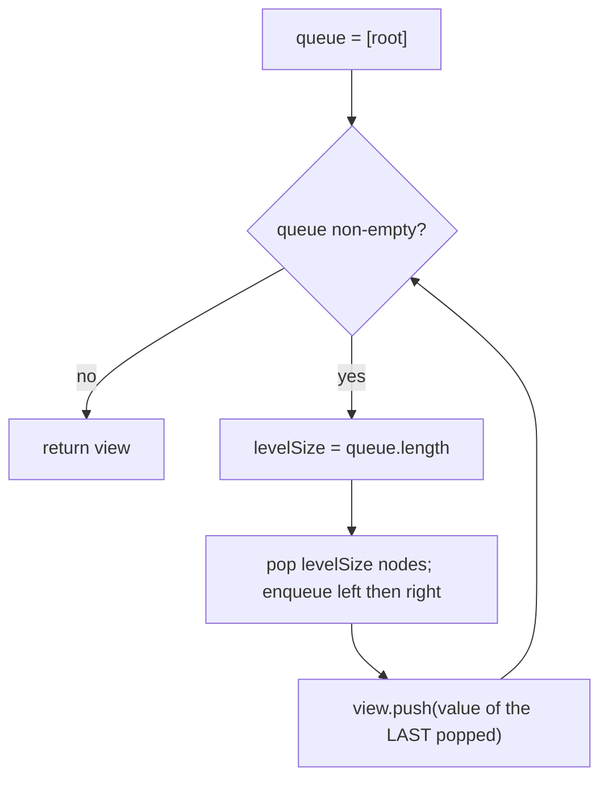

# Right side view — the last node of every level

> **3 of 5 binary-tree techniques.** New here? Read the [trees techniques overview](../) and
> [`level-order`](../level-order/) first — this is that BFS, keeping one node per level.
> **This one:** stand to the right of the tree; you see the **last** node at each depth. BFS and grab
> the final node of every level. Canonical problem: #199 Binary Tree Right Side View.

## TL;DR

**Is it the side-view shape? Ask these — all "yes" → yes:**
1. **Do I want *one node per level*** — the one you'd see looking from a side?
2. **Is "right view" the *rightmost* (last) node at each depth** (left view = first)?
3. **Can I run a level-order sweep and keep just the boundary node?** If "BFS, take the last popped per level" → yes. **This one is the decider.**

**Before you code, pin down:** right view (last per level) or left view (first)? null root → `[]`? do nodes with no right child still contribute if they're the rightmost so far (yes — it's the last node *at that depth*, which may come from a left branch)?

**The lines where bugs hide** (details in *How it works*):
**snapshot the level size** (same as level-order) · the answer is the node at index **`levelSize − 1`** (last popped), *not* simply every node's right child — a deep left branch can be the rightmost at its depth · enqueue **left then right** so "last" really is the rightmost · (DFS variant) visit **right child first** and record the first node seen at each new depth.

---

## What it is
Looking at the tree from the right, at each depth you see exactly the **rightmost** node of that
level — and crucially that might be reached via a *left* branch if the right side is shorter. So you
can't just walk right children. Do a normal level-order BFS and, for each level, keep the **last**
node you pop (or, DFS, visit right-first and record the first node at each new depth).

```
   1            right view: [1, 3, 4]
  / \
 2   3          level 0: [1]      → 1
  \             level 1: [2, 3]   → 3
   4            level 2: [4]      → 4  (a LEFT-branch node, still rightmost at depth 2)
```

## What you track
- a **queue** (BFS frontier) and the per-level **size snapshot**.
- the **last node** popped on each level → push its value to the result.
- (DFS variant) the current **depth**, and a result whose length tells you the deepest depth seen.

## How it works
Pseudocode (#199, BFS). The ⚠️ lines are where every bug hides.

```ts
if (root === null) return [];
const view = [];
const queue = [root];

while (queue.length > 0) {
  const levelSize = queue.length;        // ⚠️ snapshot (see level-order).
  for (let i = 0; i < levelSize; i++) {
    const node = queue.shift();
    if (i === levelSize - 1) view.push(node.val);  // ⚠️ the LAST node of the level = the right view.
    if (node.left  !== null) queue.push(node.left);  // ⚠️ left THEN right, so the last popped is rightmost.
    if (node.right !== null) queue.push(node.right);
  }
}
return view;
```

**DFS alternative:** recurse **right child first**, carrying `depth`; the *first* time you reach a
given depth, that node is the rightmost there — push it when `depth === view.length`.

Why not "just follow right children": if a node lacks a right child but has a left one, that left
child is the rightmost at its depth. Walking only right pointers would miss it. The level sweep (or
right-first DFS) handles that automatically.

Lock these in: **snapshot size**, **take index `levelSize − 1`**, **enqueue left then right** (or DFS right-first by depth).

## Picture


## Where you'll meet it (practice + recognition)

**On LeetCode (and similar platforms):**
- **#199 Binary Tree Right Side View** — last node per level. (This note's code.)
- **Left side view** — the mirror: first node per level. (`leftSideView` in [`solution.ts`](./solution.ts).)
- **#515 Find Largest Value in Each Tree Row** — same per-level sweep, keep the max not the boundary.
- **#102 Level Order** — the full level lists this is a projection of → [`level-order`](../level-order/).

**Real life / other platforms:**
- "Outline view" of a hierarchy showing the last item at each indentation level.
- Skyline-ish "what's visible from this side" projections over a layered structure.

**Looks like it but ISN'T:** walking only **right pointers** from the root — wrong, because a node
with no right child but a left child still has a rightmost-at-that-depth node. The fix is the level
sweep (or right-first DFS keyed on depth), not a single rightward chain.

---

Solution code (#199 right view + the left-view mirror, fully commented): [`solution.ts`](./solution.ts).
