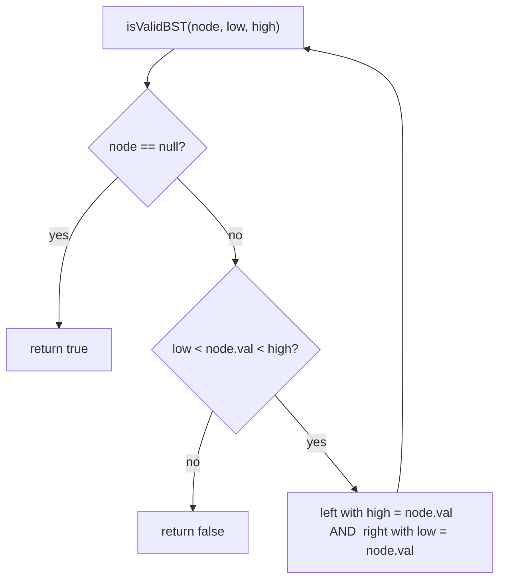

# Validate BST — every node must fall inside an inherited (low, high) range

> **5 of 5 binary-tree techniques.** New here? Read the [trees techniques overview](../), the
> [tree/BST structure note](../../../structures/trees/), and [`max-depth`](../max-depth/) (DFS) first.
> **This one:** a BST is valid only if *every* node sits in the open range allowed by **all** its
> ancestors — not just bigger than its parent. Carry `(low, high)` down. Canonical problem: #98 Validate Binary Search Tree.

## TL;DR

**Is it the bounds-DFS validation? Ask these — all "yes" → yes:**
1. **Is the rule "left subtree < node < right subtree" — for the *whole* subtree, not just direct children?**
2. **Does a node's valid range *narrow* as you descend** (each turn tightens one bound)?
3. **Can I pass an allowed `(low, high)` into each call and check the node fits?** If "going left lowers the ceiling to node.val; going right raises the floor to node.val" → yes. **This one is the decider.**

**Before you code, pin down:** strict `<` (no duplicates, the usual #98) or `<=` allowed? what bounds for the root (none → ±∞, or `null` sentinels)? could values hit `Number.MIN/MAX` (use `null` "no bound" to be safe)? is the in-order-sorted approach acceptable instead?

**The lines where bugs hide** (details in *How it works*):
**compare against inherited bounds, NOT just the parent** (the #1 wrong answer) · going **left tightens `high = node.val`**, going **right tightens `low = node.val`** · **strict** inequality `low < val < high` · base `null → true` · (in-order variant) the sequence must be **strictly increasing** — track the previous value.

---

## What it is
The trap: checking only `node.left.val < node.val < node.right.val` passes invalid trees — a node
deep in the left subtree could still be larger than a far-up ancestor. A node is valid only if it's
within the range carved out by **every** ancestor. So pass a `(low, high)` window down: it starts
unbounded at the root, and each step **tightens one side** — turn left and the current value becomes
the new ceiling; turn right and it becomes the new floor.

```
    5            valid? 5 in (-∞, ∞) ✓
   / \           1 in (-∞, 5) ✓ ; 7 in (5, ∞) ✓
  1   7          6 in (5, 7) ✓ ; 8 ... but if 8 were under 7's LEFT it'd need (5,7) and FAIL
     / \
    6   8
```
Counterexample the naive check misses: `[5, 1, 7, null, null, 4, 8]` — `4` is 7's left child, fine
vs its parent (4 < 7), but it's in the **right** subtree of `5`, so it must be `> 5`. Bounds catch
it; parent-only comparison doesn't.

## What you track
- per call: the node and its allowed open range **`(low, high)`**.
- descending left → `high` becomes `node.val`; descending right → `low` becomes `node.val`.
- (in-order variant) the **previous value** visited; it must strictly increase.

## How it works
Pseudocode (#98, bounds DFS). The ⚠️ lines are where every bug hides.

```ts
function isValidBST(node, low = null, high = null) {   // null = "no bound on this side"
  if (node === null) return true;                       // ⚠️ base: empty subtree is valid.
  // ⚠️ check against INHERITED bounds, not the parent only. Strict < (no duplicates).
  if ((low  !== null && node.val <= low)  ||
      (high !== null && node.val >= high)) {
    return false;
  }
  return isValidBST(node.left,  low,      node.val) &&  // ⚠️ left: ceiling drops to node.val.
         isValidBST(node.right, node.val, high);        // ⚠️ right: floor rises to node.val.
}
```

Why bounds, not parent compares: validity is a property of the node's position in the *whole* tree,
which is exactly the interval its ancestors permit. The interval only ever shrinks, so passing it
down captures every constraint in O(1) per node.

**In-order alternative:** an in-order traversal of a *valid* BST yields values in **strictly
increasing** order. Walk in-order, remember the previous value, and fail if the next isn't larger.
Same O(n), different lens.

Lock these in: **inherited `(low, high)`**, **left tightens high / right tightens low**, **strict inequality**, **`null → true`**.

## Picture


## Where you'll meet it (practice + recognition)

**On LeetCode (and similar platforms):**
- **#98 Validate Binary Search Tree** — bounds DFS (or in-order). (This note's code — both approaches.)
- **#530 Minimum Absolute Difference in BST / #501 Mode in BST** — lean on the in-order = sorted property.
- **#700 Search in a BST / #235 Lowest Common Ancestor of a BST** — use the ordering to prune one side (the BST search this validates the precondition for).

**Real life / other platforms:**
- Verifying an **ordered index** invariant after edits (a tree-backed map staying sorted).
- Range-check validation that must respect *inherited* limits, not just a local neighbour.

**Looks like it but ISN'T:** comparing each node **only to its immediate children** — the classic
wrong solution; it accepts trees where a deep node violates a distant ancestor. The fix is the
inherited `(low, high)` window (or the in-order-increasing check).

---

Solution code (#98 via bounds DFS + the in-order twin, fully commented): [`solution.ts`](./solution.ts).
