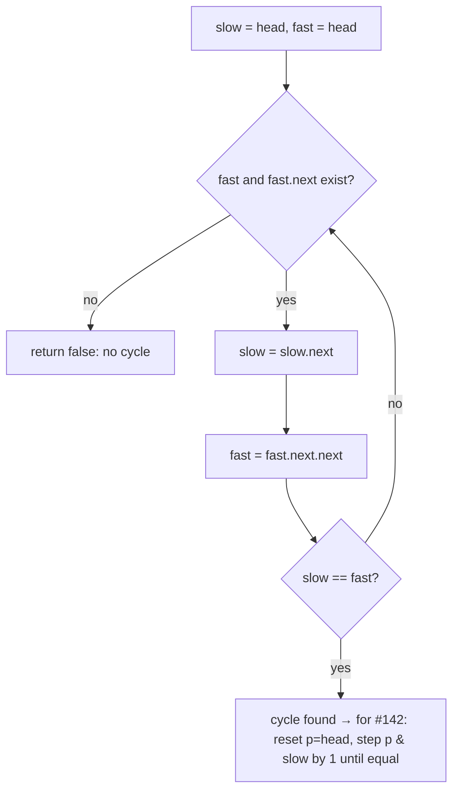

# Fast & slow pointers — two cursors at different speeds (cycle · middle · duplicate)

> **A two-pointers *movement*** (sibling of [`opposite-ends`](../opposite-ends/) and
> [`sliding-window`](../sliding-window/) — see the [family overview](../)). Run two cursors that
> both move forward, one **once** per step and one **twice**. If a chain loops, the fast one laps
> the slow one and they collide; if it ends, fast falls off. Its home turf is the
> [linked list](../../../structures/linked-list/), but it works on any "next" function (see #287).
> Canonical problems: #141 (is there a cycle?), #142 (where does it start?), #876 (the middle).

## TL;DR

**Is it fast & slow? Ask these — all "yes" → yes:**
1. **Is there a single "next" step** from each item (a `node.next`, or `i → nums[i]`) you can follow?
2. **Am I asking "does it loop / where does it loop / what's the middle / is there a repeat"** — something about the *shape* of that following, not the values?
3. **Would two pointers at different speeds reveal it** — the fast one lapping the slow inside a loop, or reaching the middle when slow is halfway? If yes → this is it. **This one is the decider.**

**Before you code, pin down:** singly linked (no `prev`)? just detect, or also return the loop's start (#142)? can the list be empty / one node? is "the middle" the first or second of two middles (#876 — usually the second)?

**The lines where bugs hide** (details in *How it works*):
guard `while (fast && fast.next)` **before** `fast = fast.next.next` (or you deref `null` on a non-looping list) · move **slow 1, fast 2** · compare **after** moving · for #142, after they meet **reset one pointer to head and step both by 1** — the meeting point alone is *not* the start.

---

## What it is
Two pointers start at the head. Each loop, **slow** takes one step, **fast** takes two. If the
list ends, fast hits `null` first — no cycle. If the list loops back, fast is gaining one node per
step on slow *inside the loop*, so it must eventually land on the exact same node — they collide,
proving a cycle. No extra memory, unlike a "seen nodes" set.

`1 → 2 → 3 → 4 → 2` (the `4` points back to `2`): slow walks 1,2,3,4,2,3…; fast walks 1,3,2,4,3…;
they meet inside `2→3→4` → cycle detected.

**Finding the start (#142):** after they meet, put one pointer back at the **head** and step both
**one at a time**; where they meet again is the loop's entry node. (It falls out of the distance
math: the gap from head to entry equals the gap from the meeting point to entry, going around.)

## What you track
- `slow` — moves **one** node per step.
- `fast` — moves **two** nodes per step (the one that falls off the end, or laps slow).
- (for #142) a second walk: one pointer reset to `head`, both stepping by 1, to land on the entry.

## How it works
Pseudocode (#141 detect, then #142 start). The ⚠️ lines are where every bug hides.

```ts
// #141 — is there a cycle?
let slow = head, fast = head;
while (fast !== null && fast.next !== null) {  // ⚠️ guard BOTH before the double step, or
                                               //    fast.next.next dereferences null on a
                                               //    list that simply ends → crash.
  slow = slow.next;                            // one step
  fast = fast.next.next;                       // ⚠️ two steps
  if (slow === fast) return true;              // ⚠️ compare AFTER moving (they start equal).
}
return false;                                  // fast fell off the end → no cycle.

// #142 — where does the cycle start? (run the loop above; on meeting, don't return yet)
//   after slow === fast:
let p = head;
while (p !== slow) {                           // ⚠️ reset ONE pointer to head, step both by 1.
  p = p.next;                                  //    The meeting node is NOT the entry on its own —
  slow = slow.next;                            //    this second walk is what finds the entry.
}
return p;                                      // the loop's start node.
```

Why fast can't "jump over" slow without landing on it: each step fast closes the gap by exactly
**one** node, so the gap goes …3, 2, 1, **0** — it can never skip from 1 to −1. That's why moving
two-and-one (not three-and-one) guarantees a collision.

Lock these in: **guard `fast && fast.next`**, **slow 1 / fast 2**, **compare after moving**, **reset-to-head walk for the start**.

## Picture


## Where you'll meet it (practice + recognition)

**On LeetCode (and similar platforms):**
- **#141 Linked List Cycle** — detect a loop with O(1) space. (This note's code.)
- **#142 Linked List Cycle II** — return the node where the loop begins. (`detectCycle` in [`solution.ts`](./solution.ts).)
- **#876 Middle of the Linked List** — when fast reaches the end, slow is at the middle (no cycle needed — just the speed ratio).
- **#287 Find the Duplicate Number** — treat the array as links (`i → nums[i]`); the duplicate forces a cycle, and #142's start-finder *is* the duplicate. (`findDuplicate` in [`solution.ts`](./solution.ts) — the far-apart twin.)

**Real life / other platforms:**
- Detecting a loop in any "follow the pointer" structure — a symlink chain, a `parent` chain that accidentally cycles, a state machine that should terminate.
- Finding the midpoint of a stream you can only read forward, in one pass.

**Looks like it but ISN'T:** using a **hash set of visited nodes** to spot a repeat — same goal,
but O(n) memory; fast & slow is the O(1)-space upgrade. And two pointers walking **inward from both
ends** is [`opposite-ends`](../opposite-ends/), a different motion
(those converge; these chase at different speeds).

---

Solution code (#141 / #142 + the #287 array twin, fully commented): [`solution.ts`](./solution.ts).
