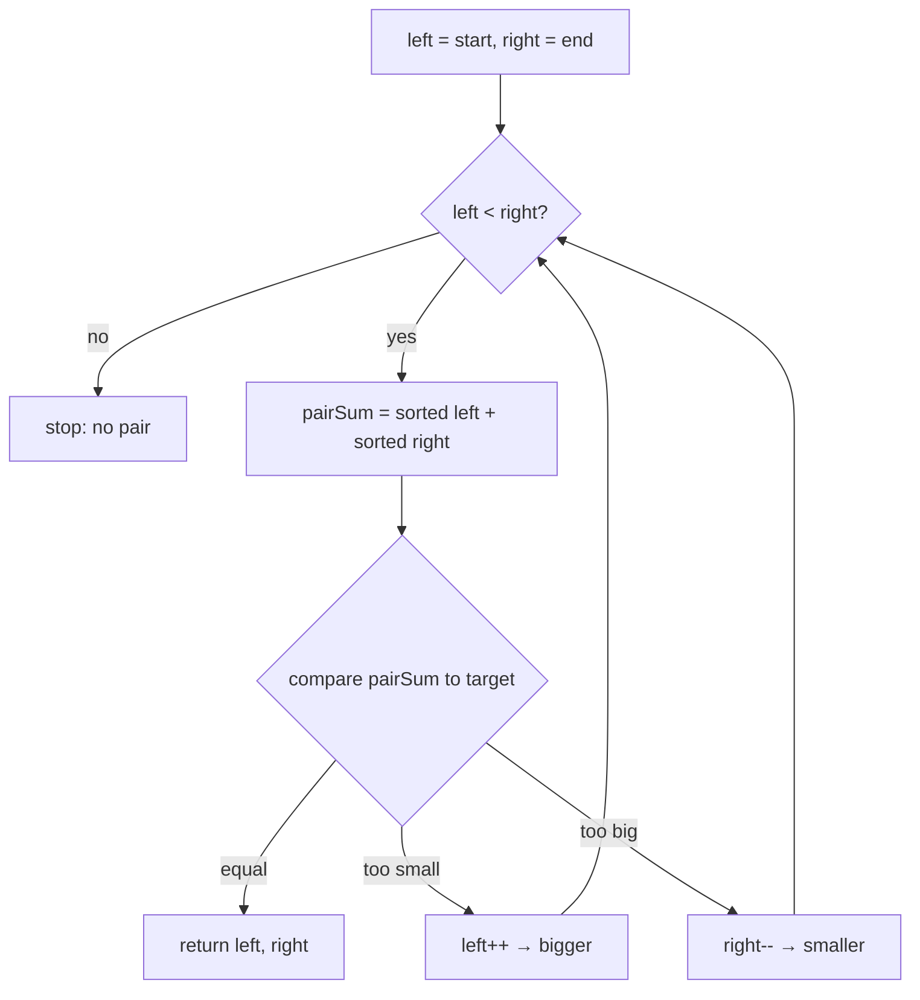

# Opposite ends — two markers converging from both sides

## TL;DR

**Is it the both-ends trick? Ask these — all yes → yes:**
1. **Is the data sorted (or symmetric)?** Either ordered small→large, *or* something you can read from both sides (a string, a palindrome). (No order, no symmetry → not this.)
2. **Am I after a pair, or comparing the two ends?** Two numbers that sum to `X`, or "do the ends match / how much fits between them" (palindrome, max area). (Comparing one item to a target → that's binary search.)
3. **Does comparing the two ends tell me which end to move next?** Look at both ends — does the result say "move the left in" or "move the right in"? If the comparison doesn't point at a side to drop → not this. **This one is the decider.**

**Before you code, pin down:** is the input sorted — ascending or descending? is the answer 1-indexed or 0-indexed (LeetCode #167 is **1-indexed** — the classic slip)? exactly one pair, or all pairs (all → you must skip duplicates)? for palindrome — which characters count, and is it case-sensitive?

**The lines where bugs hide** (details in *How it works*):
`while left < right` (NOT `<=` — that lets you pair an element with itself) · the **1-indexing** on #167 · the data **must** be sorted, or the whole trick is invalid.

---

## What it is
Put one marker at each end of the list and walk them toward the middle. Each step you
**compare the two ends**, and the result tells you which marker to move inward. Because
the data is sorted (or symmetric), that comparison is trustworthy — moving a marker can
only push the result one known direction, so you never have to look back.

`numbers = [2, 7, 11, 15]`, looking for a pair that sums to `9`:
- `left=2`, `right=15` → `2 + 15 = 17 > 9` → too big, pull `right` in → `right=11`
- `left=2`, `right=11` → `2 + 11 = 13 > 9` → still too big, pull `right` in → `right=7`
- `left=2`, `right=7` → `2 + 7 = 9` → found it. Positions (1-indexed) → `[1, 2]`.

## What you track
- `left` — the marker at the start, moving right.
- `right` — the marker at the end, moving left.
- the **comparison each step** (sum vs target, or end char vs end char) that decides which marker moves.

## How it works
Pseudocode (Two Sum II — sorted input). The three ⚠️ lines are where every bug hides —
read those slowly; the rest is filler.

```ts
let left = 0;                          // marker at the small end
let right = sorted.length - 1;         // ⚠️ the data MUST be sorted; marker at the big end.
                                       //    The whole trick rests on this — on unsorted
                                       //    input the comparison lies and you'll silently
                                       //    return wrong pairs.

while (left < right) {                 // ⚠️ < , not <= . With <= the two markers can land
                                       //    on the SAME index and you'd pair an element with
                                       //    itself — which the problem forbids.

  const pairSum = sorted[left] + sorted[right];   // total of the two ends right now

  if (pairSum === target) {
    return [left + 1, right + 1];      // ⚠️ +1 — LeetCode #167 wants 1-BASED indices.
                                       //    Returning [left, right] is the classic slip.
  }

  if (pairSum < target) {
    left++;                            // need a BIGGER total → move left to a larger number
  } else {
    right--;                           // need a SMALLER total → move right to a smaller number
  }
}

// markers met → no pair (for #167 the problem guarantees one exists)
```

Why it can't miss a pair: sorted order means moving `left` right *only raises* the sum
and moving `right` left *only lowers* it. When the sum is too big, `sorted[right]` paired
with anything to its left is **also** too big — so dropping `right` discards only
impossible options. One sweep covers them all.

Lock these three in and it's correct: **data sorted**, **`while left < right`**, **`+1` for 1-indexing on #167**.

## Picture


## Where you'll meet it (practice + recognition)

**On LeetCode (and similar platforms):**
- **#167 Two Sum II (sorted)** — sorted, 1-indexed array; compare the end-to-end `sum` to `target`, move the helpful marker. (This note's code.)
- **#125 Valid Palindrome** — compare the two end characters for *equality*: equal → step both inward; different → not a palindrome. Same skeleton, but the comparison moves *both* markers, not one. (See `isPalindrome` in [`solution.ts`](./solution.ts).)
- **#11 Container With Most Water** — `left` and `right` are two walls; the area is limited by the *shorter* wall, so move the shorter one inward hunting for a taller pair.
- **#15 3Sum** — sort first, then for each fixed number run the both-ends sweep on the rest to find the other two.

**Real life / other platforms:**
- Reversing a buffer in place by swapping the two ends and walking inward.
- Checking a sequence reads the same both ways (palindrome-style validation).
- Two-sided trimming of a sorted range — chop from both ends until a condition holds.
- The two cursors converging in a merge step.

**Looks like it but ISN'T:** *"two numbers in an **unsorted** array that sum to a target"* — with no order the comparison can't tell you which end to drop, so it's the hashmap [`two-sum`](../../hashing/two-sum/README.md), not this. Same question, different trick — picked by whether the input is sorted.

---

Solution code (both disguises, fully commented): [`solution.ts`](./solution.ts).
