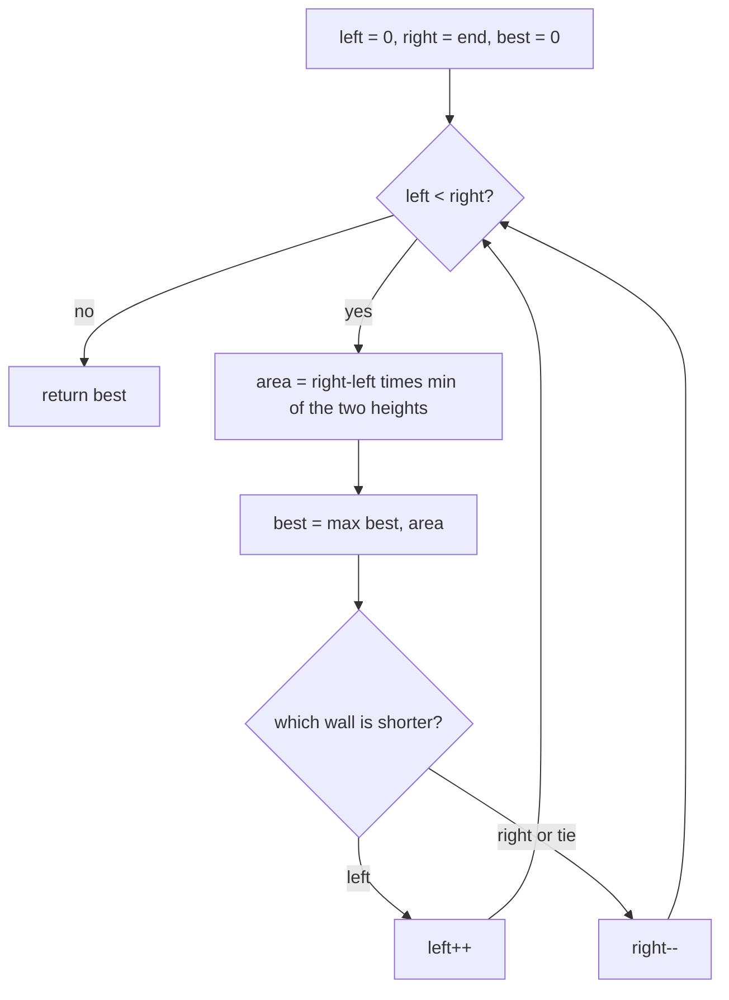

# Opposite ends (max area) — two walls, move the shorter one

> **3 of 4 opposite-ends flavors.** New to this? Read the [family overview](../) first — it
> explains the two-marker skeleton and how the flavors differ.
> **This flavor:** the data is **bar heights**; the two markers are walls, the area is capped by
> the **shorter** wall, so move the shorter one inward. Canonical problem: #11 Container With Most Water.

## TL;DR

**Is it the max-area both-ends trick? Ask these — all "yes" → yes:**
1. **Do I have heights/positions and want the *best pair*** — most water, widest-times-tallest, biggest rectangle *between two chosen lines*?
2. **Is the value `width × (the shorter of the two heights)`** — i.e. the *smaller* end caps it?
3. **Does knowing which wall is shorter tell me which to drop?** Moving the *taller* wall can only shrink width while the cap stays put — so the shorter wall is the only one worth replacing. **This one is the decider.**

**Before you code, pin down:** is width the index distance (`right − left`)? area capped by `min` of the two heights? what if heights are equal at the ends — move either (move both is fine too)? empty / single bar → area `0`?

**The lines where bugs hide** (details in *How it works*):
area = `(right − left) × min(h[left], h[right])` — **width is the gap, height is the `min`** · **move the shorter wall** (moving the taller never helps) · on a tie, moving either is safe · update the best *before* moving.

---

## What it is
Two walls, one at each end. The water they hold is a rectangle: as **wide** as the gap between
them, and only as **tall** as the **shorter** wall (water spills over the lower side). So the
area is `width × min(leftHeight, rightHeight)`.

Each step, move the **shorter** wall inward. Why: the shorter wall caps the height *now*. If you
moved the taller wall instead, the width shrinks and the height is still capped by that same
short wall — the area can only get worse. Moving the short wall is the only move that might find
a taller cap. So one converging sweep finds the maximum.

`heights = [1, 8, 6, 2, 5, 4, 8, 3, 7]`:
- `left=1`(i0), `right=7`(i8): width 8, height min(1,7)=1 → area 8. Left is shorter → move left.
- `left=8`(i1), `right=7`(i8): width 7, height min(8,7)=7 → area **49**. Right shorter → move right.
- … nothing beats 49. Answer **49**.

## What you track
- `left` / `right` — the two walls, moving inward.
- `best` — the largest area seen so far (`Math.max` running max).
- each step's area = `(right − left) × min(heights[left], heights[right])`.

## How it works
Pseudocode. The ⚠️ lines are where every bug hides.

```ts
let left = 0;
let right = heights.length - 1;
let best = 0;

while (left < right) {                          // ⚠️ < , not <= — a single wall holds no water.
  const height = Math.min(heights[left], heights[right]); // ⚠️ the SHORTER wall caps the height;
                                                          //    using max overstates the water.
  const width = right - left;                   // ⚠️ width is the index GAP, not a count of bars.
  best = Math.max(best, width * height);        // update best BEFORE moving a wall.

  if (heights[left] < heights[right]) {
    left++;                                      // ⚠️ move the SHORTER wall. Moving the taller
  } else {                                       //    keeps the same cap with less width → never
    right--;                                     //    improves, and you'd skip the real maximum.
  }                                              //    (Tie → moving either is safe.)
}

return best;
```

Why moving the shorter wall is safe: the pair `(short, anything-inside)` is bounded by `short`,
and every such pair is *narrower* than the current one — so they're all ≤ the area you just
recorded. Dropping the short wall discards only pairs that cannot beat it.

Lock these in: **height = `min` of the two**, **width = `right − left`**, **always move the
shorter wall**.

## Picture


## Where you'll meet it (practice + recognition)

**On LeetCode (and similar platforms):**
- **#11 Container With Most Water** — the canonical; area capped by the shorter wall, move it. (This note's code.)
- **#42 Trapping Rain Water** — *looks* identical (bar heights, two ends) but sums water *on top of every bar*, not one rectangle between two walls → its own flavor, [`trapping-rain`](../trapping-rain/).
- **#84 Largest Rectangle in Histogram** — biggest rectangle under the bars; a different tool (a monotonic stack), not two converging ends — a good "looks like it but isn't".

**Real life / other platforms:**
- Picking the two pillars that span the widest usable area under a height limit.
- "Best pair of fences" framing — any "value = distance × the weaker of two endpoints" problem.

**Looks like it but ISN'T:** *Trapping Rain Water* — same input shape, but you want the water
*above each bar* (a per-bar sum driven by the running max on each side), not the single rectangle
between a chosen pair. The tell: "between **two** lines" → max-area; "on top of **all** the bars"
→ [`trapping-rain`](../trapping-rain/).

---

Solution code (fully commented): [`solution.ts`](./solution.ts).
