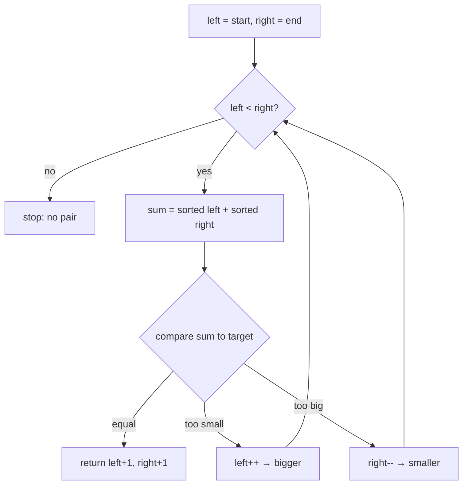

# Opposite ends (pair sum) — converge to find a pair summing to a target

> **1 of 4 opposite-ends flavors.** New to this? Read the [family overview](../) first — it
> explains the two-marker skeleton and how the flavors differ.
> **This flavor:** the data is **sorted**; compare the sum of the two ends to a `target` and
> move the **one** marker that nudges the sum the helpful way. Canonical problem: #167 Two Sum II.

## TL;DR

**Is it the pair-sum both-ends trick? Ask these — all "yes" → yes:**
1. **Is the list sorted** (ascending or descending)? The whole trick rests on order. (Unsorted → not this; that's the hashmap [`two-sum`](../../../hashing/two-sum/).)
2. **Am I after a *pair* that sums to a target** (or "closest to" a target)?
3. **Does the sum vs target tell me which end to drop?** Too big → the largest number can't be in any answer, drop `right`; too small → drop `left`. If the comparison points at a side → yes. **This one is the decider.**

**Before you code, pin down:** sorted ascending or descending? answer 1-indexed or 0-indexed (#167 is **1-indexed** — the classic slip)? exactly one pair, or all pairs (all → you must skip duplicates after a hit)? are the same element's two uses forbidden?

**The lines where bugs hide** (details in *How it works*):
`while left < right` (NOT `<=` — that pairs an element with itself) · the **`+1`** for 1-indexing on #167 · the data **must** be sorted or the comparison lies.

---

## What it is
One marker at the small end, one at the big end. Add them. If the sum is too big, the biggest
number is too big to ever help — so pull `right` in to a smaller number. If it's too small, pull
`left` in to a bigger one. Each move discards a whole batch of impossible pairs at once, so one
sweep is exhaustive.

`numbers = [2, 7, 11, 15]`, looking for a pair summing to `9`:
- `left=2`, `right=15` → `2 + 15 = 17 > 9` → too big, pull `right` in → `right=11`
- `left=2`, `right=11` → `2 + 11 = 13 > 9` → still too big → `right=7`
- `left=2`, `right=7` → `2 + 7 = 9` → found it. Positions (1-indexed) → `[1, 2]`.

## What you track
- `left` — the marker at the start, moving right toward bigger numbers.
- `right` — the marker at the end, moving left toward smaller numbers.
- the **sum vs target** each step — the comparison that decides which marker moves.

## How it works
Pseudocode (Two Sum II — sorted input). The three ⚠️ lines are where every bug hides.

```ts
let left = 0;                          // marker at the small end
let right = sorted.length - 1;         // ⚠️ the data MUST be sorted; marker at the big end.
                                       //    On unsorted input the comparison lies and you
                                       //    silently return wrong pairs.

while (left < right) {                 // ⚠️ < , not <= . With <= the two markers can land on
                                       //    the SAME index → you'd pair an element with itself,
                                       //    which the problem forbids.

  const sum = sorted[left] + sorted[right];   // total of the two ends right now

  if (sum === target) {
    return [left + 1, right + 1];      // ⚠️ +1 — #167 wants 1-BASED indices. Returning
                                       //    [left, right] is the classic slip.
  }

  if (sum < target) {
    left++;                            // need a BIGGER total → move left to a larger number
  } else {
    right--;                           // need a SMALLER total → move right to a smaller number
  }
}

// markers met → no pair (for #167 the problem guarantees one exists)
```

Why it can't miss a pair: sorted order means moving `left` right *only raises* the sum and
moving `right` left *only lowers* it. When the sum is too big, `sorted[right]` paired with
anything to its left is **also** too big — so dropping `right` discards only impossible options.

Lock these three in and it's correct: **data sorted**, **`while left < right`**, **`+1` for
1-indexing on #167**.

## Picture


## Where you'll meet it (practice + recognition)

**On LeetCode (and similar platforms):**
- **#167 Two Sum II (sorted)** — sorted, 1-indexed array; compare the end-to-end `sum` to `target`, move the helpful marker. (This note's code.)
- **#15 3Sum** — sort first, then for each fixed number run the both-ends sweep on the rest to find the other two (skip duplicates to avoid repeat triples).
- **#16 3Sum Closest** — same sweep, but track the sum nearest to `target` instead of an exact hit.
- **#977 Squares of a Sorted Array** — the two ends hold the two *largest* squares; pick the bigger and fill the result back-to-front.

**Real life / other platforms:**
- Two-sided trimming of a sorted range — chop from both ends until a budget/condition holds.
- "Find two prices that total a gift-card balance" over a sorted price list.

**Looks like it but ISN'T:** *"two numbers in an **unsorted** array that sum to a target"* — with
no order the comparison can't tell you which end to drop, so it's the hashmap
[`two-sum`](../../../hashing/two-sum/README.md), not this. Same question, different trick — picked
by whether the input is sorted.

---

Solution code (fully commented): [`solution.ts`](./solution.ts).
