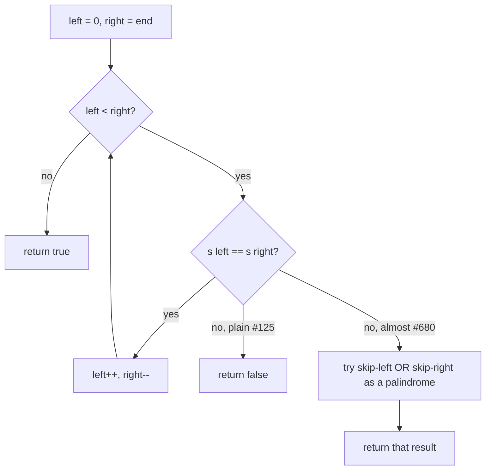

# Opposite ends (palindrome) — compare the two ends for a match, step both inward

> **2 of 4 opposite-ends flavors.** New to this? Read the [family overview](../) first — it
> explains the two-marker skeleton and how the flavors differ.
> **This flavor:** the data is a **string** read from both sides; compare the two end chars
> for **equality** and step **both** markers inward. Canonical problems: #125 Valid Palindrome,
> #680 Almost Palindrome (one deletion allowed).

## TL;DR

**Is it the palindrome both-ends trick? Ask these — all "yes" → yes:**
1. **Am I reading a sequence from *both ends at once*** — "does it read the same forwards and backwards"?
2. **Does the check compare the *outer* pair, then the next pair in**, never jumping around?
3. **When the two ends *match*, do I always step both inward — and when they *don't*, is that the whole verdict** (or, for "almost", do I get *one* deletion to fix it)? **This one is the decider.**

**Before you code, pin down:** which characters count — letters only (#680) or alphanumerics with punctuation/spaces skipped (#125)? case-sensitive? for "almost" — exactly how many deletions are allowed (#680 = at most **one**)? does empty / single char return `true`?

**The lines where bugs hide** (details in *How it works*):
`while left < right` (the middle char needs no partner) · for #125, **skip non-counted chars on both sides before comparing** · for #680, on the first mismatch try **skip-left OR skip-right** and palindrome-check the *remainder* — checking only one side is the classic miss.

---

## What it is
Two markers, one at each end of the string. If the end characters match, step both inward and
keep going; if they differ, it's not a palindrome. Because a string is **symmetric** to check,
the outer pair must match before any inner pair matters — so a single inward sweep settles it.

`"abcba"`: `a==a` → in; `b==b` → in; markers meet on `c` → all matched → **true**.

**Almost** palindrome (#680) adds one mercy: on the *first* mismatch you may **delete one
character** — try removing the left one *or* the right one, and if either leftover reads as a
plain palindrome, the answer is `true`.

`"abca"`: `a==a` → in; `b≠c` → spend the deletion: is `"bc"`→`"c"` (skip `b`) or `"b"` (skip `c`)
a palindrome? `"c"` is → **true**.

## What you track
- `left` / `right` — the two markers, only ever moving inward.
- (for #125) a **skip rule** — advance past characters that don't count before comparing.
- (for #680) the **one deletion** — whether you've already spent your single skip.

## How it works
Pseudocode for both. The ⚠️ lines are where every bug hides.

```ts
// A) Valid Palindrome (#125) — alphanumerics only, case-insensitive
function isPalindrome(s) {
  let left = 0, right = s.length - 1;
  while (left < right) {                       // ⚠️ < , not <= — a lone middle char has no partner.
    while (left < right && !isAlnum(s[left]))  left++;   // ⚠️ skip non-counted chars BEFORE comparing,
    while (left < right && !isAlnum(s[right])) right--;  //    and keep `left < right` inside or you overrun.
    if (lower(s[left]) !== lower(s[right])) return false;
    left++; right--;                           // matched → step BOTH inward.
  }
  return true;
}

// B) Almost Palindrome (#680) — at most ONE deletion (letters only, no skipping)
function validPalindromeII(s) {
  let left = 0, right = s.length - 1;
  while (left < right) {
    if (s[left] !== s[right]) {                // first mismatch → spend the single deletion.
      return isRange(s, left + 1, right)       // ⚠️ try BOTH: skip the left char …
          || isRange(s, left, right - 1);      //    … OR skip the right char. Checking only one MISSES cases.
    }
    left++; right--;
  }
  return true;                                 // no mismatch → already a palindrome, deletion unused.
}
// isRange(s, i, j): plain both-ends check that s[i..j] reads the same — no further deletions.
```

For #680, why try both sides: at a mismatch `s[left] ≠ s[right]`, the offending character could be
*either* one. Deleting the left and deleting the right give different leftovers; only by testing
both do you avoid rejecting a string that one deletion could have saved.

Lock these in: **`while left < right`**, **skip non-counted chars first (#125)**, **try skip-left
OR skip-right on the first mismatch (#680)**.

## Picture


## Where you'll meet it (practice + recognition)

**On LeetCode (and similar platforms):**
- **#125 Valid Palindrome** — compare the two end chars for *equality*, skipping punctuation/spaces and ignoring case. (`isPalindrome` in [`solution.ts`](./solution.ts).)
- **#680 Valid Palindrome II** — one deletion allowed; on the first mismatch test both skip-left and skip-right. (`validPalindromeII` in [`solution.ts`](./solution.ts).)
- **#234 Palindrome Linked List** — same check, but you first find the middle and reverse the back half (no random access on a list).
- **#5 Longest Palindromic Substring** — *expand from the center* outward (the inverse motion); the both-ends equality check is the inner test.

**Real life / other platforms:**
- Validating a sequence reads the same both ways (a symmetric ID, a mirrored token).
- Diff-style "are these equal allowing one edit?" — the #680 one-deletion idea generalizes to a tiny edit-distance check.

**Looks like it but ISN'T:** *"longest run with no repeated character"* sounds like a string
two-pointer too, but the markers both move **forward** bounding a window, not inward from the ends
— that's [`sliding-window/variable-distinct`](../../sliding-window/variable-distinct/). Decided by
whether the markers **converge** (palindrome) or **chase** (window).

---

Solution code (both #125 and #680, fully commented): [`solution.ts`](./solution.ts).
